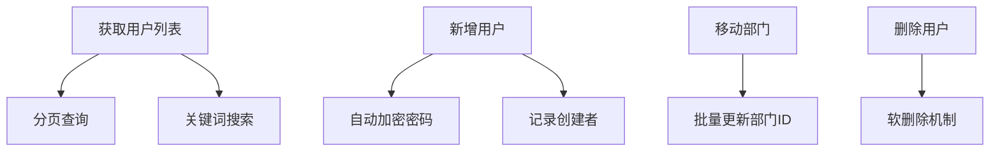
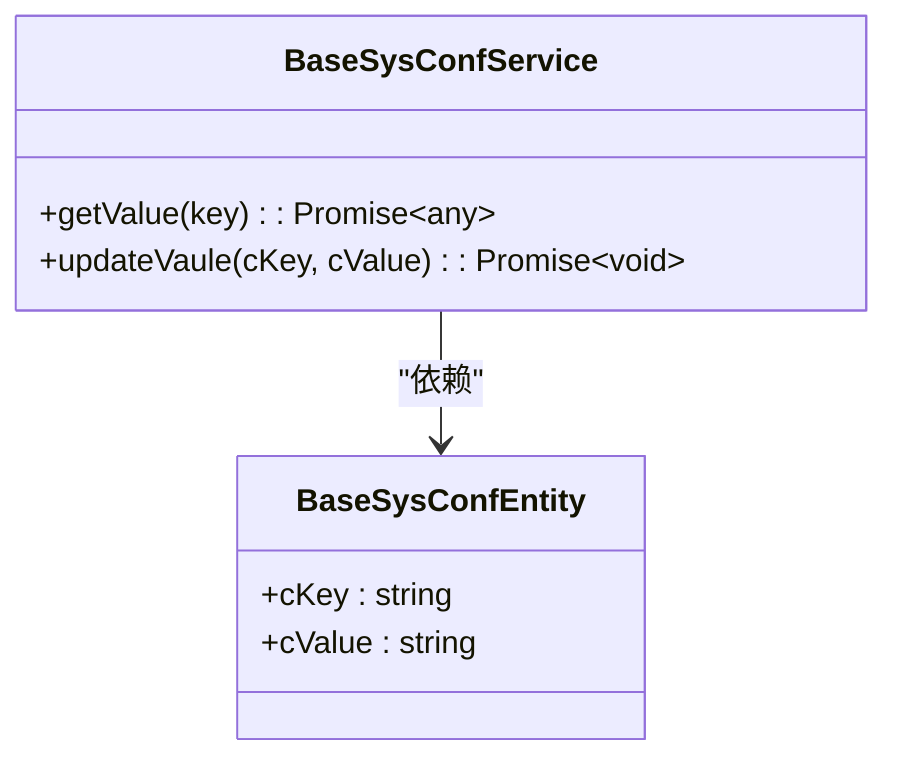
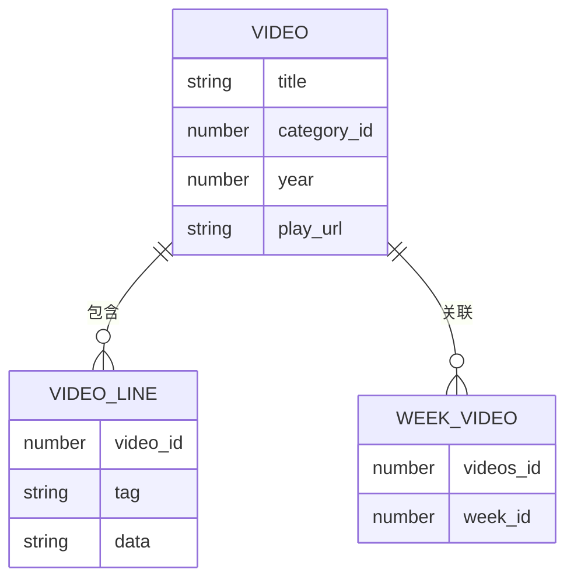

# API 接口文档

<cite>
**本文档引用文件**  
- [swagger/config.ts](file://src/modules/swagger/config.ts)
- [swagger/builder.ts](file://src/modules/swagger/builder.ts)
- [swagger/event/app.ts](file://src/modules/swagger/event/app.ts)
- [swagger/controller/index.ts](file://src/modules/swagger/controller/index.ts)
- [base/controller/admin/sys/user.ts](file://src/modules/base/controller/admin/sys/user.ts)
- [base/entity/sys/user.ts](file://src/modules/base/entity/sys/user.ts)
- [base/service/sys/conf.ts](file://src/modules/base/service/sys/conf.ts)
- [base/entity/sys/conf.ts](file://src/modules/base/entity/sys/conf.ts)
- [video/entity/videos.ts](file://src/modules/video/entity/videos.ts)
- [video/controller/admin/videos.ts](file://src/modules/video/controller/admin/videos.ts)
- [video/controller/admin/video_line.ts](file://src/modules/video/controller/admin/video_line.ts)
- [video/controller/admin/week_video.ts](file://src/modules/video/controller/admin/week_video.ts)
- [video/controller/admin/swiper.ts](file://src/modules/video/controller/admin/swiper.ts)
</cite>

## 目录

1. [Swagger 集成与文档生成机制](#swagger-集成与文档生成机制)
2. [Swagger 模块构建流程](#swagger-模块构建流程)
3. [主要 API 接口分组说明](#主要-api-接口分组说明)
4. [用户管理接口 (/admin/base/sys/user)](#用户管理接口-adminbasesysuser)
5. [系统配置接口 (/admin/base/sys/conf)](#系统配置接口-adminbasesysconf)
6. [视频内容接口 (/admin/video/videos)](#视频内容接口-adminvideovideos)
7. [轮播图接口 (/admin/video/swiper)](#轮播图接口-adminvideoswiper)
8. [访问与调试方式](#访问与调试方式)

## Swagger 集成与文档生成机制

cool-admin-midway 通过内置的 `@cool-midway/swagger` 模块实现了基于 OpenAPI 3.1.0 标准的自动化 API 文档生成。系统利用 MidwayJS 的依赖注入与装饰器机制，在应用启动时自动扫描所有控制器方法的元数据，并将其转换为标准的 Swagger JSON 格式，最终通过 Swagger UI 提供交互式文档页面。

文档生成基于 `CoolController` 装饰器和 `@Get`、`@Post` 等 HTTP 方法装饰器自动提取接口信息。开发者无需手动编写 OpenAPI 规范，系统通过反射机制自动识别接口路径、请求方式、参数类型和响应结构。

**Section sources**  
- [swagger/config.ts](file://src/modules/swagger/config.ts#L1-L49)
- [swagger/builder.ts](file://src/modules/swagger/builder.ts#L0-L316)
- [swagger/event/app.ts](file://src/modules/swagger/event/app.ts#L1-L27)

## Swagger 模块构建流程

Swagger 模块在系统启动时通过事件监听机制自动初始化。`SwaggerAppEvent` 监听 `onServerReady` 事件，触发 `SwaggerBuilder` 的 `init()` 方法，进而调用 `build()` 方法构建完整的 OpenAPI 文档。

`SwaggerBuilder` 类负责将系统内部的 `eps`（Endpoint Structure）数据结构转换为符合 OpenAPI 规范的 JSON 对象。转换过程包括：
- 合并基础配置（如 API 标题、版本、服务器地址）
- 生成模块标签（tags），排除 `swagger` 自身模块
- 遍历所有控制器接口，提取路径、方法、参数、响应等元数据
- 自动映射 TypeScript 类型到 OpenAPI 类型（如 `string` → `string`，`number` → `integer`）
- 为通用操作（如 `add`、`delete`、`page`）生成标准化的请求体和响应结构

**Section sources**  
- [swagger/builder.ts](file://src/modules/swagger/builder.ts#L0-L316)
- [swagger/event/app.ts](file://src/modules/swagger/event/app.ts#L1-L27)

## 主要 API 接口分组说明

系统 API 按功能模块进行分组，主要包含以下核心分组：

- **用户管理**：`/admin/base/sys/user`，提供系统用户的增删改查、部门移动等功能
- **系统配置**：`/admin/base/sys/conf`，用于管理全局配置参数
- **视频内容**：`/admin/video/videos`，管理视频信息、播放线路、周数据等
- **轮播图管理**：`/admin/video/swiper`，管理首页轮播图内容
- **其他模块**：包括日志、菜单、角色、参数配置等系统级功能

所有接口均遵循统一的 RESTful 风格，使用 JSON 格式传输数据，并通过 Bearer Token 进行身份认证。

## 用户管理接口 (/admin/base/sys/user)

该接口分组用于管理系统用户，提供完整的 CRUD 操作及自定义功能。

**Diagram sources**  
- [base/controller/admin/sys/user.ts](file://src/modules/base/controller/admin/sys/user.ts#L1-L34)
- [base/entity/sys/user.ts](file://src/modules/base/entity/sys/user.ts#L1-L58)

### 接口详情

#### 获取用户分页列表
- **HTTP 方法**: `GET`
- **URL 路径**: `/admin/base/sys/user/page`
- **认证方式**: Bearer Token
- **请求参数 (Query)**:
  - `page`: 页码，默认 1
  - `size`: 每页数量，默认 20
  - `keyWord`: 关键词搜索（支持姓名、用户名）
  - `status`: 状态筛选（0-禁用，1-启用）
- **响应结构**: `BaseSysUserEntity` 分页数据
- **状态码**: `200`（成功）

#### 新增用户
- **HTTP 方法**: `POST`
- **URL 路径**: `/admin/base/sys/user/add`
- **认证方式**: Bearer Token
- **请求体 (Body)**: `BaseSysUserEntity` 对象（不含 ID）
- **响应结构**: `{ code: 1000, message: "success", data: { id: 新增ID } }`
- **状态码**: `200`（成功）

#### 移动部门
- **HTTP 方法**: `POST`
- **URL 路径**: `/admin/base/sys/user/move`
- **认证方式**: Bearer Token
- **请求体 (Body)**:
  - `departmentId`: 目标部门 ID
  - `userIds`: 用户 ID 数组
- **响应结构**: `{ code: 1000, message: "success" }`
- **状态码**: `200`（成功）

**Section sources**  
- [base/controller/admin/sys/user.ts](file://src/modules/base/controller/admin/sys/user.ts#L1-L34)
- [base/entity/sys/user.ts](file://src/modules/base/entity/sys/user.ts#L1-L58)

## 系统配置接口 (/admin/base/sys/conf)

该接口用于管理系统的全局配置参数，支持动态读取与更新。

**Diagram sources**  
- [base/service/sys/conf.ts](file://src/modules/base/service/sys/conf.ts#L1-L38)
- [base/entity/sys/conf.ts](file://src/modules/base/entity/sys/conf.ts#L1-L15)

### 接口详情

#### 获取配置值
- **HTTP 方法**: `GET`
- **URL 路径**: `/admin/base/sys/conf/info`
- **认证方式**: Bearer Token
- **请求参数 (Query)**:
  - `id`: 配置项 ID
- **响应结构**: `BaseSysConfEntity` 对象
- **状态码**: `200`（成功）

#### 更新配置
- **HTTP 方法**: `POST`
- **URL 路径**: `/admin/base/sys/conf/update`
- **认证方式**: Bearer Token
- **请求体 (Body)**:
  - `id`: 配置项 ID
  - `cKey`: 配置键
  - `cValue`: 配置值
- **响应结构**: `{ code: 1000, message: "success" }`
- **状态码**: `200`（成功）

**Section sources**  
- [base/service/sys/conf.ts](file://src/modules/base/service/sys/conf.ts#L1-L38)
- [base/entity/sys/conf.ts](file://src/modules/base/entity/sys/conf.ts#L1-L15)

## 视频内容接口 (/admin/video/videos)

该模块管理视频核心数据，包括视频信息、播放线路、周数据等。

**Diagram sources**  
- [video/entity/videos.ts](file://src/modules/video/entity/videos.ts#L1-L251)
- [video/controller/admin/videos.ts](file://src/modules/video/controller/admin/videos.ts#L1-L56)
- [video/controller/admin/video_line.ts](file://src/modules/video/controller/admin/video_line.ts#L1-L30)

### 接口详情

#### 视频分页查询
- **HTTP 方法**: `GET`
- **URL 路径**: `/admin/video/videos/page`
- **认证方式**: Bearer Token
- **请求参数 (Query)**:
  - `page`, `size`: 分页参数
  - `title`: 标题关键词
  - `category_id`, `year`, `region`: 筛选条件
- **响应结构**: `VideoEntity` 分页数据
- **状态码**: `200`（成功）

#### 添加播放线路
- **HTTP 方法**: `POST`
- **URL 路径**: `/admin/video/video_line/add`
- **认证方式**: Bearer Token
- **请求体 (Body)**: `VideoLineEntity` 对象
- **响应结构**: `{ code: 1000, message: "success", data: { id: 新增ID } }`
- **状态码**: `200`（成功）

#### 视频排序
- **HTTP 方法**: `POST`
- **URL 路径**: `/admin/video/videos/sort`
- **认证方式**: Bearer Token
- **请求体 (Body)**: 排序数据数组
- **响应结构**: `{ code: 1000, message: "success" }`
- **状态码**: `200`（成功）

**Section sources**  
- [video/entity/videos.ts](file://src/modules/video/entity/videos.ts#L1-L251)
- [video/controller/admin/videos.ts](file://src/modules/video/controller/admin/videos.ts#L1-L56)
- [video/controller/admin/video_line.ts](file://src/modules/video/controller/admin/video_line.ts#L1-L30)
- [video/controller/admin/week_video.ts](file://src/modules/video/controller/admin/week_video.ts#L1-L62)

## 轮播图接口 (/admin/video/swiper)

管理首页轮播图内容，支持图片、跳转链接、排序等功能。

### 接口详情

#### 轮播图分页查询
- **HTTP 方法**: `GET`
- **URL 路径**: `/admin/video/swiper/page`
- **认证方式**: Bearer Token
- **请求参数 (Query)**:
  - `page`, `size`: 分页
  - `status`, `category`: 状态与分类筛选
- **响应结构**: `VideoSwiperEntity` 分页数据
- **状态码**: `200`（成功）

#### 新增轮播图
- **HTTP 方法**: `POST`
- **URL 路径**: `/admin/video/swiper/add`
- **认证方式**: Bearer Token
- **请求体 (Body)**: `VideoSwiperEntity` 对象
- **响应结构**: `{ code: 1000, message: "success", data: { id: 新增ID } }`
- **状态码**: `200`（成功）

**Section sources**  
- [video/controller/admin/swiper.ts](file://src/modules/video/controller/admin/swiper.ts#L1-L27)

## 访问与调试方式

开发者可通过以下方式访问和调试 API 文档：

1. **访问文档页面**：启动服务后，浏览器访问 `http://127.0.0.1:8001/swagger` 或 `public/swagger/index.html` 查看交互式文档。
2. **查看原始 JSON**：访问 `/swagger/json` 接口可获取完整的 OpenAPI JSON 数据。
3. **在线调试**：在 Swagger UI 界面中，点击任意接口展开，填写参数后点击 "Try it out" 即可发送请求并查看响应。
4. **认证配置**：在页面右上角点击 "Authorize"，输入 `Bearer <token>` 完成身份认证，后续请求将自动携带 Token。

文档自动生成，无需手动维护，确保与代码实现完全同步。

**Section sources**  
- [swagger/controller/index.ts](file://src/modules/swagger/controller/index.ts#L1-L34)
- [public/swagger/index.html](file://public/swagger/index.html)