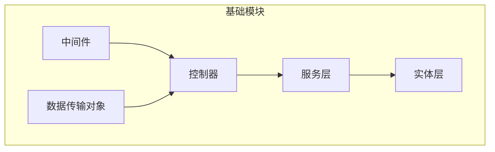
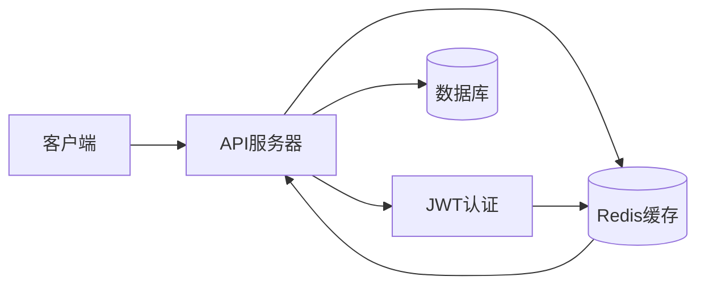
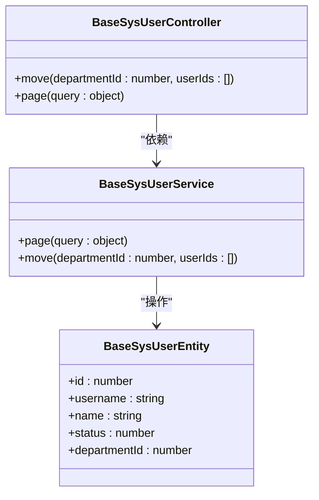
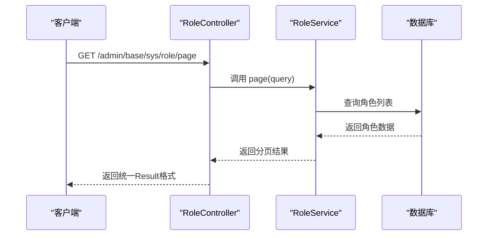
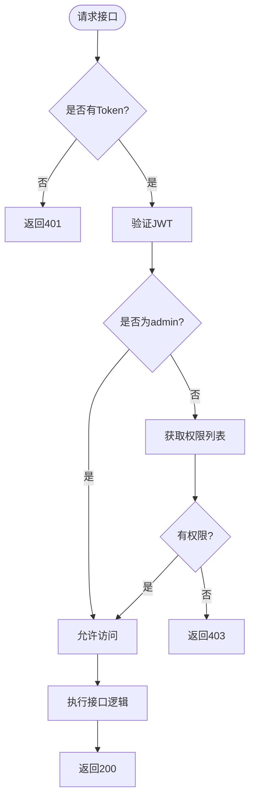

# 基础模块 API

<cite>
**本文档引用文件**  
- [user.ts](file://src/modules/base/controller/admin/sys/user.ts)
- [role.ts](file://src/modules/base/controller/admin/sys/role.ts)
- [menu.ts](file://src/modules/base/controller/admin/sys/menu.ts)
- [department.ts](file://src/modules/base/controller/admin/sys/department.ts)
- [param.ts](file://src/modules/base/controller/admin/sys/param.ts)
- [log.ts](file://src/modules/base/controller/admin/sys/log.ts)
- [authority.ts](file://src/modules/base/middleware/authority.ts)
- [login.ts](file://src/modules/base/service/sys/login.ts)
- [config.ts](file://src/modules/base/config.ts)
- [swagger/index.ts](file://src/modules/swagger/controller/index.ts)
</cite>

## 目录

1. [简介](#简介)
2. [项目结构](#项目结构)
3. [核心组件](#核心组件)
4. [架构概览](#架构概览)
5. [详细组件分析](#详细组件分析)
6. [依赖分析](#依赖分析)
7. [性能考虑](#性能考虑)
8. [故障排除指南](#故障排除指南)
9. [结论](#结论)

## 简介

本API文档旨在为`cool-admin-midway`项目中的基础模块提供全面的技术说明。该模块涵盖用户、角色、菜单、部门、日志和系统参数等核心管理接口，支持基于JWT的身份认证与细粒度权限控制。所有接口均通过Swagger UI可视化展示，便于开发者测试与集成。

## 项目结构

基础模块位于`src/modules/base`目录下，采用分层架构设计，包含控制器（controller）、服务（service）、实体（entity）、中间件（middleware）和DTO（数据传输对象）等标准组件。各子模块按功能划分，如`sys/user`、`sys/role`等，结构清晰，职责明确。



**Diagram sources**
- [user.ts](file://src/modules/base/controller/admin/sys/user.ts)
- [department.ts](file://src/modules/base/controller/admin/sys/department.ts)

**Section sources**
- [user.ts](file://src/modules/base/controller/admin/sys/user.ts#L1-L35)
- [department.ts](file://src/modules/base/controller/admin/sys/department.ts#L1-L31)

## 核心组件

本模块的核心组件包括用户管理、角色管理、菜单权限、部门结构、系统参数配置和操作日志记录。所有接口均通过`@CoolController`装饰器自动生成RESTful路由，并集成分页、查询、增删改查等通用功能。

**Section sources**
- [user.ts](file://src/modules/base/controller/admin/sys/user.ts#L1-L35)
- [role.ts](file://src/modules/base/controller/admin/sys/role.ts#L1-L38)

## 架构概览

系统采用典型的前后端分离架构，后端基于Midway框架实现，前端通过Bearer Token进行身份验证。权限控制由`BaseAuthorityMiddleware`中间件实现，结合Redis缓存存储用户权限列表，确保高性能访问控制。



**Diagram sources**
- [authority.ts](file://src/modules/base/middleware/authority.ts#L1-L134)
- [config.ts](file://src/modules/base/config.ts#L1-L39)

## 详细组件分析

### 用户管理分析

用户管理接口支持增删改查、分页查询、部门移动等功能。分页查询通过SQL拼接实现动态条件过滤，包括关键字搜索、状态筛选和部门权限控制。

#### 类图


**Diagram sources**
- [user.ts](file://src/modules/base/controller/admin/sys/user.ts#L1-L35)
- [user.ts](file://src/modules/base/service/sys/user.ts#L36-L71)

**Section sources**
- [user.ts](file://src/modules/base/controller/admin/sys/user.ts#L1-L35)
- [user.ts](file://src/modules/base/service/sys/user.ts#L1-L100)

### 角色管理分析

角色管理接口支持角色的增删改查与分页查询，具备超管权限隔离机制。非超管用户仅能查看自己创建或拥有的角色。

#### 序列图


**Diagram sources**
- [role.ts](file://src/modules/base/controller/admin/sys/role.ts#L1-L38)
- [role.ts](file://src/modules/base/service/sys/role.ts)

**Section sources**
- [role.ts](file://src/modules/base/controller/admin/sys/role.ts#L1-L38)

### 菜单管理分析

菜单管理提供菜单的增删改查、解析、代码生成、导入导出等功能。权限校验通过`perms`缓存实现，确保只有具备相应权限的用户才能访问特定接口。

#### 流程图


**Diagram sources**
- [authority.ts](file://src/modules/base/middleware/authority.ts#L1-L134)
- [menu.ts](file://src/modules/base/controller/admin/sys/menu.ts#L1-L46)

**Section sources**
- [menu.ts](file://src/modules/base/controller/admin/sys/menu.ts#L1-L46)

### 部门管理分析

部门管理支持部门的增删改查与排序功能。权限控制通过`baseSysPermsService.departmentIds()`获取当前用户可访问的部门ID列表，实现数据隔离。

**Section sources**
- [department.ts](file://src/modules/base/controller/admin/sys/department.ts#L1-L31)
- [department.ts](file://src/modules/base/service/sys/department.ts#L1-L37)

### 系统参数管理分析

系统参数接口支持参数的增删改查与分页查询，可通过`/html`接口获取富文本类型的参数值。查询支持关键字模糊匹配和数据类型精确匹配。

**Section sources**
- [param.ts](file://src/modules/base/controller/admin/sys/param.ts#L1-L34)

### 日志管理分析

日志管理提供操作日志的分页查询、清理和保存时间设置功能。日志清理需管理员权限，日志保存时间通过系统配置动态调整。

**Section sources**
- [log.ts](file://src/modules/base/controller/admin/sys/log.ts#L1-L64)

## 依赖分析

基础模块依赖于Midway框架核心库、TypeORM、JWT、Redis缓存等外部组件。模块内部各服务之间通过依赖注入（@Inject）解耦，控制器与服务分离，便于维护与测试。

```mermaid
graph TD
BaseModule[基础模块] --> Midway[@midwayjs/core]
BaseModule --> CoolCore[@cool-midway/core]
BaseModule --> TypeORM[typeorm]
BaseModule --> JWT[jsonwebtoken]
BaseModule --> Cache[@midwayjs/cache-manager]
```

**Diagram sources**
- [config.ts](file://src/modules/base/config.ts#L1-L39)
- [authority.ts](file://src/modules/base/middleware/authority.ts#L1-L134)

**Section sources**
- [config.ts](file://src/modules/base/config.ts#L1-L39)

## 性能考虑

- 权限数据缓存于Redis，避免频繁数据库查询
- 分页查询使用原生SQL优化复杂条件拼接
- JWT验证结合缓存token校验，防止会话劫持
- SSO单点登录可配置，提升安全性

## 故障排除指南

常见错误码及解决方案：

| 错误码 | 含义 | 解决方案 |
|-------|------|---------|
| 401 | 登录失效或未携带Token | 检查Authorization头是否包含Bearer Token |
| 403 | 无权限访问 | 确认当前用户角色是否具备该接口权限 |
| 400 | 参数错误 | 检查请求体或查询参数是否符合DTO定义 |
| 500 | 服务器内部错误 | 查看日志文件定位异常原因 |

**Section sources**
- [authority.ts](file://src/modules/base/middleware/authority.ts#L1-L134)
- [login.ts](file://src/modules/base/service/sys/login.ts#L38-L84)

## 结论

基础模块提供了完整的后台管理系统核心功能，具备良好的可扩展性与安全性。通过Swagger UI可直观查看所有API接口，结合JWT与Redis实现高效权限控制。建议开发者在使用时遵循统一的Result封装格式，并合理利用缓存机制提升系统性能。