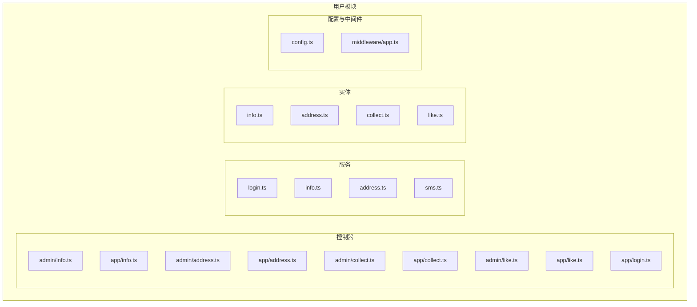
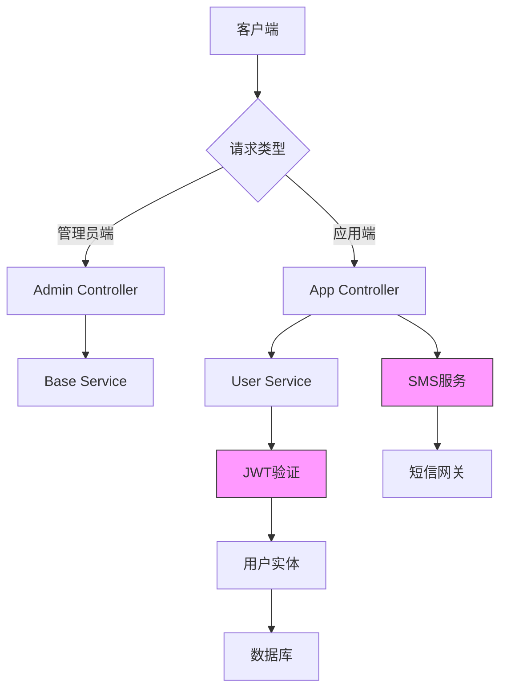
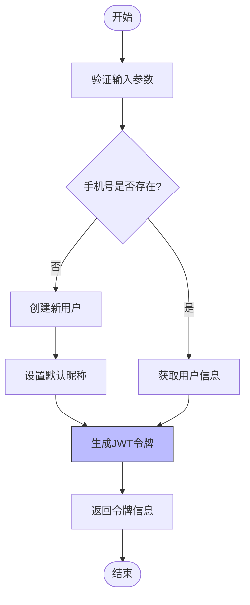
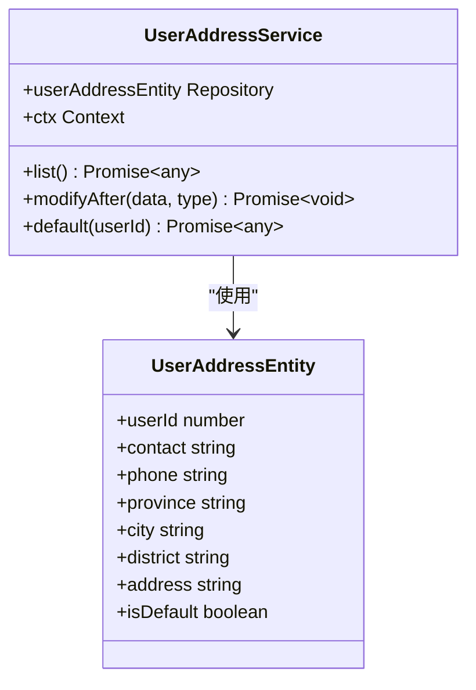
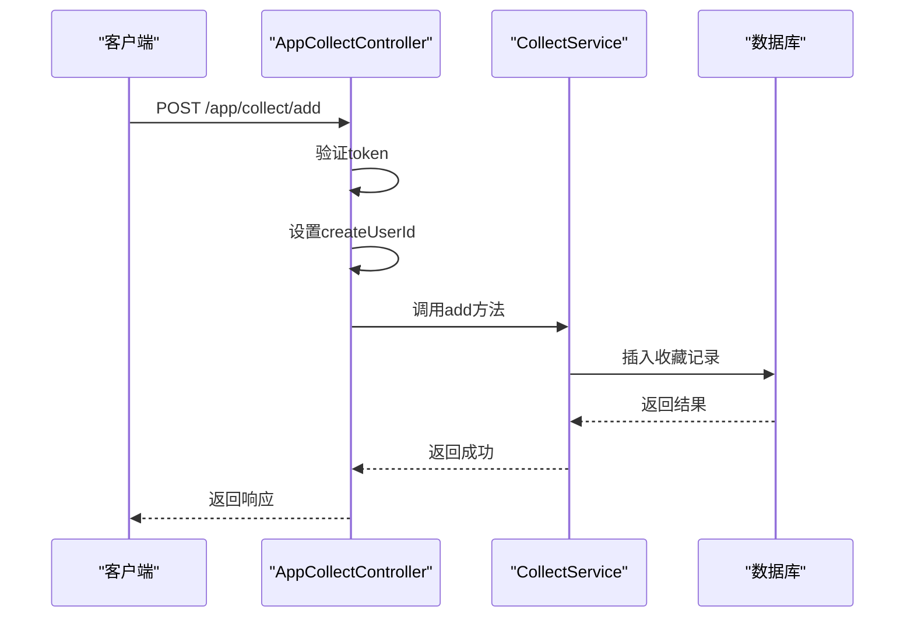
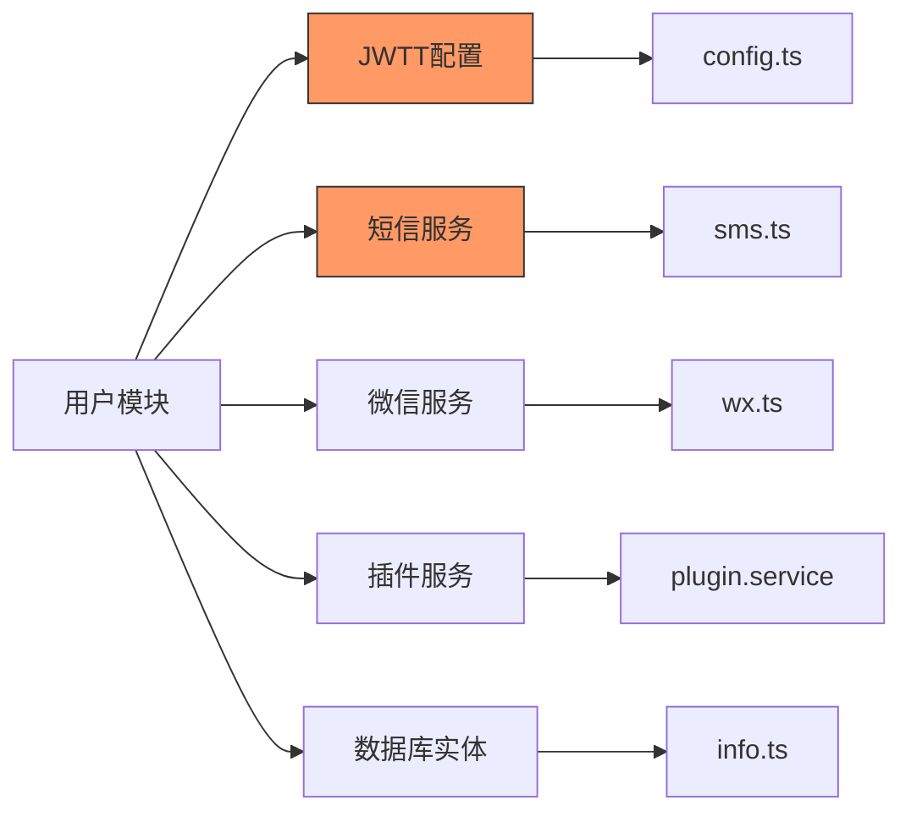

# 用户模块 API

<cite>
**本文档引用文件**  
- [info.ts](file://src/modules/user/entity/info.ts)
- [login.ts](file://src/modules/user/service/login.ts)
- [info.ts](file://src/modules/user/controller/app/info.ts)
- [address.ts](file://src/modules/user/controller/app/address.ts)
- [collect.ts](file://src/modules/user/controller/app/collect.ts)
- [like.ts](file://src/modules/user/controller/app/like.ts)
- [config.ts](file://src/modules/user/config.ts)
- [app.ts](file://src/modules/user/middleware/app.ts)
- [sms.ts](file://src/modules/user/service/sms.ts)
</cite>

## 目录
1. [简介](#简介)
2. [项目结构](#项目结构)
3. [核心组件](#核心组件)
4. [架构概览](#架构概览)
5. [详细组件分析](#详细组件分析)
6. [依赖分析](#依赖分析)
7. [性能考虑](#性能考虑)
8. [故障排除指南](#故障排除指南)
9. [结论](#结论)

## 简介
本文档详细描述了用户模块的API接口，涵盖管理员端和应用端双视角功能。重点包括用户信息管理、登录认证、地址簿操作、收藏功能和点赞记录等核心接口。文档详细说明了JWT令牌生成流程、权限分级机制、请求/响应示例以及安全防护措施。

## 项目结构
用户模块采用分层架构设计，包含控制器、服务、实体和中间件等关键组件。控制器分为管理员端（admin）和应用端（app）两个目录，分别处理不同权限级别的请求。

**图示来源**  
- [info.ts](file://src/modules/user/controller/admin/info.ts)
- [address.ts](file://src/modules/user/controller/admin/address.ts)
- [collect.ts](file://src/modules/user/controller/admin/collect.ts)
- [like.ts](file://src/modules/user/controller/admin/like.ts)
- [login.ts](file://src/modules/user/service/login.ts)
- [info.ts](file://src/modules/user/entity/info.ts)

## 核心组件
用户模块的核心组件包括用户信息管理、认证服务、地址管理、收藏和点赞功能。所有应用端接口均通过统一的中间件进行身份验证，确保接口安全性。

**组件来源**  
- [info.ts](file://src/modules/user/entity/info.ts#L0-L41)
- [login.ts](file://src/modules/user/service/login.ts#L0-L343)
- [config.ts](file://src/modules/user/config.ts#L0-L34)

## 架构概览
系统采用典型的MVC架构模式，通过中间件统一处理身份验证。应用端接口通过JWT令牌进行权限控制，管理员端接口则使用独立的认证体系。

**图示来源**  
- [app.ts](file://src/modules/user/middleware/app.ts#L0-L72)
- [login.ts](file://src/modules/user/service/login.ts#L0-L343)
- [sms.ts](file://src/modules/user/service/sms.ts)

## 详细组件分析

### 用户信息管理分析
提供用户信息的增删改查功能，支持按状态、性别、登录方式等字段进行筛选查询。

**组件来源**  
- [info.ts](file://src/modules/user/controller/admin/info.ts#L0-L14)

### 登录认证分析
实现多种登录方式，包括密码登录、短信验证码登录、微信小程序登录等。

#### 认证流程图

**图示来源**  
- [login.ts](file://src/modules/user/service/login.ts#L264-L312)

### 地址簿操作分析
管理用户的收货地址信息，支持设置默认地址功能。

#### 地址服务类图

**图示来源**  
- [address.ts](file://src/modules/user/service/address.ts#L0-L62)
- [address.ts](file://src/modules/user/entity/address.ts#L0-L33)

### 收藏功能分析
实现用户收藏功能，支持按关联ID和标题进行查询。

#### 收藏控制器序列图

**图示来源**  
- [collect.ts](file://src/modules/user/controller/app/collect.ts#L0-L33)
- [collect.ts](file://src/modules/user/entity/collect.ts#L0-L19)

### 点赞记录分析
管理用户点赞记录，支持分页查询和删除操作。

**组件来源**  
- [like.ts](file://src/modules/user/controller/app/like.ts#L0-L33)
- [like.ts](file://src/modules/user/entity/like.ts#L0-L19)

## 依赖分析
用户模块依赖多个核心服务和配置项，形成完整的功能闭环。

**图示来源**  
- [config.ts](file://src/modules/user/config.ts#L0-L34)
- [login.ts](file://src/modules/user/service/login.ts#L0-L343)
- [info.ts](file://src/modules/user/entity/info.ts#L0-L41)

## 性能考虑
- JWT令牌采用内存缓存机制，提高验证效率
- 数据库查询使用索引优化，特别是手机号和unionid字段
- 图片上传自动下载并重新上传，确保资源统一管理
- 短信验证码设置3分钟有效期，平衡安全与用户体验

## 故障排除指南
常见问题及解决方案：

1. **登录失效**：检查Authorization头是否正确传递JWT令牌
2. **验证码错误**：确认验证码在有效期内且未被使用过
3. **权限不足**：确保请求的接口与用户角色匹配
4. **数据更新失败**：检查手机号是否已存在（唯一性约束）
5. **微信登录失败**：验证微信配置参数是否正确

**问题来源**  
- [app.ts](file://src/modules/user/middleware/app.ts#L0-L72)
- [login.ts](file://src/modules/user/service/login.ts#L0-L343)
- [info.ts](file://src/modules/user/service/info.ts#L0-L124)

## 结论
用户模块提供了完整的用户管理功能，通过清晰的权限分级和安全机制，确保系统稳定可靠。建议在生产环境中定期更新JWT密钥，并监控异常登录行为。