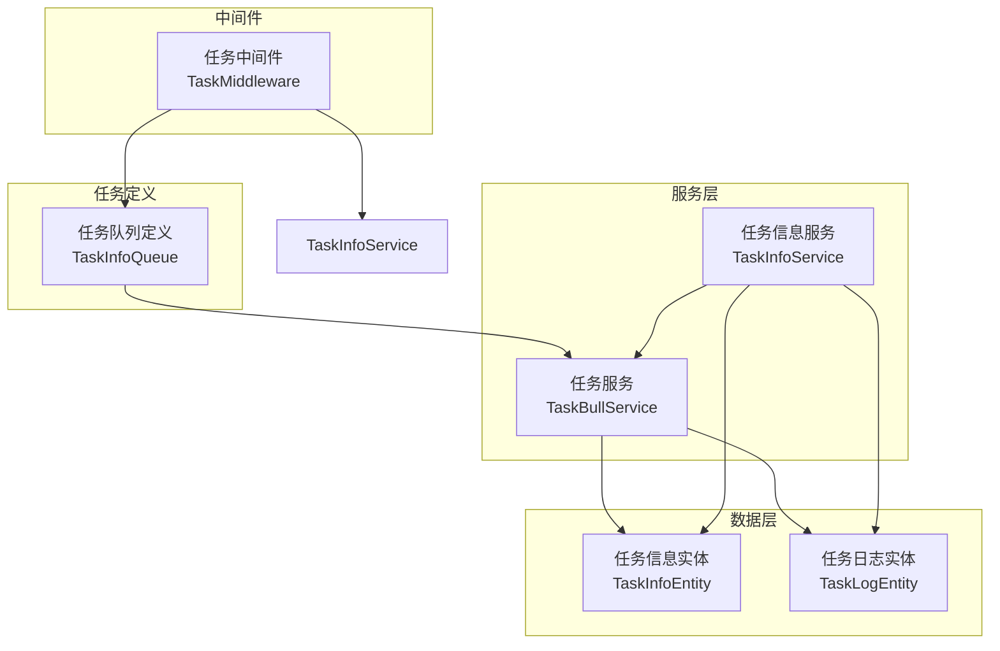
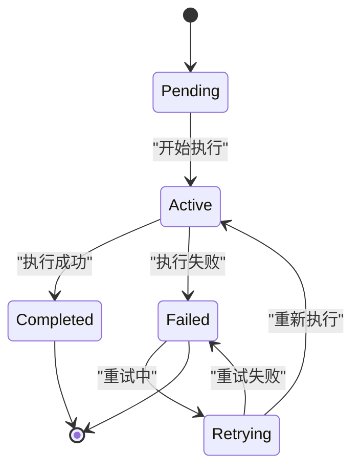
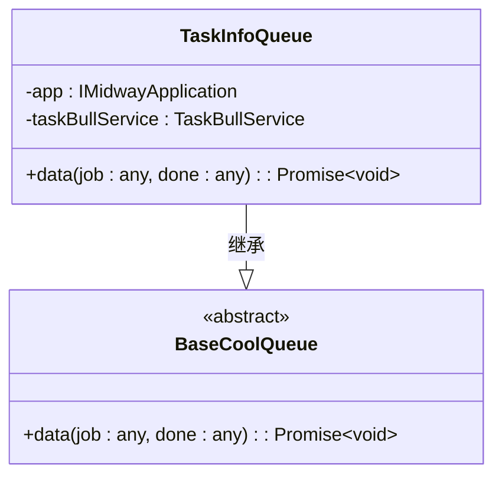
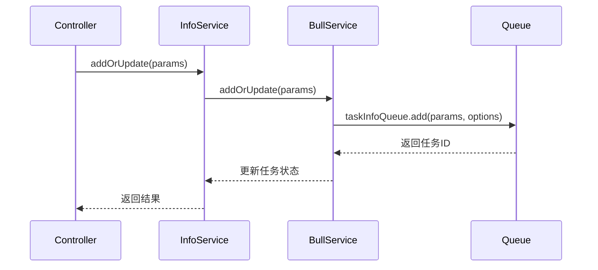
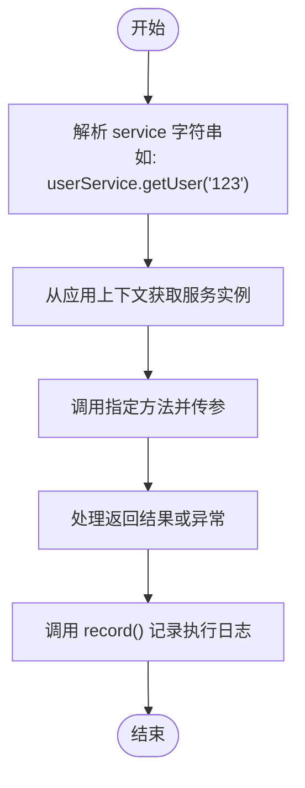
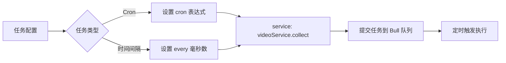
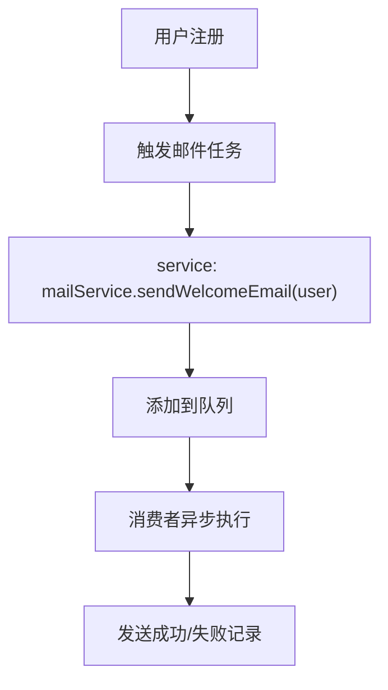
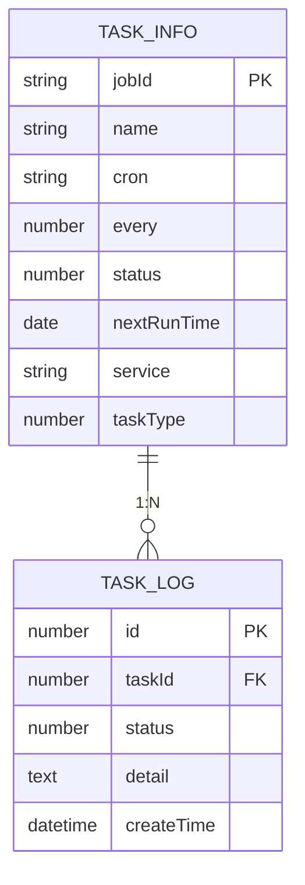
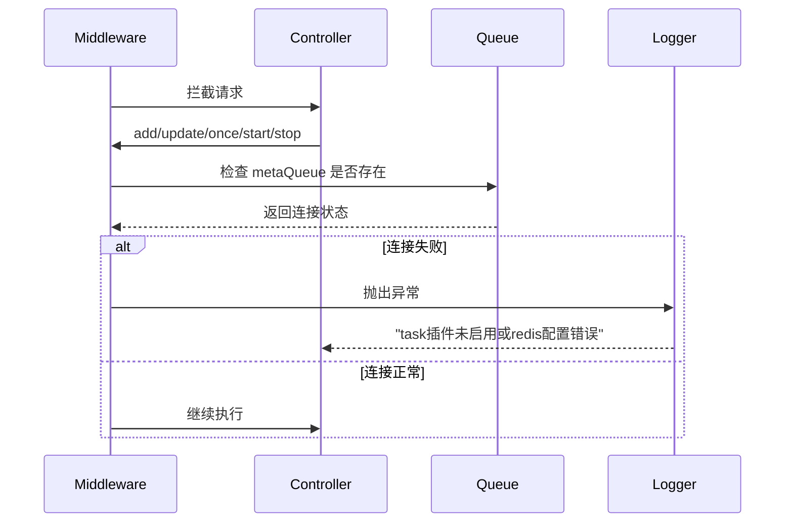

# 任务队列使用指南

<cite>
**本文档引用文件**  
- [task.ts](file://src/modules/task/queue/task.ts)
- [bull.ts](file://src/modules/task/service/bull.ts)
- [info.ts](file://src/modules/task/service/info.ts)
- [info.ts](file://src/modules/task/entity/info.ts)
- [log.ts](file://src/modules/task/entity/log.ts)
- [task.ts](file://src/modules/task/middleware/task.ts)
- [comm.ts](file://src/modules/demo/queue/comm.ts)
- [getter.ts](file://src/modules/demo/queue/getter.ts)
- [queue.ts](file://src/modules/demo/controller/open/queue.ts)
</cite>

## 目录
1. [简介](#简介)
2. [任务模块架构](#任务模块架构)
3. [Bull 队列工作原理](#bull-队列工作原理)
4. [任务处理器定义与消费者配置](#任务处理器定义与消费者配置)
5. [任务发布与服务调用](#任务发布与服务调用)
6. [实际用例实现](#实际用例实现)
7. [任务状态管理与日志记录](#任务状态管理与日志记录)
8. [队列监控与异常处理](#队列监控与异常处理)
9. [队列配置调整](#队列配置调整)
10. [高可用部署策略](#高可用部署策略)

## 简介
本指南详细介绍基于 Bull 的任务队列系统在 cool-admin-midway 框架中的集成与使用方法。涵盖任务定义、状态管理、执行日志、队列配置及高可用部署等核心内容，帮助开发者高效实现异步任务处理。

## 任务模块架构



**Diagram sources**  
- [task.ts](file://src/modules/task/queue/task.ts)
- [bull.ts](file://src/modules/task/service/bull.ts)
- [info.ts](file://src/modules/task/service/info.ts)
- [info.ts](file://src/modules/task/entity/info.ts)
- [log.ts](file://src/modules/task/entity/log.ts)
- [task.ts](file://src/modules/task/middleware/task.ts)

**Section sources**  
- [task.ts](file://src/modules/task/queue/task.ts#L1-L30)
- [bull.ts](file://src/modules/task/service/bull.ts#L1-L50)
- [info.ts](file://src/modules/task/service/info.ts#L1-L70)

## Bull 队列工作原理

### 基于 Redis 的优先级队列
Bull 队列基于 Redis 实现，利用其高性能特性支持高并发任务处理。通过 `@CoolQueue()` 装饰器定义队列，底层使用 Redis 的 List 结构存储任务，确保任务的有序执行。

### 延迟任务
通过配置 `delay` 参数可实现延迟执行。Bull 使用 Redis 的 ZSet（有序集合）来管理延迟任务，按执行时间排序，由后台进程轮询触发。

### 重试机制与失败处理
Bull 内置重试机制，默认最多重试 5 次。当任务抛出异常时，系统自动记录失败日志并根据配置进行重试。`TaskBullService.record()` 方法用于记录任务执行结果，区分成功与失败状态。



**Diagram sources**  
- [task.ts](file://src/modules/task/queue/task.ts#L15-L28)
- [bull.ts](file://src/modules/task/service/bull.ts#L150-L170)

**Section sources**  
- [task.ts](file://src/modules/task/queue/task.ts#L15-L28)
- [bull.ts](file://src/modules/task/service/bull.ts#L150-L170)

## 任务处理器定义与消费者配置

### 定义任务处理器
通过继承 `BaseCoolQueue` 并使用 `@CoolQueue()` 装饰器定义任务处理器：



**Diagram sources**  
- [task.ts](file://src/modules/task/queue/task.ts#L8-L30)

**Section sources**  
- [task.ts](file://src/modules/task/queue/task.ts#L8-L30)

### 不同类型队列配置
- **普通队列**：`@CoolQueue()` 默认类型，适用于常规异步任务
- **主动消费队列**：`@CoolQueue({ type: 'getter' })`，需主动获取任务数据
- **单例队列**：`@CoolQueue({ type: 'single' })`，集群模式下保证唯一消费者

**Section sources**  
- [comm.ts](file://src/modules/demo/queue/comm.ts#L8-L19)
- [getter.ts](file://src/modules/demo/queue/getter.ts#L5-L6)
- [single.ts](file://src/modules/demo/queue/single.ts#L8-L19)

## 任务发布与服务调用

### 通过 Service 层发布任务
`TaskBullService` 提供统一接口发布任务，支持新增、修改、删除、启动、停止等操作：



**Diagram sources**  
- [info.ts](file://src/modules/task/service/info.ts#L67-L127)
- [bull.ts](file://src/modules/task/service/bull.ts#L90-L140)

**Section sources**  
- [info.ts](file://src/modules/task/service/info.ts#L67-L127)
- [bull.ts](file://src/modules/task/service/bull.ts#L90-L140)

### 动态调用服务方法
`invokeService()` 方法支持动态调用任意服务方法，通过字符串格式 `serviceName.methodName(param)` 实现：



**Diagram sources**  
- [bull.ts](file://src/modules/task/service/bull.ts#L300-L340)

**Section sources**  
- [bull.ts](file://src/modules/task/service/bull.ts#L300-L340)

## 实际用例实现

### 视频采集任务
通过配置 `service` 字段调用视频采集服务，设置定时 cron 表达式或时间间隔自动执行：



### 邮件发送任务
定义邮件服务方法，通过任务队列异步发送邮件，避免阻塞主流程：



### 数据同步任务
跨系统数据同步可通过任务队列实现，支持失败重试和执行日志追踪：

```mermaid
flowchart LR
N[定时同步] --> O[调用 syncService.syncData()]
O --> P[数据转换与传输]
P --> Q{成功?}
Q --> |是| R[记录成功日志]
Q --> |否| S[记录失败日志并重试]
R --> T[更新下次执行时间]
S --> T
```

**Section sources**  
- [bull.ts](file://src/modules/task/service/bull.ts#L300-L340)
- [info.ts](file://src/modules/task/entity/info.ts#L1-L62)

## 任务状态管理与日志记录

### 任务状态管理
系统维护任务的运行状态（0-停止，1-运行），通过以下方法控制：
- `start(id)`: 启动任务
- `stop(id)`: 停止任务
- `once(id)`: 手动执行一次
- `exist(jobId)`: 检查任务是否存在

### 执行日志记录
每次任务执行都会生成日志记录，包含：
- 任务ID
- 执行状态（0-失败，1-成功）
- 详情描述（结果或错误信息）

日志保留策略由 `task.log.keepDays` 配置项控制，默认保留20天。



**Diagram sources**  
- [info.ts](file://src/modules/task/entity/info.ts#L1-L62)
- [log.ts](file://src/modules/task/entity/log.ts#L1-L18)

**Section sources**  
- [info.ts](file://src/modules/task/entity/info.ts#L1-L62)
- [log.ts](file://src/modules/task/entity/log.ts#L1-L18)
- [bull.ts](file://src/modules/task/service/bull.ts#L200-L230)

## 队列监控与异常处理

### 监控队列状态
通过 `getJobSchedulers()` 获取所有调度任务状态，包括：
- 任务名称（key）
- 下次执行时间（next）
- 重复配置（repeat）

### 查看任务进度
提供分页接口查询任务日志，支持按任务ID和状态过滤，便于追踪执行历史。

### 异常处理机制
- **中间件校验**：`TaskMiddleware` 在关键操作前检查 Redis 连接状态
- **错误捕获**：`data()` 方法中 try-catch 捕获执行异常
- **重试机制**：Bull 内置重试，结合业务逻辑实现可靠执行



**Diagram sources**  
- [task.ts](file://src/modules/task/middleware/task.ts#L1-L38)
- [task.ts](file://src/modules/task/queue/task.ts#L15-L28)

**Section sources**  
- [task.ts](file://src/modules/task/middleware/task.ts#L1-L38)
- [task.ts](file://src/modules/task/queue/task.ts#L15-L28)

## 队列配置调整

### 并发数配置
通过 Bull 队列选项可设置消费者并发数，控制同时处理的任务数量。

### 重试策略
支持自定义重试次数和延迟时间，可在 `add()` 方法的选项中配置：
- `attempts`: 最大重试次数
- `backoff`: 重试延迟策略

### 日志保留天数
通过 `@Config('task.log.keepDays')` 注解读取配置，控制日志数据清理周期。

**Section sources**  
- [bull.ts](file://src/modules/task/service/bull.ts#L45-L50)
- [config.default.ts](file://src/config/config.default.ts)

## 高可用部署策略

### 集群模式支持
- **单例队列**：`type: 'single'` 确保集群环境下仅一个实例消费
- **Redis 高可用**：依赖 Redis Sentinel 或 Cluster 模式保障消息可靠性

### 故障恢复
- **自动重连**：Bull 内置 Redis 断线重连机制
- **任务持久化**：所有任务存储在 Redis 中，重启后可恢复
- **初始化加载**：应用启动时调用 `initTask()` 恢复运行中任务

### 监控告警
建议结合外部监控系统，对以下指标进行监控：
- Redis 内存使用率
- 队列积压任务数
- 任务执行成功率
- 消费者存活状态

**Section sources**  
- [single.ts](file://src/modules/demo/queue/single.ts#L8-L19)
- [bull.ts](file://src/modules/task/service/bull.ts#L240-L260)