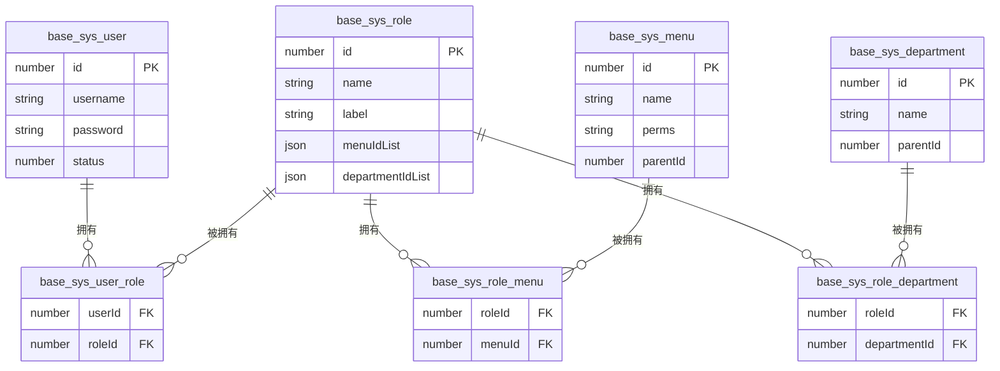
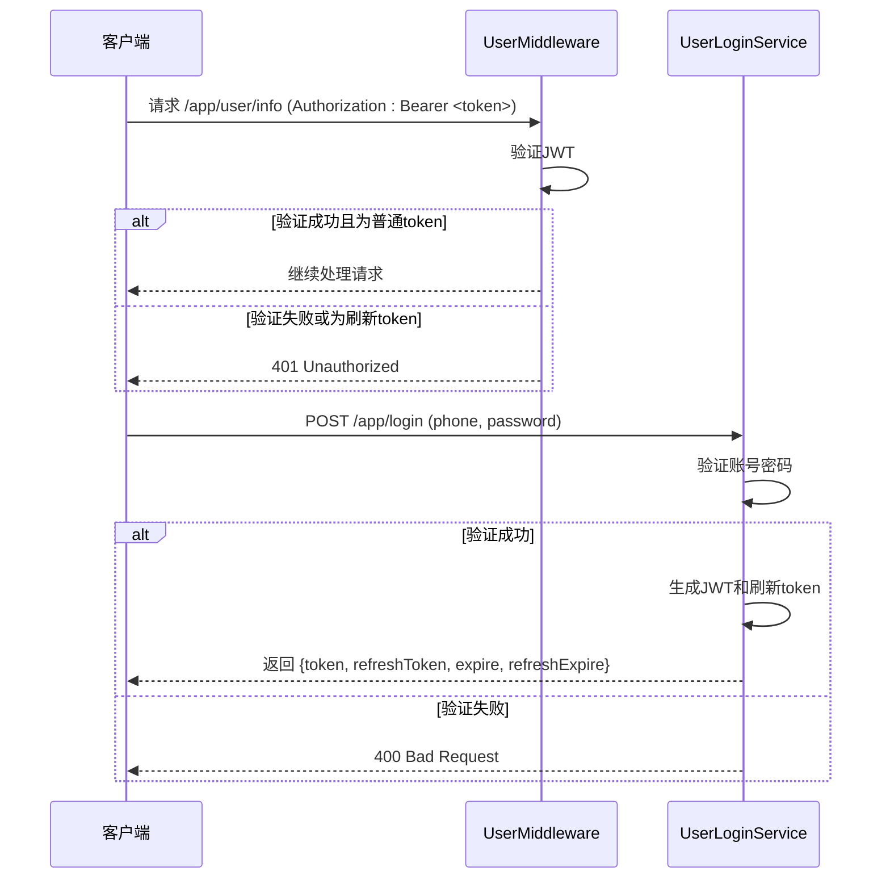
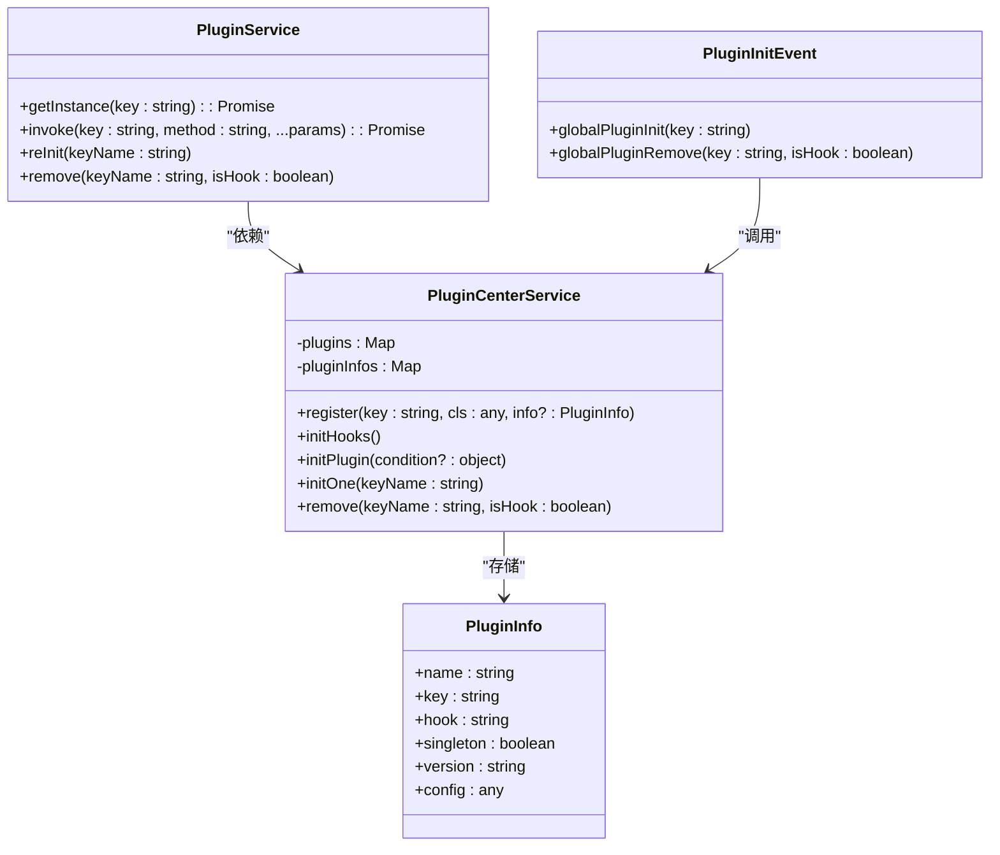

# 功能模块技术设计

<cite>
**本文档引用文件**   
- [role.ts](file://src/modules/base/entity/sys/role.ts)
- [role_menu.ts](file://src/modules/base/entity/sys/role_menu.ts)
- [role_department.ts](file://src/modules/base/entity/sys/role_department.ts)
- [user_role.ts](file://src/modules/base/entity/sys/user_role.ts)
- [perms.ts](file://src/modules/base/service/sys/perms.ts)
- [menu.ts](file://src/modules/base/service/sys/menu.ts)
- [role.ts](file://src/modules/base/service/sys/role.ts)
- [config.ts](file://src/modules/user/config.ts)
- [login.ts](file://src/modules/user/service/login.ts)
- [app.ts](file://src/modules/user/middleware/app.ts)
- [barrage.ts](file://src/modules/video/entity/barrage.ts)
- [center.ts](file://src/modules/plugin/service/center.ts)
- [info.ts](file://src/modules/plugin/service/info.ts)
- [init.ts](file://src/modules/plugin/event/init.ts)
- [interface.ts](file://src/modules/plugin/interface.ts)
- [task.ts](file://src/modules/task/queue/task.ts)
- [bull.ts](file://src/modules/task/service/bull.ts)
- [info.ts](file://src/modules/task/service/info.ts)
- [task.ts](file://src/modules/task/middleware/task.ts)
- [data.ts](file://src/modules/recycle/event/data.ts)
- [data.ts](file://src/modules/recycle/service/data.ts)
- [data.ts](file://src/modules/recycle/controller/admin/data.ts)
- [data.ts](file://src/modules/recycle/schedule/data.ts)
- [data.ts](file://src/modules/recycle/entity/data.ts)
</cite>

## 目录
1. [简介](#简介)
2. [基础模块（base）](#基础模块base)
3. [用户模块（user）](#用户模块user)
4. [视频模块（video）](#视频模块video)
5. [插件模块（plugin）](#插件模块plugin)
6. [任务模块（task）](#任务模块task)
7. [回收站模块（recycle）](#回收站模块recycle)

## 简介
本技术文档系统性地介绍 cool-admin-midway 框架中各核心功能模块的技术实现细节。文档涵盖基础管理、用户系统、视频内容、插件扩展、异步任务及数据回收等关键模块，深入解析其数据库设计、服务逻辑、权限控制与系统集成机制，为开发者提供全面的技术参考。

## 基础模块（base）

该模块实现了用户、角色、菜单、部门、日志等系统基础管理功能，其核心是基于 RBAC（基于角色的访问控制）模型的权限管理系统。

### RBAC 权限模型数据库设计
系统通过多张关联表实现精细化的权限控制：
- **用户角色关联表** (`base_sys_user_role`)：建立用户与角色的多对多关系。
- **角色菜单关联表** (`base_sys_role_menu`)：定义角色可访问的菜单权限。
- **角色部门关联表** (`base_sys_role_department`)：定义角色可管理的部门数据权限。
- **角色表** (`base_sys_role`)：存储角色基本信息，包含 `menuIdList` 和 `departmentIdList` 字段，用于直接存储权限ID列表。



**Diagram sources**
- [role.ts](file://src/modules/base/entity/sys/role.ts)
- [role_menu.ts](file://src/modules/base/entity/sys/role_menu.ts)
- [role_department.ts](file://src/modules/base/entity/sys/role_department.ts)
- [user_role.ts](file://src/modules/base/entity/sys/user_role.ts)

### 权限校验流程
权限校验流程高效且自动化，核心由 `BaseSysPermsService` 服务驱动：
1.  **权限获取**：`getPerms()` 方法通过 `roleIds` 查询 `base_sys_role_menu` 表，连接 `base_sys_menu` 表获取所有关联菜单的 `perms` 字段，合并去重后返回权限字符串数组。
2.  **菜单获取**：`getMenus()` 方法根据 `roleIds` 查询用户有权访问的菜单列表。
3.  **权限缓存**：`refreshPerms()` 方法在用户登录或权限变更后，调用上述方法获取权限和菜单，并将结果缓存至 Redis，键名为 `admin:perms:${userId}` 和 `admin:department:${userId}`。
4.  **自动刷新**：当角色 (`role.ts`) 或菜单 (`menu.ts`) 的权限信息被修改时，其 `modifyAfter` 钩子函数会自动调用 `refreshPerms()`，确保所有关联用户的权限缓存即时更新。

**Section sources**
- [perms.ts](file://src/modules/base/service/sys/perms.ts)
- [menu.ts](file://src/modules/base/service/sys/menu.ts)
- [role.ts](file://src/modules/base/service/sys/role.ts)

### 日志管理
日志功能通过中间件和定时任务实现：
- **记录**：`BaseLogMiddleware` 在每次请求后，自动调用 `BaseSysLogService.record()` 将请求的URL、参数、IP、用户ID等信息存入 `base_sys_log` 表。
- **清理**：`BaseLogJob` 定时任务每日执行，调用 `BaseSysLogService.clear()` 方法，根据 `logKeep` 配置项的值（通过 `base_sys_conf` 表存储）删除过期日志。

**Section sources**
- [log.ts](file://src/modules/base/middleware/log.ts)
- [log.ts](file://src/modules/base/service/sys/log.ts)
- [log.ts](file://src/modules/base/job/log.ts)

## 用户模块（user）

该模块负责用户登录、收藏、点赞、地址簿等用户中心功能。

### JWT 登录认证
系统采用 JWT（JSON Web Token）实现无状态认证。
- **配置**：在 `config.ts` 中配置 JWT 的 `secret`、`expire`（token过期时间）和 `refreshExpire`（刷新token过期时间）。
- **中间件**：`UserMiddleware` 是全局中间件，对 `/app/` 开头的请求进行拦截。它从请求头 `Authorization` 中提取 token，使用 `jwt.verify()` 进行验证。若验证失败或 token 类型为刷新token（`isRefresh` 为 true），则拒绝请求。
- **登录流程**：`UserLoginService` 的 `password()` 方法验证手机号和密码，成功后调用 `token()` 方法生成包含用户ID的 JWT。`token()` 方法会同时生成一个普通 token 和一个刷新 token。
- **刷新机制**：`refreshToken()` 方法验证刷新 token 的有效性，并为用户重新生成一对新的 token。



**Diagram sources**
- [config.ts](file://src/modules/user/config.ts)
- [app.ts](file://src/modules/user/middleware/app.ts)
- [login.ts](file://src/modules/user/service/login.ts)

### 收藏、点赞与地址簿
- **数据结构**：`LikeEntity`、`CollectEntity` 和 `UserAddressEntity` 分别定义了点赞、收藏和地址的数据模型。地址表 (`user_address`) 包含省市区、详细地址和 `isDefault` 字段。
- **业务逻辑**：`UserAddressService` 的 `modifyAfter()` 方法确保当用户设置一个新地址为默认地址时，该用户其他所有地址的 `isDefault` 字段都会被置为 `false`，保证了唯一性。

**Section sources**
- [like.ts](file://src/modules/user/entity/like.ts)
- [address.ts](file://src/modules/user/entity/address.ts)
- [address.ts](file://src/modules/user/service/address.ts)

## 视频模块（video）

该模块提供视频内容的全生命周期管理。

### 视频管理与播放线路
- **数据模型**：`VideoEntity` 存储视频基本信息。`VideoLineEntity` 代表一个视频资源（如一个剧集），与 `VideoEntity` 是一对多关系。`PlayLineEntity` 代表具体的播放文件（如不同清晰度的链接），与 `VideoLineEntity` 是一对多关系。
- **播放线路**：`AppPlayLineController` 和 `AdminPlayLineController` 提供对 `PlayLineEntity` 的增删改查。`VideoLineService` 负责处理播放线路的业务逻辑。

### 专辑与分类
- **专辑**：`AlbumEntity` 代表一个视频专辑（如电视剧）。`VideoAlbumRelationship` 是专辑与视频的多对多关联表。
- **分类**：`CategoryEntity` 定义视频分类。`CategoryService` 提供分类管理服务。

### 弹幕系统
- **数据结构**：`BarrageEntity` 表存储弹幕数据，包含 `video_id`（关联视频）、`content`（弹幕内容）、`relative_time`（发送时的视频时间点）、`color`、`size` 和 `type`（弹幕类型）等字段。
- **接口**：`AdminBarrageController` 提供了弹幕的管理接口，通过 `CoolController` 装饰器快速生成。

**Section sources**
- [barrage.ts](file://src/modules/video/entity/barrage.ts)
- [play_line.ts](file://src/modules/video/entity/play_line.ts)
- [video_line.ts](file://src/modules/video/entity/video_line.ts)
- [album.ts](file://src/modules/video/entity/album.ts)
- [category.ts](file://src/modules/video/entity/category.ts)

## 插件模块（plugin）

该模块实现了灵活的插件注册与钩子系统。

### 插件注册机制
- **核心服务**：`PluginCenterService` 是插件系统的核心，其 `plugins` 和 `pluginInfos` Map 存储了所有已注册插件的实例和信息。
- **注册流程**：`register()` 方法根据插件配置的 `singleton` 字段决定是注册为单例还是普通类。`initHooks()` 方法扫描 `modules/plugin/hooks` 目录下的子目录，动态注册钩子插件。
- **初始化**：`initPlugin()` 方法从数据库 `plugin_info` 表中查询已启用的插件，加载其代码并调用 `register()` 进行注册。

### 钩子系统（上传钩子）
- **事件驱动**：系统定义了 `GLOBAL_EVENT_PLUGIN_INIT` 和 `GLOBAL_EVENT_PLUGIN_REMOVE` 全局事件。
- **事件监听**：`PluginInitEvent` 监听这两个事件，当事件触发时，调用 `pluginCenterService` 的 `initOne()` 或 `remove()` 方法来启动或移除插件。
- **调用方式**：通过 `PluginService.invoke()` 方法，可以动态调用已注册插件的任意方法，实现功能扩展。



**Diagram sources**
- [center.ts](file://src/modules/plugin/service/center.ts)
- [info.ts](file://src/modules/plugin/service/info.ts)
- [init.ts](file://src/modules/plugin/event/init.ts)
- [interface.ts](file://src/modules/plugin/interface.ts)

## 任务模块（task）

该模块基于 Bull 实现异步任务队列与定时任务调度。

### 异步任务队列
- **队列实现**：`TaskInfoQueue` 继承自 `BaseCoolQueue`，其 `data()` 方法是任务执行的核心。它会调用 `TaskBullService.invokeService()` 来执行具体的业务服务，并记录执行结果和日志。
- **任务调度**：`TaskBullService` 负责与 Bull 队列交互，提供 `start()`、`stop()`、`once()` 等方法来控制任务的运行。`addOrUpdate()` 方法用于创建或更新任务，会根据任务的 cron 表达式将其添加到调度器中。
- **类型切换**：`TaskInfoService` 在初始化时通过检查 `CoolQueueHandle` 是否存在来判断 `type` 是 'bull' 还是 'local'，实现了无缝切换。

### 定时任务
- **中间件**：`TaskMiddleware` 在执行 `add`、`update` 等操作前，会检查 `type` 是否为 'bull' 以及队列是否可用，确保操作的安全性。
- **日志**：任务执行日志存储在 `task_log` 表中，`TaskInfoService.log()` 方法提供分页查询。

**Section sources**
- [task.ts](file://src/modules/task/queue/task.ts)
- [bull.ts](file://src/modules/task/service/bull.ts)
- [info.ts](file://src/modules/task/service/info.ts)
- [task.ts](file://src/modules/task/middleware/task.ts)

## 回收站模块（recycle）

该模块实现了数据的软删除与恢复机制。

### 软删除与数据恢复
- **事件监听**：`RecycleDataEvent` 监听框架的 `EVENT.SOFT_DELETE` 事件。当任何实体被软删除时，该事件被触发。
- **数据记录**：`RecycleDataService.record()` 方法捕获删除事件，将被删除的数据（`data`）、实体信息（`entityInfo`）、操作人（`userId`）、请求URL和参数等信息，序列化后存入 `recycle_data` 表。
- **数据恢复**：`AdminRecycleDataController` 提供 `restore` 接口。`RecycleDataService.restore()` 方法根据 `ids` 从 `recycle_data` 表中查出原始数据，通过 `typeORMDataSourceManager` 获取对应的数据源和实体仓库，调用 `save()` 方法将数据重新插入原表，最后删除回收站中的记录。

### 定时清理
- **定时任务**：`BaseRecycleSchedule` 定义了一个每日执行的定时任务 `exec()`。
- **清理逻辑**：`RecycleDataService.clear()` 方法会查询 `base_sys_conf` 表获取 `recycleKeep` 配置（保留天数），然后删除 `createTime` 早于指定天数的所有回收站数据。

```mermaid
flowchart TD
A[实体被软删除] --> B[触发 EVENT.SOFT_DELETE 事件]
B --> C[RecycleDataEvent 监听到事件]
C --> D[调用 RecycleDataService.record()]
D --> E[将数据存入 recycle_data 表]
F[用户请求恢复数据] --> G[调用 AdminRecycleDataController.restore()]
G --> H[调用 RecycleDataService.restore()]
H --> I[从 recycle_data 表读取数据]
I --> J[通过 TypeORM 重新插入原表]
J --> K[删除 recycle_data 表中的记录]
L[每日定时任务触发] --> M[调用 BaseRecycleSchedule.exec()]
M --> N[调用 RecycleDataService.clear()]
N --> O[根据 recycleKeep 配置删除过期数据]
```

**Diagram sources**
- [data.ts](file://src/modules/recycle/event/data.ts)
- [data.ts](file://src/modules/recycle/service/data.ts)
- [data.ts](file://src/modules/recycle/controller/admin/data.ts)
- [data.ts](file://src/modules/recycle/schedule/data.ts)
- [data.ts](file://src/modules/recycle/entity/data.ts)