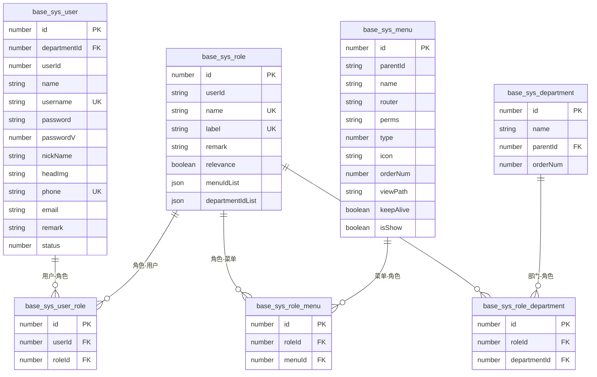
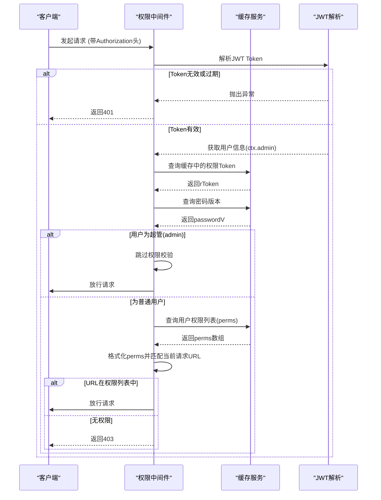
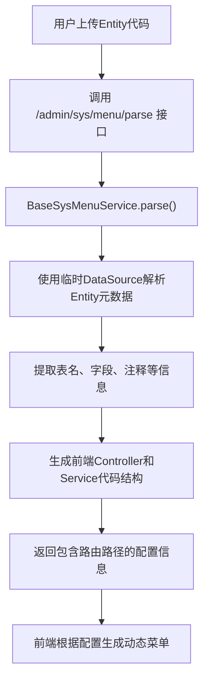
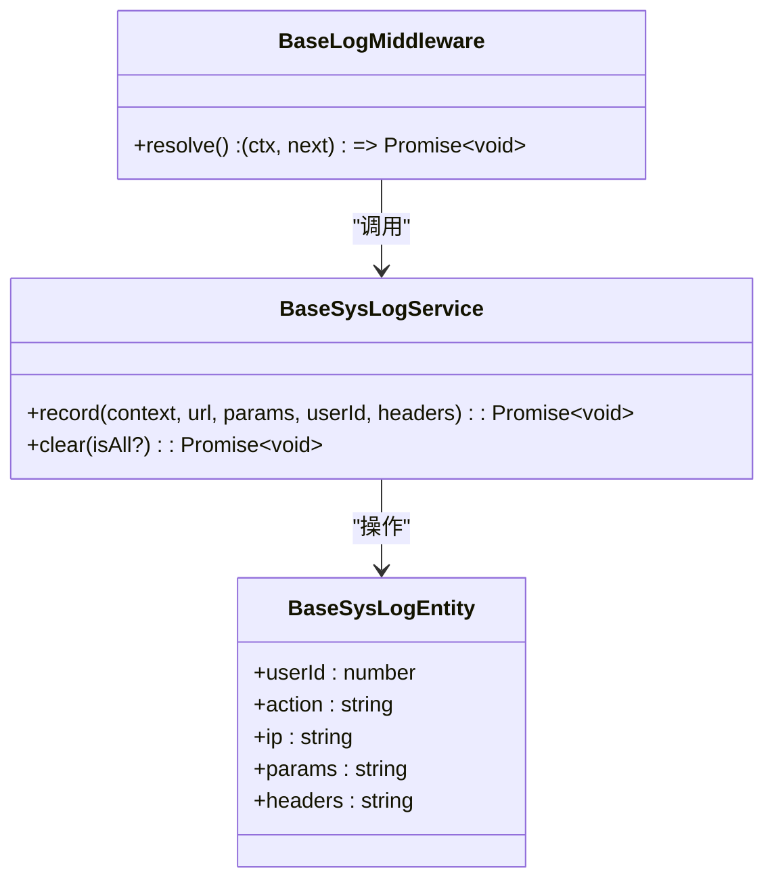
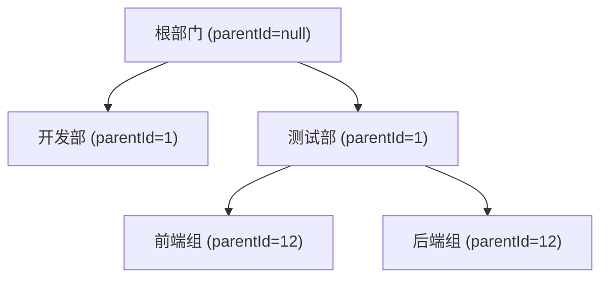

# 基础模块（base）

<cite>
**本文档引用文件**  
- [user.ts](file://src/modules/base/entity/sys/user.ts)
- [role.ts](file://src/modules/base/entity/sys/role.ts)
- [menu.ts](file://src/modules/base/entity/sys/menu.ts)
- [role_menu.ts](file://src/modules/base/entity/sys/role_menu.ts)
- [user_role.ts](file://src/modules/base/entity/sys/user_role.ts)
- [department.ts](file://src/modules/base/entity/sys/department.ts)
- [param.ts](file://src/modules/base/entity/sys/param.ts)
- [conf.ts](file://src/modules/base/entity/sys/conf.ts)
- [log.ts](file://src/modules/base/entity/sys/log.ts)
- [authority.ts](file://src/modules/base/middleware/authority.ts)
- [menu.ts](file://src/modules/base/service/sys/menu.ts)
- [perms.ts](file://src/modules/base/service/sys/perms.ts)
- [log.ts](file://src/modules/base/service/sys/log.ts)
- [department.ts](file://src/modules/base/service/sys/department.ts)
- [config.ts](file://src/modules/base/config.ts)
</cite>

## 目录
1. [简介](#简介)
2. [核心数据模型与RBAC权限设计](#核心数据模型与rbac权限设计)
3. [权限校验流程分析](#权限校验流程分析)
4. [菜单动态生成机制](#菜单动态生成机制)
5. [系统日志记录机制](#系统日志记录机制)
6. [部门树形结构管理](#部门树形结构管理)
7. [典型CRUD操作实现模式](#典型crud操作实现模式)
8. [管理员用户管理接口调用示例](#管理员用户管理接口调用示例)

## 简介
`base` 模块是 Cool Admin 后台管理系统的核心权限管理模块，提供用户、角色、菜单、部门、系统参数、操作日志等基础功能。该模块基于 Midway 框架构建，采用 TypeORM 进行数据库操作，实现了完整的 RBAC（基于角色的访问控制）权限模型，并通过 JWT 和缓存机制保障系统的安全性和高性能。

**本文档引用文件**  
- [config.ts](file://src/modules/base/config.ts)

## 核心数据模型与RBAC权限设计

### 数据库实体关系
`base` 模块通过多个实体类定义了用户、角色、菜单、部门等核心数据结构，并通过中间表建立多对多关系，形成完整的 RBAC 权限体系。



**Diagram sources**
- [user.ts](file://src/modules/base/entity/sys/user.ts)
- [role.ts](file://src/modules/base/entity/sys/role.ts)
- [menu.ts](file://src/modules/base/entity/sys/menu.ts)
- [department.ts](file://src/modules/base/entity/sys/department.ts)
- [user_role.ts](file://src/modules/base/entity/sys/user_role.ts)
- [role_menu.ts](file://src/modules/base/entity/sys/role_menu.ts)

### 核心实体说明

#### 用户实体 (BaseSysUserEntity)
定义系统用户的基本信息和状态。

**Section sources**
- [user.ts](file://src/modules/base/entity/sys/user.ts)

#### 角色实体 (BaseSysRoleEntity)
定义角色的名称、标签、备注以及数据权限关联规则。

**Section sources**
- [role.ts](file://src/modules/base/entity/sys/role.ts)

#### 菜单实体 (BaseSysMenuEntity)
定义前端路由菜单的结构，包括名称、路径、权限标识、图标等。

**Section sources**
- [menu.ts](file://src/modules/base/entity/sys/menu.ts)

#### 多对多关系表
- **用户-角色 (base_sys_user_role)**: 建立用户与角色的多对多关系。
- **角色-菜单 (base_sys_role_menu)**: 建立角色与菜单的多对多关系，实现权限分配。
- **角色-部门 (base_sys_role_department)**: 建立角色与部门的多对多关系，用于数据权限控制。

**Section sources**
- [user_role.ts](file://src/modules/base/entity/sys/user_role.ts)
- [role_menu.ts](file://src/modules/base/entity/sys/role_menu.ts)

## 权限校验流程分析

### 权限校验中间件 (BaseAuthorityMiddleware)
`authority.ts` 是核心的权限校验中间件，负责在请求到达业务逻辑前进行身份和权限验证。



**Diagram sources**
- [authority.ts](file://src/modules/base/middleware/authority.ts)

### 权限校验关键逻辑
1.  **JWT解析**: 使用 `jsonwebtoken` 库解析 `Authorization` 头中的 Token，获取用户信息。
2.  **缓存校验**: 检查 `admin:token:${userId}` 缓存，确保 Token 未被注销（单点登录场景）。
3.  **密码版本校验**: 检查 `admin:passwordVersion:${userId}` 缓存，确保用户密码未被修改，防止旧 Token 继续使用。
4.  **权限匹配**: 从 `admin:perms:${userId}` 缓存中获取用户的权限标识列表，并与当前请求的路由进行匹配。
5.  **特殊路径放行**: 对 `/admin/comm/` 和 `/admin/dict/info/data` 等公共接口放行。

**Section sources**
- [authority.ts](file://src/modules/base/middleware/authority.ts)
- [config.ts](file://src/modules/base/config.ts)

## 菜单动态生成机制

### 基于Entity的前端路由生成
系统提供了一套自动化方案，通过解析后端的 TypeORM Entity 类，自动生成前端所需的路由和菜单配置。



**Diagram sources**
- [menu.ts](file://src/modules/base/controller/admin/sys/menu.ts)
- [menu.ts](file://src/modules/base/service/sys/menu.ts)

### 实现原理
1.  **代码解析**: `BaseSysMenuService.parse()` 方法接收 Entity 的字符串代码和 Controller 模板。
2.  **元数据提取**: 利用 TypeORM 的 `DataSource` 和 `getMetadata()` 方法，在内存中解析 Entity 的表名、字段、类型等信息。
3.  **代码生成**: 结合提取的元数据和预设模板，生成完整的 Controller 和 Service 代码。
4.  **路由映射**: 自动生成的 Controller 会注册 RESTful API 路由，如 `/admin/${module}/${fileName}/add`。

**Section sources**
- [menu.ts](file://src/modules/base/service/sys/menu.ts)
- [menu.ts](file://src/modules/base/controller/admin/sys/menu.ts)

## 系统日志记录机制

### 日志实体与服务
`BaseSysLogEntity` 定义了操作日志的结构，`BaseSysLogService` 提供了日志记录和清理功能。



**Diagram sources**
- [log.ts](file://src/modules/base/entity/sys/log.ts)
- [log.ts](file://src/modules/base/service/sys/log.ts)
- [log.ts](file://src/modules/base/middleware/log.ts)

### 日志工作流程
1.  **中间件拦截**: `BaseLogMiddleware` 在全局中间件中注册，拦截所有请求。
2.  **自动记录**: 在 `next()` 执行前，调用 `BaseSysLogService.record()` 方法，将请求的 URL、参数、用户ID、IP地址等信息写入数据库。
3.  **定时清理**: 通过 `@midwayjs/cron` 定义的 `BaseLogJob` 定时任务，每天执行一次日志清理。
4.  **配置化保留**: 保留天数由 `base_sys_conf` 表中的 `logKeep` 配置项决定，可通过 `/admin/sys/log/setKeep` 接口动态修改。

**Section sources**
- [log.ts](file://src/modules/base/service/sys/log.ts)
- [log.ts](file://src/modules/base/middleware/log.ts)
- [log.ts](file://src/modules/base/job/log.ts)

## 部门树形结构管理

### 部门实体与服务
`BaseSysDepartmentEntity` 通过 `parentId` 字段实现树形结构，`BaseSysDepartmentService` 提供了树形数据的查询和排序功能。



**Diagram sources**
- [department.ts](file://src/modules/base/entity/sys/department.ts)

### 核心功能
- **树形查询**: `list()` 方法通过递归或数据库查询构建完整的部门树。
- **拖拽排序**: `order()` 方法接收前端传来的排序参数，批量更新 `orderNum` 字段。
- **级联删除**: 删除部门时，可选择是否同时删除该部门下的所有用户，或将其用户转移至顶级部门。

**Section sources**
- [department.ts](file://src/modules/base/service/sys/department.ts)

## 典型CRUD操作实现模式

### 基于装饰器的自动化CRUD
系统通过 `@CoolController` 装饰器，声明式地为实体类生成标准的增删改查接口。

```typescript
@CoolController({
  api: ['add', 'delete', 'update', 'info', 'list', 'page'],
  entity: BaseSysUserEntity,
  service: BaseSysUserService,
  insertParam: ctx => ({ createUserId: ctx.admin.userId }),
  pageQueryOp: { fieldEq: ['status'], keyWordLikeFields: ['username', 'name'] }
})
export class BaseSysUserController extends BaseController {}
```

此配置会自动生成以下6个RESTful API：
- `POST /admin/sys/user/add` - 新增用户
- `POST /admin/sys/user/delete` - 删除用户
- `POST /admin/sys/user/update` - 更新用户
- `GET /admin/sys/user/info` - 获取用户信息
- `POST /admin/sys/user/list` - 获取用户列表
- `POST /admin/sys/user/page` - 分页查询用户

**Section sources**
- [user.ts](file://src/modules/base/controller/admin/sys/user.ts)

## 管理员用户管理接口调用示例

### 获取用户分页列表
**请求**
```http
POST /admin/sys/user/page
Authorization: Bearer <your_token>
Content-Type: application/json

{
  "page": 1,
  "size": 10,
  "username": "张三",
  "status": 1
}
```

**响应**
```json
{
  "code": 200,
  "data": {
    "records": [
      {
        "id": 1001,
        "username": "zhangsan",
        "name": "张三",
        "status": 1,
        "createTime": "2023-10-01T10:00:00.000Z"
      }
    ],
    "total": 1,
    "size": 10,
    "current": 1,
    "pages": 1
  },
  "msg": "成功"
}
```

**Section sources**
- [user.ts](file://src/modules/base/controller/admin/sys/user.ts)