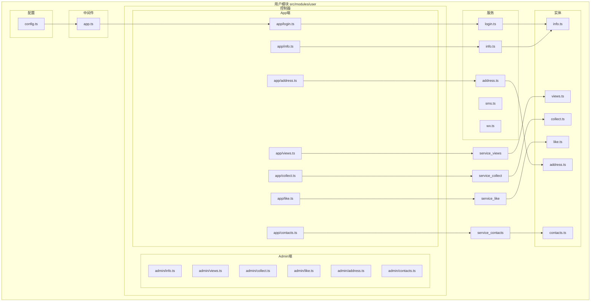
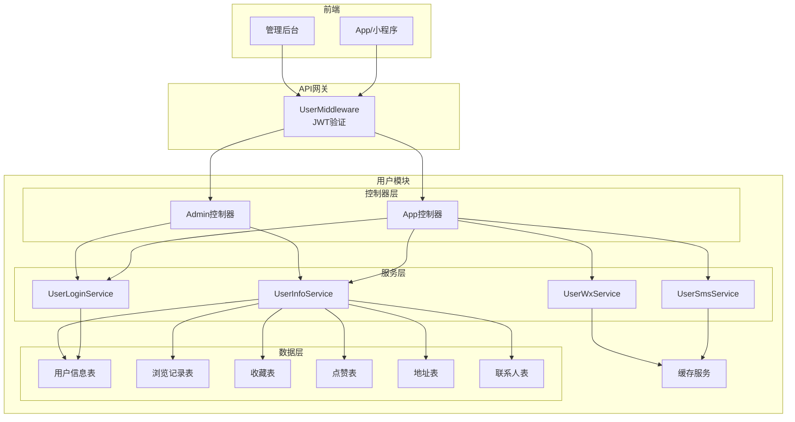
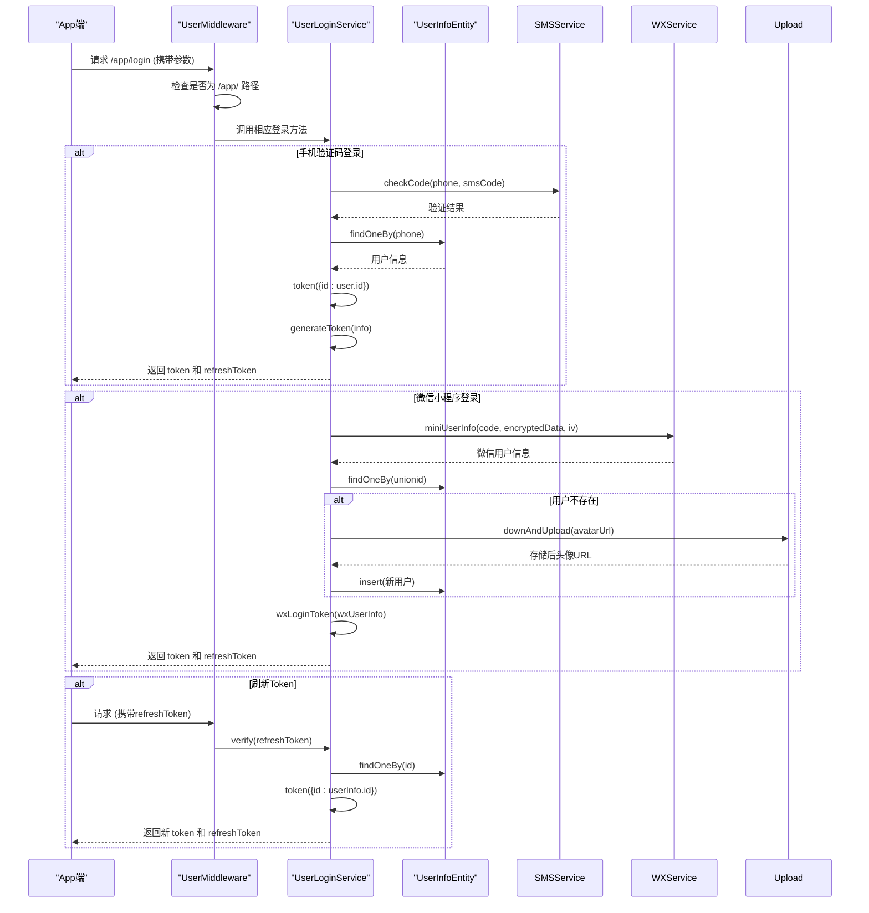
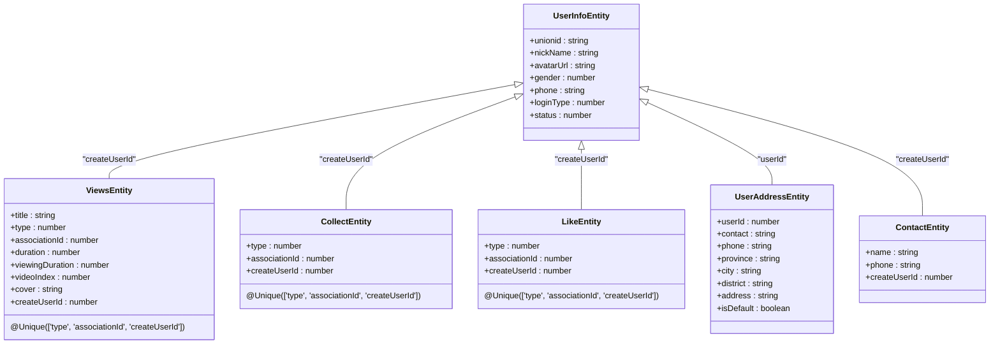
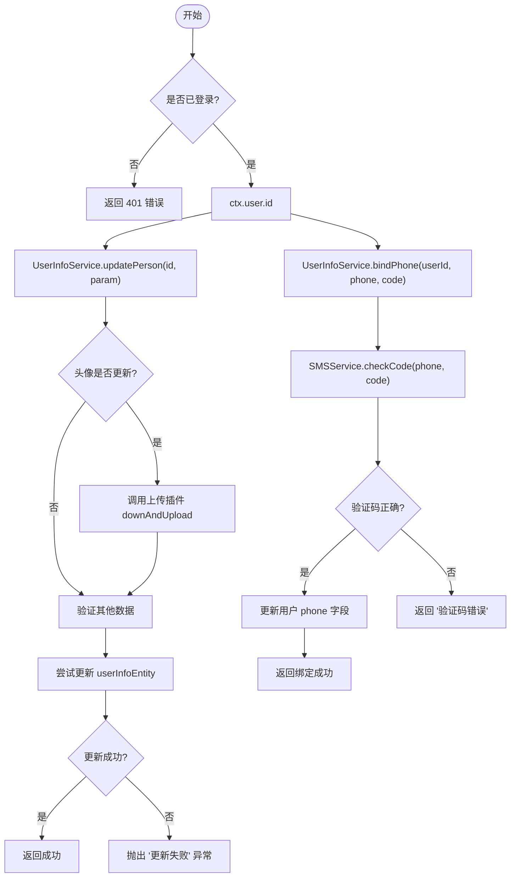

# 用户模块（user）

<cite>
**本文档引用文件**  
- [config.ts](file://src/modules/user/config.ts)
- [login.ts](file://src/modules/user/service/login.ts)
- [info.ts](file://src/modules/user/service/info.ts)
- [sms.ts](file://src/modules/user/service/sms.ts)
- [wx.ts](file://src/modules/user/service/wx.ts)
- [middleware/app.ts](file://src/modules/user/middleware/app.ts)
- [entity/info.ts](file://src/modules/user/entity/info.ts)
- [entity/views.ts](file://src/modules/user/entity/views.ts)
- [entity/collect.ts](file://src/modules/user/entity/collect.ts)
- [entity/like.ts](file://src/modules/user/entity/like.ts)
- [entity/address.ts](file://src/modules/user/entity/address.ts)
- [entity/contacts.ts](file://src/modules/user/entity/contacts.ts)
- [controller/app/login.ts](file://src/modules/user/controller/app/login.ts)
- [controller/app/info.ts](file://src/modules/user/controller/app/info.ts)
- [controller/app/views.ts](file://src/modules/user/controller/app/views.ts)
- [controller/app/collect.ts](file://src/modules/user/controller/app/collect.ts)
- [controller/app/like.ts](file://src/modules/user/controller/app/like.ts)
- [controller/app/address.ts](file://src/modules/user/controller/app/address.ts)
- [controller/app/contacts.ts](file://src/modules/user/controller/app/contacts.ts)
- [controller/admin/info.ts](file://src/modules/user/controller/admin/info.ts)
- [controller/admin/views.ts](file://src/modules/user/controller/admin/views.ts)
- [controller/admin/collect.ts](file://src/modules/user/controller/admin/collect.ts)
- [controller/admin/like.ts](file://src/modules/user/controller/admin/like.ts)
- [controller/admin/address.ts](file://src/modules/user/controller/admin/address.ts)
- [controller/admin/contacts.ts](file://src/modules/user/controller/admin/contacts.ts)
</cite>

## 目录
1. [简介](#简介)
2. [项目结构](#项目结构)
3. [核心组件](#核心组件)
4. [架构概览](#架构概览)
5. [详细组件分析](#详细组件分析)
6. [依赖分析](#依赖分析)
7. [性能考虑](#性能考虑)
8. [故障排除指南](#故障排除指南)
9. [结论](#结论)

## 简介
本技术文档全面介绍 Cool Admin Midway 框架中用户模块（user）的技术设计与实现细节。该模块专注于支持 APP、小程序、公众号等多端用户场景，提供完整的用户中心功能体系。文档重点阐述用户信息管理、基于 JWT 的登录认证机制、收藏与点赞功能、地址簿管理、手机联系人同步以及用户行为数据（如浏览记录）的采集与存储策略。同时，详细说明了 app 端与 admin 端接口的分离设计原则，并深入分析了登录流程中 JWT 令牌的生成、验证与刷新机制，以及用户资料更新、手机号验证（SMS）、第三方登录（如微信）等关键业务流程的实现方式。

## 项目结构



**图示来源**
- [config.ts](file://src/modules/user/config.ts)
- [middleware/app.ts](file://src/modules/user/middleware/app.ts)
- [controller/app/login.ts](file://src/modules/user/controller/app/login.ts)
- [controller/app/info.ts](file://src/modules/user/controller/app/info.ts)
- [controller/app/views.ts](file://src/modules/user/controller/app/views.ts)
- [controller/app/collect.ts](file://src/modules/user/controller/app/collect.ts)
- [controller/app/like.ts](file://src/modules/user/controller/app/like.ts)
- [controller/app/address.ts](file://src/modules/user/controller/app/address.ts)
- [controller/app/contacts.ts](file://src/modules/user/controller/app/contacts.ts)
- [service/login.ts](file://src/modules/user/service/login.ts)
- [service/info.ts](file://src/modules/user/service/info.ts)
- [service/address.ts](file://src/modules/user/service/address.ts)
- [entity/info.ts](file://src/modules/user/entity/info.ts)
- [entity/views.ts](file://src/modules/user/entity/views.ts)
- [entity/collect.ts](file://src/modules/user/entity/collect.ts)
- [entity/like.ts](file://src/modules/user/entity/like.ts)
- [entity/address.ts](file://src/modules/user/entity/address.ts)
- [entity/contacts.ts](file://src/modules/user/entity/contacts.ts)

**本节来源**
- [config.ts](file://src/modules/user/config.ts)
- [middleware/app.ts](file://src/modules/user/middleware/app.ts)

## 核心组件

本模块的核心组件包括用户登录服务（`UserLoginService`）、用户信息服务（`UserInfoService`）、短信服务（`UserSmsService`）以及微信服务（`UserWxService`）。这些服务分别处理用户认证、信息管理、短信验证码和第三方登录等核心业务逻辑。数据模型通过 TypeORM 实体类（如 `UserInfoEntity`, `ViewsEntity`）定义，控制器（Controller）则根据 app 端和 admin 端进行分离，确保接口职责清晰。全局中间件 `UserMiddleware` 负责 JWT 令牌的验证，是保障接口安全的关键组件。

**本节来源**
- [service/login.ts](file://src/modules/user/service/login.ts)
- [service/info.ts](file://src/modules/user/service/info.ts)
- [service/sms.ts](file://src/modules/user/service/sms.ts)
- [service/wx.ts](file://src/modules/user/service/wx.ts)
- [entity/info.ts](file://src/modules/user/entity/info.ts)
- [entity/views.ts](file://src/modules/user/entity/views.ts)
- [middleware/app.ts](file://src/modules/user/middleware/app.ts)

## 架构概览



**图示来源**
- [middleware/app.ts](file://src/modules/user/middleware/app.ts)
- [controller/app/login.ts](file://src/modules/user/controller/app/login.ts)
- [controller/app/info.ts](file://src/modules/user/controller/app/info.ts)
- [controller/admin/info.ts](file://src/modules/user/controller/admin/info.ts)
- [service/login.ts](file://src/modules/user/service/login.ts)
- [service/info.ts](file://src/modules/user/service/info.ts)
- [service/sms.ts](file://src/modules/user/service/sms.ts)
- [service/wx.ts](file://src/modules/user/service/wx.ts)
- [entity/info.ts](file://src/modules/user/entity/info.ts)
- [entity/views.ts](file://src/modules/user/entity/views.ts)
- [entity/collect.ts](file://src/modules/user/entity/collect.ts)
- [entity/like.ts](file://src/modules/user/entity/like.ts)
- [entity/address.ts](file://src/modules/user/entity/address.ts)
- [entity/contacts.ts](file://src/modules/user/entity/contacts.ts)

## 详细组件分析

### 登录认证与JWT机制分析

#### 登录流程与JWT令牌管理


**图示来源**
- [middleware/app.ts](file://src/modules/user/middleware/app.ts)
- [service/login.ts](file://src/modules/user/service/login.ts)
- [service/wx.ts](file://src/modules/user/service/wx.ts)
- [service/sms.ts](file://src/modules/user/service/sms.ts)
- [entity/info.ts](file://src/modules/user/entity/info.ts)

**本节来源**
- [config.ts](file://src/modules/user/config.ts#L15-L25)
- [middleware/app.ts](file://src/modules/user/middleware/app.ts#L20-L70)
- [service/login.ts](file://src/modules/user/service/login.ts#L217-L312)

### 用户信息与行为数据管理分析

#### 收藏、点赞与浏览记录功能


**图示来源**
- [entity/views.ts](file://src/modules/user/entity/views.ts)
- [entity/collect.ts](file://src/modules/user/entity/collect.ts)
- [entity/like.ts](file://src/modules/user/entity/like.ts)
- [entity/address.ts](file://src/modules/user/entity/address.ts)
- [entity/contacts.ts](file://src/modules/user/entity/contacts.ts)
- [entity/info.ts](file://src/modules/user/entity/info.ts)

**本节来源**
- [entity/views.ts](file://src/modules/user/entity/views.ts#L5-L29)
- [entity/collect.ts](file://src/modules/user/entity/collect.ts)
- [entity/like.ts](file://src/modules/user/entity/like.ts)
- [service/views.ts](file://src/modules/user/service/views.ts#L15-L40)
- [controller/app/views.ts](file://src/modules/user/controller/app/views.ts)
- [controller/app/collect.ts](file://src/modules/user/controller/app/collect.ts)
- [controller/app/like.ts](file://src/modules/user/controller/app/like.ts)

### 关键业务流程分析

#### 用户资料更新与手机号验证流程


**图示来源**
- [service/info.ts](file://src/modules/user/service/info.ts)
- [service/sms.ts](file://src/modules/user/service/sms.ts)
- [entity/info.ts](file://src/modules/user/entity/info.ts)

**本节来源**
- [service/info.ts](file://src/modules/user/service/info.ts#L50-L123)
- [service/sms.ts](file://src/modules/user/service/sms.ts#L38-L78)

## 依赖分析

```mermaid
graph TD
UserModule[用户模块] --> CoolCore[@cool-midway/core]
UserModule --> MidwayJS[@midwayjs/core]
UserModule --> TypeORM[typeorm]
UserModule --> JsonWebToken(jsonwebtoken)
UserModule --> Md5(md5)
UserModule --> Uuid(uuid)
UserModule --> PluginService[PluginService]
PluginService --> UploadPlugin[upload]
PluginService --> SmsTxPlugin[sms-tx]
PluginService --> SmsAliPlugin[sms-ali]
PluginService --> UniPhonePlugin[uniphone]
UserModule --> BaseService[BaseService]
BaseService --> CoolCommException[CoolCommException]
UserModule --> Utils[Utils]
Utils --> MatchUrl[matchUrl]
```

**图示来源**
- [service/login.ts](file://src/modules/user/service/login.ts)
- [service/info.ts](file://src/modules/user/service/info.ts)
- [service/sms.ts](file://src/modules/user/service/sms.ts)
- [config.ts](file://src/modules/user/config.ts)

**本节来源**
- [service/login.ts](file://src/modules/user/service/login.ts#L1-L43)
- [service/sms.ts](file://src/modules/user/service/sms.ts#L1-L36)
- [config.ts](file://src/modules/user/config.ts)

## 性能考虑
用户模块的设计充分考虑了性能因素。通过 `@Unique` 约束确保收藏、点赞、浏览记录等操作的幂等性，防止重复提交。JWT 令牌的使用避免了频繁的数据库查询，提升了认证效率。敏感操作（如密码修改）通过短信验证码进行二次验证，增强了安全性。头像等文件上传操作通过插件异步处理，避免阻塞主业务流程。对于高频的浏览记录，系统采用先查询后更新或插入的策略，确保数据一致性的同时优化了写入性能。

## 故障排除指南
- **登录失效**: 检查请求头 `Authorization` 是否携带正确的 token，确认 token 未过期（默认24小时）。
- **验证码错误**: 确认图片验证码和短信验证码的输入正确，检查 `sms` 插件是否已正确配置并启用。
- **手机号绑定失败**: 确保提供的手机号格式正确，且短信验证码在有效期内（180秒）。
- **微信登录失败**: 检查微信相关插件（如 `wx`）的配置是否正确，确认 `code`、`encryptedData`、`iv` 参数有效。
- **接口401错误**: 确认请求路径是否以 `/app/` 开头，且非 `@CoolUrlTag` 标记的忽略路径，检查中间件 `UserMiddleware` 是否正常工作。

**本节来源**
- [middleware/app.ts](file://src/modules/user/middleware/app.ts)
- [service/login.ts](file://src/modules/user/service/login.ts)
- [service/sms.ts](file://src/modules/user/service/sms.ts)
- [service/info.ts](file://src/modules/user/service/info.ts)

## 结论
用户模块（user）通过清晰的分层架构和职责分离，实现了功能丰富且安全可靠的用户中心系统。其核心亮点在于灵活的多方式登录认证体系（支持手机号、密码、微信等）、基于 JWT 的无状态会话管理、以及通过 `@CoolUrlTag` 实现的 app 与 admin 接口权限的精细化控制。数据模型设计合理，利用数据库唯一约束有效防止了重复操作。整体设计遵循了高内聚、低耦合的原则，便于维护和扩展，为上层应用提供了坚实的用户服务基础。