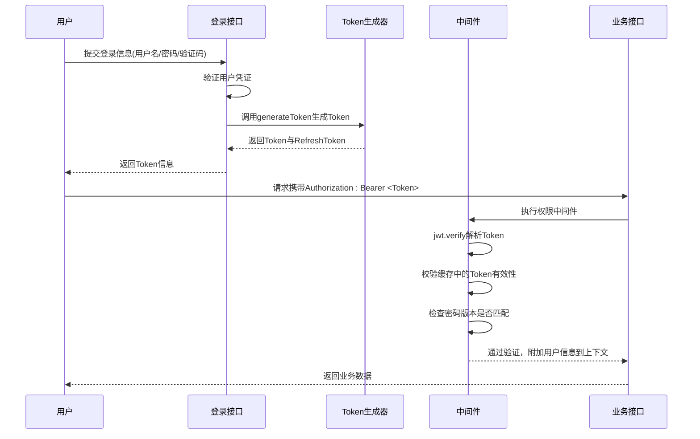
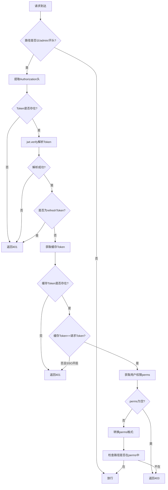
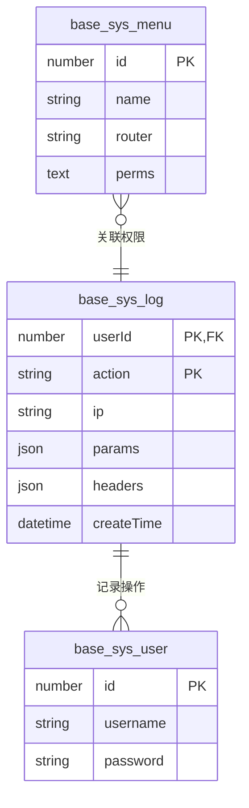

# 安全机制

<cite>
**本文档引用的文件**  
- [authority.ts](file://src/modules/base/middleware/authority.ts)
- [crypto.ts](file://src/comm/crypto.ts)
- [login.ts](file://src/modules/base/service/sys/login.ts)
- [log.ts](file://src/modules/base/middleware/log.ts)
- [config.default.ts](file://src/config/config.default.ts)
- [base_sys_menu.ts](file://src/modules/base/entity/sys/menu.ts)
- [base_sys_log.ts](file://src/modules/base/entity/sys/log.ts)
- [base_sys_user.ts](file://src/modules/base/entity/sys/user.ts)
</cite>

## 目录

1. [简介](#简介)
2. [JWT身份认证流程](#jwt身份认证流程)
3. [权限中间件工作机制](#权限中间件工作机制)
4. [密码存储策略](#密码存储策略)
5. [操作日志记录功能](#操作日志记录功能)
6. [安全最佳实践](#安全最佳实践)
7. [安全配置项调整](#安全配置项调整)

## 简介

`cool-admin-midway` 是一个基于 Midway 框架的后台管理系统，具备完善的安全防护体系。本系统通过 JWT 实现无状态身份认证，结合细粒度权限控制、密码哈希存储、操作日志审计等机制，保障系统的安全性与可追溯性。本文档全面阐述其安全架构与实现细节。

## JWT身份认证流程

系统采用 JSON Web Token（JWT）实现用户身份认证。用户登录成功后，服务端生成包含用户信息的 Token 并返回客户端；后续请求需在 `Authorization` 请求头中携带该 Token，由中间件进行验证。

认证流程如下：
1. 用户提交用户名、密码及验证码进行登录。
2. 服务端校验凭证有效性，若通过则生成 Access Token 和 Refresh Token。
3. Token 中包含用户 ID、角色、密码版本等信息，并使用密钥签名防篡改。
4. 客户端在后续请求中携带 Token。
5. 服务端中间件解析并验证 Token 的有效性与权限。



**Diagram sources**  
- [login.ts](file://src/modules/base/service/sys/login.ts#L50-L100)
- [authority.ts](file://src/modules/base/middleware/authority.ts#L30-L60)

**Section sources**  
- [login.ts](file://src/modules/base/service/sys/login.ts#L50-L150)
- [authority.ts](file://src/modules/base/middleware/authority.ts#L30-L70)

## 权限中间件工作机制

`authority.ts` 实现了核心的权限校验逻辑，通过中间件对 `/admin/` 开头的请求路径进行访问控制。

### 工作流程分析

1. **路径匹配**：仅对以 `/admin/` 开头的路由启用权限校验。
2. **Token 解析**：从 `Authorization` 头部提取 Token，使用 `jwt.verify` 解析用户信息。
3. **忽略路径检查**：支持通过标签配置忽略某些路径（如公共接口、字典接口）。
4. **Token 有效性验证**：
   - 检查缓存中是否存在当前 Token。
   - 对比 Token 中的 `passwordVersion` 与缓存中的一致性，确保改密后旧 Token 失效。
   - 若启用单点登录（SSO），则严格校验 Token 是否为最新。
5. **权限比对**：
   - 从缓存获取用户权限列表（`perms`）。
   - 将权限标识中的 `:` 替换为 `/`，与请求路径进行匹配。
   - 若用户非超级管理员且无对应权限，则返回 403 禁止访问。



**Diagram sources**  
- [authority.ts](file://src/modules/base/middleware/authority.ts#L30-L130)

**Section sources**  
- [authority.ts](file://src/modules/base/middleware/authority.ts#L1-L135)
- [login.ts](file://src/modules/base/service/sys/login.ts#L120-L150)

## 密码存储策略

系统采用安全的密码哈希机制，防止明文密码泄露。

### 加密实现

- **哈希算法**：使用 `md5` 对用户密码进行哈希处理（注：实际项目建议使用更安全的 bcrypt 或 scrypt）。
- **盐值机制**：虽然代码中未显式加盐，但配置文件中定义了默认盐值 `defaultSalt`，可用于增强哈希安全性。
- **动态盐值**：`crypto.ts` 提供 `generateSalt()` 方法生成随机盐值，可用于未来升级。

### 密码版本控制

通过 `passwordV` 字段实现密码变更后的 Token 失效机制：
- 每次修改密码时，`passwordV` 自增。
- 登录时将 `passwordV` 写入 Token 和缓存。
- 每次请求验证时比对 Token 中的 `passwordVersion` 与缓存中的值，不一致则拒绝访问。

```mermaid
classDiagram
class CryptoUtil {
+cryptoConfig : {aesKey, rsaPrivateKey, defaultSalt}
+aesEncrypt(text : string, key? : string) : Promise~string~
+aesDecrypt(encryptedText : string, key? : string) : Promise~string~
+rsaEncrypt(text : string) : Promise~string~
+rsaDecrypt(encryptedText : string) : Promise~string~
+sha256(text : string, salt? : string) : Promise~string~
+generateSalt(length : number) : string
}
class BaseSysUserEntity {
+password : string
+passwordV : number
}
class BaseSysLoginService {
+generateToken(user, roleIds, expire, isRefresh?) : Promise~string~
}
BaseSysLoginService --> BaseSysUserEntity : "读取passwordV"
BaseSysLoginService --> CryptoUtil : "可选使用sha256"
```

**Diagram sources**  
- [crypto.ts](file://src/comm/crypto.ts#L1-L78)
- [base_sys_user.ts](file://src/modules/base/entity/sys/user.ts#L30-L35)
- [login.ts](file://src/modules/base/service/sys/login.ts#L180-L200)

**Section sources**  
- [crypto.ts](file://src/comm/crypto.ts#L1-L78)
- [base_sys_user.ts](file://src/modules/base/entity/sys/user.ts#L30-L35)

## 操作日志记录功能

系统通过日志中间件自动记录关键操作，实现审计追踪。

### 日志记录流程

1. **中间件拦截**：`log.ts` 中间件拦截所有请求。
2. **获取服务实例**：通过 `ctx.requestContext.getAsync(BaseSysLogService)` 获取日志服务。
3. **记录日志**：
   - 提取用户 IP（支持代理转发场景）。
   - 记录请求 URL、方法、参数、请求头。
   - 若已登录，记录 `userId`。
4. **持久化存储**：写入 `base_sys_log` 数据表。

### 日志清理策略

- 支持清除全部日志。
- 可配置日志保留天数（通过 `logKeep` 配置项），自动清理过期日志。



**Diagram sources**  
- [log.ts](file://src/modules/base/middleware/log.ts#L1-L25)
- [base_sys_log.ts](file://src/modules/base/entity/sys/log.ts#L1-L37)
- [base_sys_menu.ts](file://src/modules/base/entity/sys/menu.ts#L1-L48)

**Section sources**  
- [log.ts](file://src/modules/base/middleware/log.ts#L1-L25)
- [base_sys_log.ts](file://src/modules/base/entity/sys/log.ts#L1-L37)

## 安全最佳实践

系统遵循多项安全规范，防范常见攻击：

### SQL 注入防护

- 使用 TypeORM ORM 框架，自动转义参数，避免拼接 SQL。
- 启用软删除（`softDelete: true`），减少直接 DELETE 操作风险。

### XSS 攻击防护

- 前端展示数据时应进行 HTML 转义。
- 验证码 SVG 输出时已做颜色替换处理，防止注入。

### CSRF 防护

- 推荐启用 HTTPS，结合 SameSite Cookie 策略。
- 敏感操作建议增加 Token 校验或二次确认。

### HTTPS 传输加密

- 生产环境必须配置 HTTPS，防止 Token 在传输过程中被窃取。
- 可通过 Nginx 或云服务商配置 SSL 证书。

### 其他建议

- 定期更新依赖，修复已知漏洞。
- 生产环境关闭 `synchronize: true`，防止数据库结构意外变更。
- 敏感配置（如数据库密码）使用环境变量管理。

## 安全配置项调整

可在配置文件中调整以下安全相关参数：

### JWT 配置

在 `config.default.ts` 或环境配置中调整：

```ts
module.exports = {
  module: {
    base: {
      jwt: {
        secret: 'your-secret-key', // Token 签名密钥
        token: {
          expire: 7200,        // Access Token 过期时间（秒）
          refreshExpire: 604800 // Refresh Token 过期时间
        },
        sso: true // 是否启用单点登录（同一账号只能一处登录）
      }
    }
  }
}
```

### 登录失败锁定

目前系统未内置失败次数锁定，可通过以下方式增强：

- 在 `login.ts` 中添加失败计数逻辑，使用缓存记录尝试次数。
- 达到阈值后暂时锁定账户或要求图形验证码。

### 密码策略

建议扩展密码复杂度校验逻辑：

- 在登录或修改密码时，校验密码长度、字符类型。
- 强制定期修改密码。
- 禁止使用历史密码。

**Section sources**  
- [config.default.ts](file://src/config/config.default.ts#L1-L142)
- [config.prod.ts](file://src/config/config.prod.ts#L1-L60)
- [login.ts](file://src/modules/base/service/sys/login.ts#L1-L246)