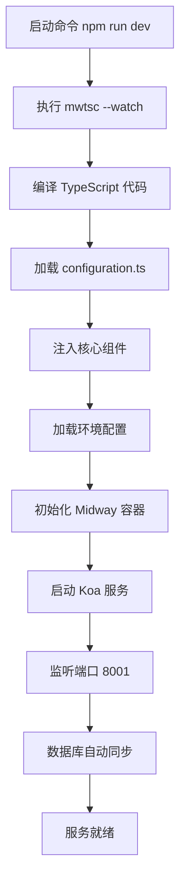

# 快速开始指南

<cite>
**本文档中引用的文件**  
- [README.md](file://README.md)
- [bootstrap.js](file://bootstrap.js)
- [Dockerfile](file://Dockerfile)
- [docker-compose.yml](file://docker-compose.yml)
- [config.local.ts](file://src/config/config.local.ts)
- [config.prod.ts](file://src/config/config.prod.ts)
- [package.json](file://package.json)
- [configuration.ts](file://src/configuration.ts)
</cite>

## 目录
1. [简介](#简介)
2. [环境准备](#环境准备)
3. [项目部署步骤](#项目部署步骤)
4. [应用启动流程解析](#应用启动流程解析)
5. [Docker 部署方式](#docker-部署方式)
6. [常见问题排查](#常见问题排查)
7. [总结](#总结)

## 简介

`cool-admin-midway` 是一个基于 Node.js 与 TypeScript 的现代化后台权限管理系统，使用 MidwayJS 框架构建，支持模块化、插件化、AI 编码等高级特性。本指南旨在为零基础开发者提供一份清晰、简洁的本地部署与运行教程，涵盖从环境搭建到访问管理界面的完整流程。

通过本指南，您将学会如何：
- 安装必要的运行环境（Node.js、数据库）
- 配置项目环境变量和数据库连接
- 初始化数据库并启动服务
- 理解应用的启动流程
- 使用 Docker 快速部署
- 解决常见部署问题

**Section sources**
- [README.md](file://README.md#L0-L569)

## 环境准备

在开始部署之前，请确保您的本地环境已安装以下必要组件：

### 1. Node.js 运行环境
- **版本要求**：Node.js >= 18.0.0
- **推荐安装方式**：
  - 使用 [Node.js 官网](https://nodejs.org/) 下载 LTS 版本
  - 或使用版本管理工具如 `nvm`（Node Version Manager）进行安装与切换

验证安装是否成功：
```bash
node -v
npm -v
```

### 2. 数据库系统（MySQL 或 PostgreSQL）
`cool-admin-midway` 支持多种数据库，推荐使用 **MySQL 8.0**。

#### 安装 MySQL（推荐使用 Docker）
```bash
# 启动 MySQL 容器
docker run -d --name mysql \
  -p 3306:3306 \
  -e MYSQL_ROOT_PASSWORD=123456 \
  -e MYSQL_DATABASE=cool \
  mysql:8.0
```

#### 安装 PostgreSQL（可选）
```bash
docker run -d --name postgres \
  -p 5432:5432 \
  -e POSTGRES_PASSWORD=123456 \
  -e POSTGRES_DB=cool \
  postgres:13
```

### 3. Redis 缓存服务
用于会话管理与数据缓存。
```bash
# 启动 Redis 容器
docker run -d --name redis \
  -p 6379:6379 \
  redis:latest
```

### 4. 包管理工具
推荐使用 `npm` 或 `pnpm`（性能更优）。
```bash
# 安装 pnpm（可选）
npm install -g pnpm
```

**Section sources**
- [README.md](file://README.md#L0-L569)

## 项目部署步骤

### 1. 克隆项目仓库
```bash
git clone https://github.com/cool-team-official/cool-admin-midway.git
cd cool-admin-midway
```

### 2. 安装项目依赖
```bash
# 使用 npm
npm install

# 或使用 pnpm（推荐）
pnpm install
```

### 3. 配置数据库连接

项目通过 `src/config/` 目录下的配置文件管理不同环境的设置。

#### 开发环境配置（`config.local.ts`）
该文件用于本地开发，支持自动建表与初始化数据。

```typescript
// src/config/config.local.ts
export default {
  typeorm: {
    dataSource: {
      default: {
        type: 'mysql',           // 数据库类型
        host: '127.0.0.1',       // 数据库地址
        port: 3306,              // 端口
        username: 'root',        // 用户名
        password: '123456',      // 密码
        database: 'cool',        // 数据库名
        synchronize: true,       // 自动同步实体到数据库（仅开发环境开启）
        logging: false,          // 是否打印 SQL 日志
        charset: 'utf8mb4',
        entities: ['**/modules/*/entity'],
      },
    },
  },
  redis: {
    client: {
      port: 6379,
      host: '127.0.0.1',
      password: '',
      db: 0,
    },
  },
};
```

> ⚠️ **生产环境注意**：请将 `synchronize` 设置为 `false`，避免数据丢失。

#### 生产环境配置（`config.prod.ts`）
用于线上部署，建议关闭自动建表与敏感功能。

```typescript
// src/config/config.prod.ts
synchronize: false,  // 关闭自动建表
logging: false,
cool: {
  eps: false,        // 关闭实体路径暴露
  initDB: false,     // 关闭自动导入数据库
  initMenu: false,   // 关闭自动导入菜单
}
```

**Section sources**
- [src/config/config.local.ts](file://src/config/config.local.ts#L0-L43)
- [src/config/config.prod.ts](file://src/config/config.prod.ts#L0-L59)

### 4. 启动服务

#### 开发模式启动
```bash
npm run dev
```
或
```bash
pnpm dev
```

#### 构建并生产启动
```bash
# 构建项目
npm run build

# 启动服务
npm run start
```

### 5. 访问管理界面

服务启动成功后，打开浏览器访问：

- **管理后台**：[http://localhost:8001](http://localhost:8001)
- **API 文档**：[http://localhost:8001/swagger](http://localhost:8001/swagger)

#### 默认登录账号
- **用户名**：`admin`
- **密码**：`123456`

> ✅ 首次启动会自动初始化数据库表结构与基础数据。

**Section sources**
- [README.md](file://README.md#L0-L569)
- [package.json](file://package.json#L0-L94)

## 应用启动流程解析

`cool-admin-midway` 的启动流程由 `bootstrap.js` 文件驱动，结合 `configuration.ts` 完成依赖注入与组件初始化。

### 启动入口：`bootstrap.js`

```javascript
const { Bootstrap } = require('@midwayjs/bootstrap');

Bootstrap.configure({
  imports: require('./dist/index'),
  moduleDetector: false,
}).run();
```

- **作用**：显式加载编译后的入口文件（`dist/index`），避免运行时扫描，提升启动效率。
- **适用场景**：生产环境使用，开发环境由 `mwtsc --watch` 监听启动。

### 核心配置：`configuration.ts`

该文件定义了项目的核心组件与配置加载逻辑。

```typescript
@Configuration({
  imports: [
    koa,
    orm,
    validate,
    staticFile,
    upload,
    cool,
    redis,
    prometheus,
  ],
  importConfigs: [
    {
      default: DefaultConfig,
      local: LocalConfig,
      prod: ProdConfig,
    },
  ],
})
export class MainConfiguration {
  async onReady() {}
}
```

#### 启动流程图解



**Diagram sources**
- [bootstrap.js](file://bootstrap.js#L0-L10)
- [configuration.ts](file://src/configuration.ts#L0-L74)

**Section sources**
- [bootstrap.js](file://bootstrap.js#L0-L10)
- [configuration.ts](file://src/configuration.ts#L0-L74)

## Docker 部署方式

项目提供 `Dockerfile` 与 `docker-compose.yml`，支持一键容器化部署。

### 1. 使用 `docker-compose.yml` 启动全套环境

```yaml
# docker-compose.yml
services:
  coolDB:
    image: mysql
    environment:
      MYSQL_ROOT_PASSWORD: "123456"
      MYSQL_DATABASE: "cms"
    ports:
      - 3306:3306

  coolRedis:
    image: redis
    ports:
      - 6379:6379
```

启动命令：
```bash
docker-compose up -d
```

### 2. 构建并运行应用镜像

```bash
# 构建镜像
docker build -t cool-admin-midway .

# 运行容器
docker run -d \
  --name cool-admin \
  -p 8001:8001 \
  cool-admin-midway
```

### 3. `Dockerfile` 关键说明

```dockerfile
FROM node:lts-alpine

WORKDIR /app

COPY package.json .
RUN npm install

COPY . .
RUN npm run build

CMD ["npm", "run", "start"]
```

- 使用 `alpine` 镜像减小体积
- 安装生产依赖并构建项目
- 暴露 8001 端口
- 启动 `bootstrap.js`

**Section sources**
- [Dockerfile](file://Dockerfile#L0-L32)
- [docker-compose.yml](file://docker-compose.yml#L0-L40)

## 常见问题排查

### 1. 端口冲突（8001 或 3306）
**现象**：服务无法启动，提示 `EADDRINUSE`  
**解决方案**：
- 修改 `src/config/config.default.ts` 中的端口：
  ```ts
  koa: {
    port: 8002  // 修改为其他端口
  }
  ```
- 或停止占用进程：
  ```bash
  lsof -i :8001
  kill -9 <PID>
  ```

### 2. 数据库连接失败
**现象**：启动时报错 `Connection refused`  
**检查项**：
- 数据库容器是否正常运行：`docker ps`
- `config.local.ts` 中的 `host` 是否为 `127.0.0.1`（非 `localhost`）
- 用户名、密码、数据库名是否正确
- 防火墙或安全组是否放行端口

### 3. Redis 连接失败
**现象**：登录或缓存功能异常  
**解决方案**：
- 确保 Redis 容器已启动
- 检查 `redis` 配置中的 `host` 与 `port`
- 若使用密码，需在配置中填写

### 4. 依赖安装失败
**现象**：`npm install` 报错  
**建议**：
- 使用国内镜像源：
  ```bash
  npm config set registry https://registry.npmmirror.com
  ```
- 清除缓存后重试：
  ```bash
  npm cache clean --force
  rm -rf node_modules package-lock.json
  npm install
  ```

**Section sources**
- [README.md](file://README.md#L0-L569)
- [config.default.ts](file://src/config/config.default.ts#L0-L141)

## 总结

通过本指南，您已掌握 `cool-admin-midway` 的完整本地部署流程。从环境准备、项目配置、服务启动到问题排查，每一步都力求简洁明了，适合初学者快速上手。

关键要点回顾：
- 使用 `npm run dev` 启动开发服务
- 配置 `config.local.ts` 实现数据库连接
- 首次启动自动初始化数据
- `bootstrap.js` 是生产启动入口
- Docker 支持一键部署
- 注意生产环境关闭 `synchronize`

接下来，您可以尝试：
- 修改前端页面
- 添加新的 CRUD 模块
- 接入插件（如短信、支付）
- 使用 AI 编码功能生成代码

祝您开发愉快！

**Section sources**
- [README.md](file://README.md#L0-L569)