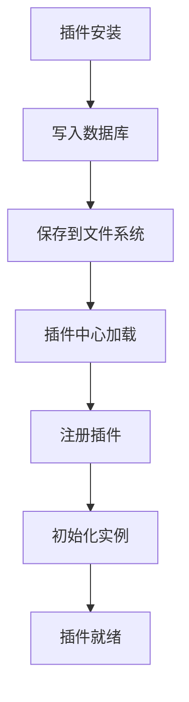
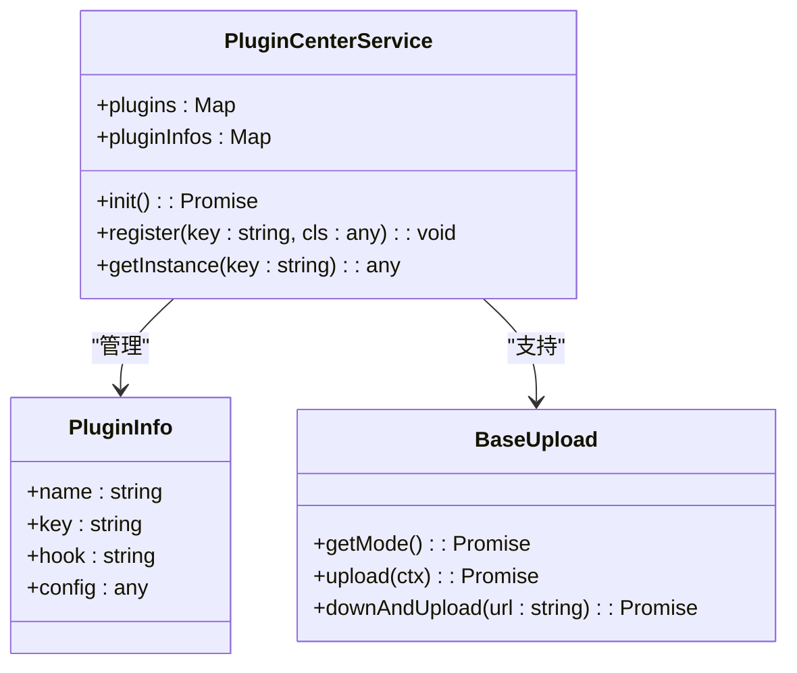
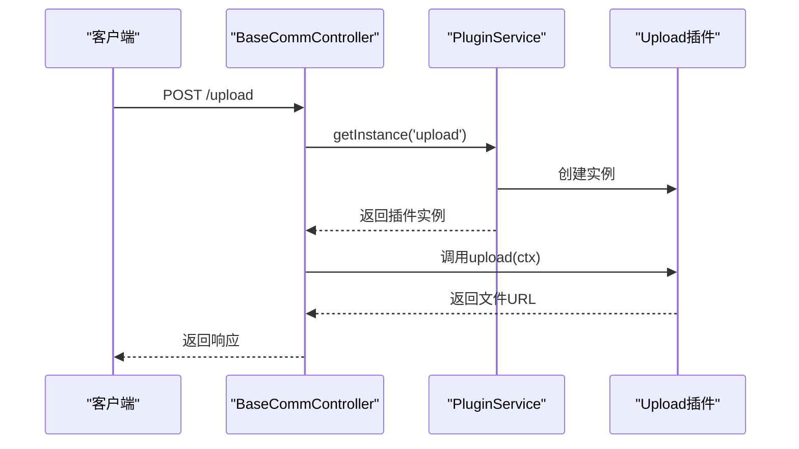

# 插件开发手册

<cite>
**本文档引用的文件**  
- [center.ts](file://src/modules/plugin/service/center.ts)
- [info.ts](file://src/modules/plugin/service/info.ts)
- [types.ts](file://src/modules/plugin/service/types.ts)
- [upload/index.ts](file://src/modules/plugin/hooks/upload/index.ts)
- [upload/interface.ts](file://src/modules/plugin/hooks/upload/interface.ts)
- [plugin.d.ts](file://typings/plugin.d.ts)
- [upload-cos.d.ts](file://typings/upload-cos.d.ts)
- [info.ts](file://src/modules/plugin/entity/info.ts)
</cite>

## 目录
1. [简介](#简介)
2. [插件系统设计目标](#插件系统设计目标)
3. [插件注册与管理机制](#插件注册与管理机制)
4. [钩子系统工作原理](#钩子系统工作原理)
5. [上传钩子实现详解](#上传钩子实现详解)
6. [插件开发模板](#插件开发模板)
7. [COS上传插件示例](#cos上传插件示例)
8. [安全审查与版本管理](#安全审查与版本管理)

## 简介
本手册面向扩展开发者，详细说明Cool Admin系统的插件开发规范。系统通过插件化设计支持第三方功能（如支付、短信、对象存储）的灵活集成，提供完整的插件生命周期管理、钩子机制和类型安全支持。

## 插件系统设计目标
插件系统旨在实现功能模块的松耦合与可扩展性，允许开发者以插件形式集成第三方服务。核心设计目标包括：
- **模块化扩展**：支持支付、短信、对象存储等功能以插件形式独立开发和部署
- **动态加载**：插件可在运行时动态安装、启用、禁用和卸载
- **类型安全**：通过TypeScript声明文件实现插件接口的类型检查
- **配置驱动**：插件行为可通过配置文件或数据库配置进行定制

**Section sources**
- [center.ts](file://src/modules/plugin/service/center.ts#L1-L224)
- [info.ts](file://src/modules/plugin/service/info.ts#L1-L474)

## 插件注册与管理机制
插件信息通过数据库`plugin_info`表进行持久化存储，包含名称、标识、版本、配置等元数据。插件中心（PluginCenterService）负责统一管理插件的生命周期。

插件注册流程：
1. 插件安装时，元数据写入数据库并保存到文件系统
2. 系统启动时，从数据库加载启用状态的插件
3. 通过`register`方法将插件类注册到中心管理器
4. 插件实例根据配置的单例模式进行初始化

插件状态变更（启用/禁用）会触发重新初始化或移除操作，确保运行时状态同步。



**Diagram sources**
- [center.ts](file://src/modules/plugin/service/center.ts#L1-L224)
- [info.ts](file://src/modules/plugin/service/info.ts#L1-L474)
- [info.ts](file://src/modules/plugin/entity/info.ts#L1-L63)

**Section sources**
- [center.ts](file://src/modules/plugin/service/center.ts#L1-L224)
- [info.ts](file://src/modules/plugin/service/info.ts#L1-L474)

## 钩子系统工作原理
钩子（Hook）系统是插件与核心系统交互的核心机制，允许插件拦截特定业务流程。系统通过`PluginMap`类型映射和声明文件实现类型安全的钩子调用。

钩子注册流程：
1. 在`plugin.json`中声明`hook`字段，指定钩子类型
2. 插件中心扫描`modules/plugin/hooks`目录下的钩子实现
3. 将钩子插件注册到统一的管理映射中
4. 业务代码通过`getInstance('hookName')`获取具体实现

钩子系统支持同名钩子插件的互斥启用，确保同一时刻只有一个实现生效。



**Diagram sources**
- [center.ts](file://src/modules/plugin/service/center.ts#L1-L224)
- [upload/interface.ts](file://src/modules/plugin/hooks/upload/interface.ts#L1-L56)
- [plugin.d.ts](file://typings/plugin.d.ts#L1-L25)

**Section sources**
- [center.ts](file://src/modules/plugin/service/center.ts#L1-L224)
- [types.ts](file://src/modules/plugin/service/types.ts#L1-L256)

## 上传钩子实现详解
上传钩子（upload hook）是典型的业务拦截插件，用于自定义文件上传逻辑。系统定义了`BaseUpload`接口规范，插件需实现该接口以提供具体的上传策略。

核心方法说明：
- `getMode()`：返回上传模式（本地/云存储）
- `upload(ctx)`：处理上传请求，返回访问URL
- `downAndUpload(url)`：从远程URL下载并上传
- `uploadWithKey(filePath, key)`：指定路径上传文件

业务控制器通过插件服务获取上传实例，实现上传逻辑的透明切换：



**Diagram sources**
- [upload/index.ts](file://src/modules/plugin/hooks/upload/index.ts#L1-L119)
- [upload/interface.ts](file://src/modules/plugin/hooks/upload/interface.ts#L1-L56)
- [admin/comm.ts](file://src/modules/base/controller/admin/comm.ts#L70-L73)

**Section sources**
- [upload/index.ts](file://src/modules/plugin/hooks/upload/index.ts#L1-L119)
- [upload/interface.ts](file://src/modules/plugin/hooks/upload/interface.ts#L1-L56)

## 插件开发模板
开发新插件需遵循标准模板，包含以下核心步骤：

### 插件元信息定义
在`plugin.json`中定义插件元数据：
```json
{
  "name": "COS对象存储",
  "key": "upload-cos",
  "hook": "upload",
  "version": "1.0.0",
  "author": "developer",
  "description": "腾讯云COS存储插件",
  "config": {
    "domain": "https://example.com",
    "secretId": "",
    "secretKey": "",
    "bucket": "",
    "region": ""
  }
}
```

### 服务实现规范
插件类需继承`BasePluginHook`并实现对应接口：
- 实现`init()`方法进行初始化配置
- 实现业务接口方法（如`upload`）
- 通过`this.pluginInfo.config`访问配置

### 类型声明生成
系统自动为插件生成TypeScript声明文件：
1. 插件安装时，从`source/index.ts`提取类型
2. 生成`typings/{key}.d.ts`文件
3. 更新`plugin.d.ts`中的`PluginMap`映射
4. 提供类型安全的插件调用支持

## COS上传插件示例
以`upload/index.ts`为例，展示COS上传插件的实现要点：

### 核心实现
```typescript
export class CoolPlugin extends BasePluginHook implements BaseUpload {
  client: COS;

  async init(pluginInfo: PluginInfo) {
    const config = pluginInfo.config;
    this.client = new COS({
      SecretId: config.secretId,
      SecretKey: config.secretKey,
    });
  }

  async upload(ctx: any) {
    const file = ctx.files[0];
    const key = `upload/${Date.now()}_${file.filename}`;
    
    const result = await this.client.putObject({
      Bucket: this.pluginInfo.config.bucket,
      Region: this.pluginInfo.config.region,
      Key: key,
      Body: fs.createReadStream(file.data),
    });

    return `${this.pluginInfo.config.domain}/${key}`;
  }
}
```

### 关键特性
- **配置驱动**：通过`pluginInfo.config`获取COS配置
- **安全校验**：对上传路径进行合法性检查
- **错误处理**：捕获上传异常并返回友好提示
- **类型安全**：通过`upload-cos.d.ts`提供完整类型定义

**Section sources**
- [upload/index.ts](file://src/modules/plugin/hooks/upload/index.ts#L1-L119)
- [upload-cos.d.ts](file://typings/upload-cos.d.ts#L1-L51)

## 安全审查与版本管理
系统实施严格的插件安全审查和版本管理策略，确保系统稳定性。

### 安全审查机制
- **代码沙箱**：插件代码在隔离环境中执行
- **权限控制**：插件无法访问核心系统敏感API
- **输入校验**：对上传路径等参数进行严格校验
- **依赖检查**：禁止引入高风险第三方包

### 版本管理策略
- **数据库版本记录**：每个插件版本信息持久化存储
- **兼容性检查**：升级时验证API兼容性
- **回滚支持**：保留历史版本，支持快速回滚
- **热更新**：版本更新无需重启服务

插件生命周期操作均记录审计日志，确保操作可追溯。

**Section sources**
- [info.ts](file://src/modules/plugin/service/info.ts#L1-L474)
- [types.ts](file://src/modules/plugin/service/types.ts#L1-L256)
- [info.ts](file://src/modules/plugin/entity/info.ts#L1-L63)