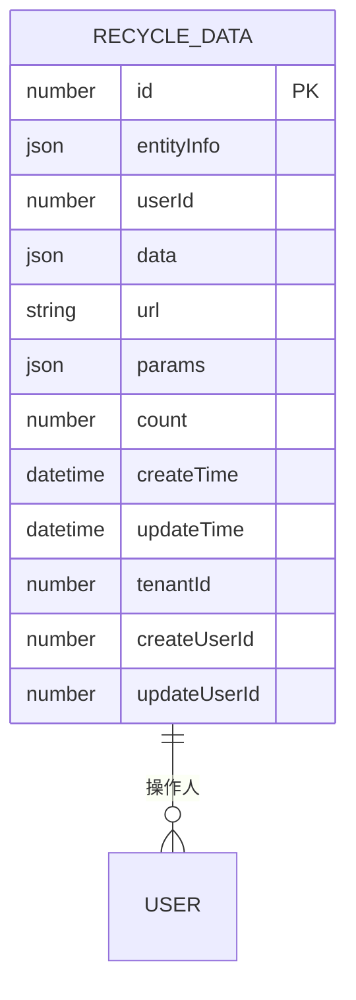
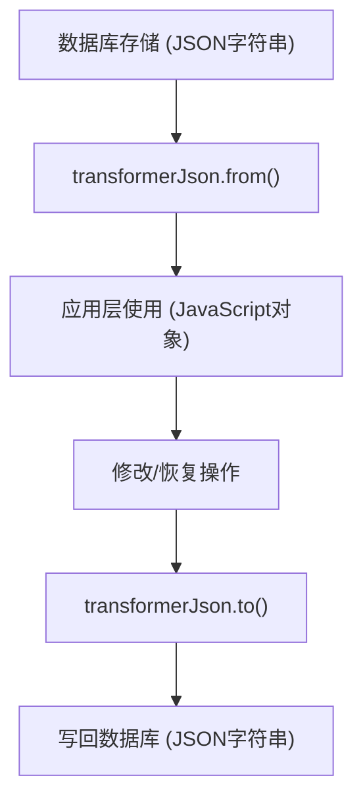
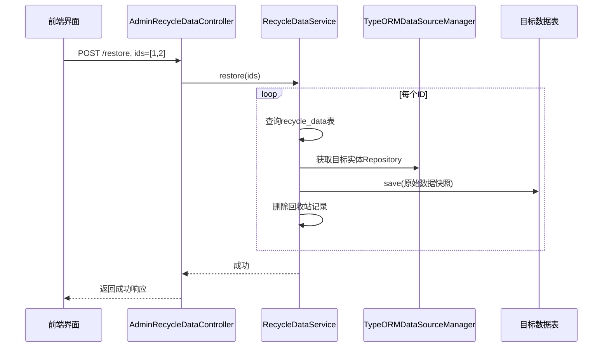
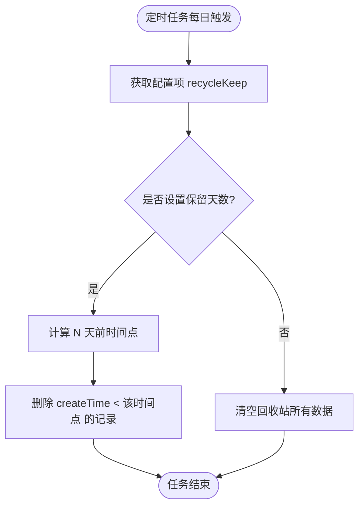

# 回收站模块数据模型

<cite>
**本文档引用文件**  
- [data.ts](file://src/modules/recycle/entity/data.ts)
- [data.ts](file://src/modules/recycle/service/data.ts)
- [data.ts](file://src/modules/recycle/schedule/data.ts)
- [data.ts](file://src/modules/recycle/event/data.ts)
- [base.ts](file://src/modules/base/entity/base.ts)
- [data.ts](file://src/modules/recycle/controller/admin/data.ts)
</cite>

## 目录
1. [引言](#引言)
2. [核心数据模型设计](#核心数据模型设计)
3. [关键字段解析与使用场景](#关键字段解析与使用场景)
4. [数据序列化与反序列化策略](#数据序列化与反序列化策略)
5. [恢复逻辑实现机制](#恢复逻辑实现机制)
6. [自动清理策略（TTL）](#自动清理策略（TTL）)
7. [跨模块扩展性分析](#跨模块扩展性分析)
8. [操作示例：SQL与API调用](#操作示例：SQL与API调用)
9. [系统权衡分析](#系统权衡分析)
10. [总结](#总结)

## 引言
本系统通过统一的回收站机制实现软删除数据的集中管理，避免传统方式中各模块自行维护删除状态带来的冗余与一致性问题。`RecycleDataEntity` 实体作为核心，提供了一种通用、可扩展的数据回收方案，支持多租户隔离、操作溯源与自动化清理。

## 核心数据模型设计



**图示来源**  
- [data.ts](file://src/modules/recycle/entity/data.ts#L6-L40)
- [base.ts](file://src/modules/base/entity/base.ts#L40-L72)

**本节来源**  
- [data.ts](file://src/modules/recycle/entity/data.ts#L1-L40)

## 关键字段解析与使用场景

### entityInfo（原始模块与实体信息）
存储被删除数据所属的原始数据源名称（`dataSourceName`）和实体类名（`entity`），用于恢复时动态定位目标数据库和表结构。

### data（JSON格式完整数据快照）
以 JSON 格式保存被软删除的原始记录完整副本，确保即使原表结构变更，仍能基于历史快照进行恢复。

### tenantId（租户隔离）
继承自基类 `BaseEntity`，实现多租户环境下回收站数据的逻辑隔离，不同租户无法查看或恢复彼此的已删除数据。

### userId（操作人标识）
记录执行删除操作的用户ID，支持审计追踪与责任追溯。

### url 与 params（上下文信息）
记录触发删除操作的接口路径及请求参数，便于问题排查与行为分析。

**本节来源**  
- [data.ts](file://src/modules/recycle/entity/data.ts#L6-L40)

## 数据序列化与反序列化策略



**图示来源**  
- [base.ts](file://src/modules/base/entity/base.ts#L20-L35)
- [data.ts](file://src/modules/recycle/entity/data.ts#L10-L11)

**本节来源**  
- [base.ts](file://src/modules/base/entity/base.ts#L20-L35)

## 恢复逻辑实现机制



**图示来源**  
- [data.ts](file://src/modules/recycle/service/data.ts#L25-L40)
- [data.ts](file://src/modules/recycle/controller/admin/data.ts#L25-L30)

**本节来源**  
- [data.ts](file://src/modules/recycle/service/data.ts#L25-L40)
- [data.ts](file://src/modules/recycle/controller/admin/data.ts#L25-L30)

## 自动清理策略（TTL）



**图示来源**  
- [data.ts](file://src/modules/recycle/service/data.ts#L65-L80)
- [data.ts](file://src/modules/recycle/schedule/data.ts#L15-L25)

**本节来源**  
- [data.ts](file://src/modules/recycle/service/data.ts#L65-L80)
- [data.ts](file://src/modules/recycle/schedule/data.ts#L15-L25)

## 跨模块扩展性分析
该设计具备高度可扩展性：
- **新增模块无需修改回收站结构**：任何模块在执行软删除时，只需触发 `EVENT.SOFT_DELETE` 事件，由 `RecycleDataEvent` 监听并调用 `record` 方法记录。
- **动态恢复机制**：通过 `entityInfo` 中的 `dataSourceName` 和 `entity` 动态获取目标 Repository，无需硬编码表名。
- **松耦合架构**：回收站模块独立运行，不影响其他业务逻辑。

**本节来源**  
- [data.ts](file://src/modules/recycle/event/data.ts#L10-L15)
- [data.ts](file://src/modules/recycle/service/data.ts#L45-L60)

## 操作示例：SQL与API调用

### 手动查询回收站数据（SQL）
```sql
SELECT id, url, userId, createTime, count 
FROM recycle_data 
WHERE tenantId = 1 
ORDER BY createTime DESC;
```

### 恢复指定记录（API调用）
```http
POST /admin/recycle/data/restore
Content-Type: application/json

{
  "ids": [1001, 1002]
}
```

**本节来源**  
- [data.ts](file://src/modules/recycle/service/data.ts#L25-L40)
- [data.ts](file://src/modules/recycle/controller/admin/data.ts#L25-L30)

## 系统权衡分析

| 维度 | 优势 | 挑战 |
|------|------|------|
| **数据一致性** | 恢复时写入原始数据快照，避免中间状态污染 | 需确保恢复操作的原子性，防止部分失败 |
| **存储成本** | 集中管理，便于统一设置保留策略 | JSON 存储可能比原生字段占用更多空间 |
| **查询性能** | 支持按操作人、接口、时间等字段索引查询 | 大量历史数据可能影响 `recycle_data` 表性能 |
| **可维护性** | 结构稳定，新增模块无需变更 | 需定期监控清理任务执行情况 |

**本节来源**  
- [data.ts](file://src/modules/recycle/entity/data.ts#L6-L40)
- [data.ts](file://src/modules/recycle/service/data.ts#L65-L80)

## 总结
`RecycleDataEntity` 提供了一种高效、通用的软删除数据管理方案。其核心价值在于：
- **统一存储**：跨模块数据集中回收，简化管理。
- **安全可逆**：完整数据快照保障恢复准确性。
- **自动运维**：基于配置的 TTL 清理策略降低人工干预。
- **高扩展性**：新模块接入零成本，符合开闭原则。

该设计在数据安全性与系统复杂性之间取得了良好平衡，适用于中大型多租户管理系统。

**本节来源**  
- [data.ts](file://src/modules/recycle/entity/data.ts#L1-L40)
- [data.ts](file://src/modules/recycle/service/data.ts#L1-L80)