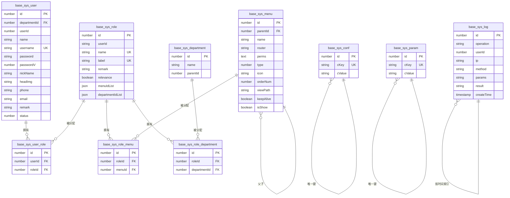

# 基础模块数据模型

<cite>
**本文档引用文件**  
- [base.ts](file://src/modules/base/entity/base.ts)
- [user.ts](file://src/modules/base/entity/sys/user.ts)
- [role.ts](file://src/modules/base/entity/sys/role.ts)
- [menu.ts](file://src/modules/base/entity/sys/menu.ts)
- [role_menu.ts](file://src/modules/base/entity/sys/role_menu.ts)
- [role_department.ts](file://src/modules/base/entity/sys/role_department.ts)
- [user_role.ts](file://src/modules/base/entity/sys/user_role.ts)
- [conf.ts](file://src/modules/base/entity/sys/conf.ts)
- [param.ts](file://src/modules/base/entity/sys/param.ts)
- [log.ts](file://src/modules/base/entity/sys/log.ts)
</cite>

## 目录
1. [简介](#简介)
2. [基础实体抽象](#基础实体抽象)
3. [核心实体模型](#核心实体模型)
   - [用户 (base_sys_user)](#用户-base_sys_user)
   - [角色 (base_sys_role)](#角色-base_sys_role)
   - [菜单 (base_sys_menu)](#菜单-base_sys_menu)
   - [角色-菜单关联 (base_sys_role_menu)](#角色-菜单关联-base_sys_role_menu)
   - [角色-部门关联 (base_sys_role_department)](#角色-部门关联-base_sys_role_department)
   - [用户-角色关联 (base_sys_user_role)](#用户-角色关联-base_sys_user_role)
   - [系统配置 (base_sys_conf)](#系统配置-base_sys_conf)
   - [参数管理 (base_sys_param)](#参数管理-base_sys_param)
   - [操作日志 (base_sys_log)](#操作日志-base_sys_log)
4. [RBAC权限模型实现机制](#rbac权限模型实现机制)
5. [ER关系图建议](#er关系图建议)
6. [权限校验查询逻辑](#权限校验查询逻辑)

## 简介
本文档详细描述 Cool Admin Midway 项目中基础模块的数据库模型设计，涵盖用户、角色、菜单及其关联关系等核心实体。重点阐述基于 RBAC（基于角色的访问控制）模型的权限体系实现，包括多对多关系的中间表设计、树形菜单结构存储方式、软删除统一处理机制，以及基础字段的继承复用模式。

## 基础实体抽象

`BaseEntity` 是所有系统实体的基类，定义在 `base.ts` 中，通过继承 `CoolBaseEntity` 实现通用字段的统一管理。该抽象类确保所有业务实体具备一致的时间戳、租户隔离和操作审计能力。

```mermaid
classDiagram
class CoolBaseEntity {
<<abstract>>
}
class BaseEntity {
+id : number
+createTime : Date
+updateTime : Date
+tenantId : number
+createUserId : number
+updateUserId : number
}
BaseEntity --|> CoolBaseEntity : 继承
note right of BaseEntity
基础实体类，提供ID、时间戳、<br/>
租户ID及用户操作记录字段
end note
```

**Diagram sources**  
- [base.ts](file://src/modules/base/entity/base.ts#L15-L72)

**Section sources**  
- [base.ts](file://src/modules/base/entity/base.ts#L15-L72)

## 核心实体模型

### 用户 (base_sys_user)

系统用户实体，存储管理员账户信息。

**字段说明：**

| 字段名 | 类型 | 是否索引 | 是否唯一 | 默认值 | 业务含义 |
|-------|------|---------|---------|--------|---------|
| id | number | 是 | 是 | 自增 | 主键ID |
| departmentId | number | 是 | 否 | null | 所属部门ID |
| userId | number | 是 | 否 | null | 创建者ID（冗余） |
| name | string | 否 | 否 | null | 姓名 |
| username | string | 是 | 是 | - | 登录用户名 |
| password | string | 否 | 否 | - | 加密密码 |
| passwordV | number | 否 | 否 | 1 | 密码版本号（用于Token失效） |
| nickName | string | 否 | 否 | null | 昵称 |
| headImg | string | 否 | 否 | null | 头像URL |
| phone | string | 是 | 否 | null | 手机号 |
| email | string | 否 | 否 | null | 邮箱 |
| remark | string | 否 | 否 | null | 备注 |
| status | number | 否 | 否 | 1 | 状态：0-禁用，1-启用 |
| socketId | string | 否 | 否 | null | WebSocket会话ID |

**附加属性（非数据库字段）：**
- `departmentName`: 部门名称（查询时关联填充）
- `roleIdList`: 用户拥有的角色ID列表（查询时填充）

**Section sources**  
- [user.ts](file://src/modules/base/entity/sys/user.ts#L1-L58)

### 角色 (base_sys_role)

系统角色实体，定义权限集合。

**字段说明：**

| 字段名 | 类型 | 是否索引 | 是否唯一 | 默认值 | 业务含义 |
|-------|------|---------|---------|--------|---------|
| id | number | 是 | 是 | 自增 | 主键ID |
| userId | string | 否 | 否 | - | 创建用户ID（字符串类型） |
| name | string | 是 | 是 | - | 角色名称 |
| label | string | 是 | 是 | null | 角色标签（如 admin） |
| remark | string | 否 | 否 | null | 备注 |
| relevance | boolean | 否 | 否 | false | 数据权限是否关联上下级 |
| menuIdList | json | 否 | 否 | - | 菜单权限ID列表（JSON存储） |
| departmentIdList | json | 否 | 否 | - | 部门权限ID列表（JSON存储） |

**Section sources**  
- [role.ts](file://src/modules/base/entity/sys/role.ts#L1-L31)

### 菜单 (base_sys_menu)

系统菜单实体，支持树形结构。

**字段说明：**

| 字段名 | 类型 | 是否索引 | 是否唯一 | 默认值 | 业务含义 |
|-------|------|---------|---------|--------|---------|
| id | number | 是 | 是 | 自增 | 主键ID |
| parentId | number | 否 | 否 | null | 父菜单ID（实现树形结构） |
| name | string | 否 | 否 | - | 菜单名称 |
| router | string | 否 | 否 | null | 前端路由路径 |
| perms | text | 否 | 否 | null | 权限标识（如 sys:user:add） |
| type | number | 否 | 否 | 0 | 类型：0-目录，1-菜单，2-按钮 |
| icon | string | 否 | 否 | null | 图标类名 |
| orderNum | number | 否 | 否 | 0 | 排序序号 |
| viewPath | string | 否 | 否 | null | 前端视图组件路径 |
| keepAlive | boolean | 否 | 否 | true | 路由是否缓存 |
| isShow | boolean | 否 | 否 | true | 是否在菜单中显示 |

**附加属性（非数据库字段）：**
- `parentName`: 父菜单名称（查询时填充）
- `childMenus`: 子菜单列表（查询时构建树形结构）

**Section sources**  
- [menu.ts](file://src/modules/base/entity/sys/menu.ts#L1-L47)

### 角色-菜单关联 (base_sys_role_menu)

角色与菜单的多对多关联中间表。

**字段说明：**

| 字段名 | 类型 | 是否索引 | 是否唯一 | 默认值 | 业务含义 |
|-------|------|---------|---------|--------|---------|
| id | number | 是 | 是 | 自增 | 主键ID |
| roleId | number | 是 | 否 | - | 角色ID（外键） |
| menuId | number | 是 | 否 | - | 菜单ID（外键） |

该表通过组合索引 `(roleId, menuId)` 保证角色与菜单的唯一关联。

**Section sources**  
- [role_menu.ts](file://src/modules/base/entity/sys/role_menu.ts#L1-L14)

### 角色-部门关联 (base_sys_role_department)

角色与部门的多对多关联中间表。

**字段说明：**

| 字段名 | 类型 | 是否索引 | 是否唯一 | 默认值 | 业务含义 |
|-------|------|---------|---------|--------|---------|
| id | number | 是 | 是 | 自增 | 主键ID |
| roleId | number | 是 | 否 | - | 角色ID（外键） |
| departmentId | number | 是 | 否 | - | 部门ID（外键） |

用于实现角色的数据权限范围控制。

**Section sources**  
- [role_department.ts](file://src/modules/base/entity/sys/role_department.ts#L1-L14)

### 用户-角色关联 (base_sys_user_role)

用户与角色的多对多关联中间表。

**字段说明：**

| 字段名 | 类型 | 是否索引 | 是否唯一 | 默认值 | 业务含义 |
|-------|------|---------|---------|--------|---------|
| id | number | 是 | 是 | 自增 | 主键ID |
| userId | number | 是 | 否 | - | 用户ID（外键） |
| roleId | number | 是 | 否 | - | 角色ID（外键） |

一个用户可拥有多个角色，一个角色可分配给多个用户。

**Section sources**  
- [user_role.ts](file://src/modules/base/entity/sys/user_role.ts#L1-L14)

### 系统配置 (base_sys_conf)

系统级配置键值对存储。

**字段说明：**

| 字段名 | 类型 | 是否索引 | 是否唯一 | 默认值 | 业务含义 |
|-------|------|---------|---------|--------|---------|
| id | number | 是 | 是 | 自增 | 主键ID |
| cKey | string | 是 | 是 | - | 配置键（唯一） |
| cValue | string | 否 | 否 | - | 配置值（字符串） |

适用于存储系统参数、开关、常量等。

**Section sources**  
- [conf.ts](file://src/modules/base/entity/sys/conf.ts#L1-L15)

### 参数管理 (base_sys_param)

系统参数管理实体（结构与配置类似，可能用于分类管理）。

> 注：具体字段未提供，但根据命名推测其结构与 `base_sys_conf` 类似，可能包含参数分组、类型等扩展字段。

**Section sources**  
- [param.ts](file://src/modules/base/entity/sys/param.ts)

### 操作日志 (base_sys_log)

系统操作日志记录。

> 注：具体字段未提供，但通常包含操作人、操作模块、操作行为、请求参数、IP地址、操作时间等。

**Section sources**  
- [log.ts](file://src/modules/base/entity/sys/log.ts)

## RBAC权限模型实现机制

本系统采用标准的 RBAC（基于角色的访问控制）模型，通过以下方式实现：

1. **多对多关系中间表设计**：
   - 用户与角色通过 `base_sys_user_role` 表关联
   - 角色与菜单通过 `base_sys_role_menu` 表关联
   - 角色与部门通过 `base_sys_role_department` 表关联
   - 这种设计支持灵活的权限分配，避免权限直接绑定到用户

2. **树形菜单结构存储**：
   - 使用 `parentId` 字段实现菜单的无限层级树形结构
   - 查询时通过递归或程序逻辑构建完整菜单树
   - 支持目录、菜单、按钮三级权限控制

3. **软删除统一处理**：
   - 虽然未在字段中显式体现，但 `CoolBaseEntity` 基类通常包含 `isDelete` 字段
   - 所有继承 `BaseEntity` 的实体自动具备软删除能力
   - 删除操作仅标记 `isDelete = 1`，不物理删除数据

4. **基础字段继承复用**：
   - `base.ts` 中定义的 `BaseEntity` 抽象类包含 `createTime`, `updateTime`, `tenantId`, `createUserId`, `updateUserId`
   - 所有业务实体继承该类，无需重复定义
   - 时间字段通过 `transformerTime` 自动格式化为 `YYYY-MM-DD HH:mm:ss`

5. **权限标识设计**：
   - 菜单表中的 `perms` 字段存储权限标识（如 `sys:user:add`）
   - 后端接口通过 `@CheckPermission('sys:user:add')` 等装饰器进行权限校验
   - 前端菜单渲染时根据用户权限过滤可见菜单

**Section sources**  
- [base.ts](file://src/modules/base/entity/base.ts#L15-L72)
- [user.ts](file://src/modules/base/entity/sys/user.ts)
- [role.ts](file://src/modules/base/entity/sys/role.ts)
- [menu.ts](file://src/modules/base/entity/sys/menu.ts)
- [role_menu.ts](file://src/modules/base/entity/sys/role_menu.ts)
- [user_role.ts](file://src/modules/base/entity/sys/user_role.ts)

## ER关系图建议



**Diagram sources**  
- [user.ts](file://src/modules/base/entity/sys/user.ts)
- [role.ts](file://src/modules/base/entity/sys/role.ts)
- [menu.ts](file://src/modules/base/entity/sys/menu.ts)
- [role_menu.ts](file://src/modules/base/entity/sys/role_menu.ts)
- [role_department.ts](file://src/modules/base/entity/sys/role_department.ts)
- [user_role.ts](file://src/modules/base/entity/sys/user_role.ts)
- [conf.ts](file://src/modules/base/entity/sys/conf.ts)

## 权限校验查询逻辑

当用户发起请求时，系统的权限校验流程如下：

1. **获取用户角色**：
   ```sql
   SELECT roleId FROM base_sys_user_role WHERE userId = ?
   ```

2. **获取角色菜单权限**：
   - 方式一：通过 `base_sys_role_menu` 关联查询
     ```sql
     SELECT m.perms 
     FROM base_sys_menu m 
     JOIN base_sys_role_menu rm ON m.id = rm.menuId 
     WHERE rm.roleId IN (?)
     ```
   - 方式二：直接读取 `base_sys_role` 中的 `menuIdList` JSON 字段（需数据库支持JSON查询）

3. **校验权限标识**：
   - 将当前请求的权限标识（如 `sys:user:add`）与用户拥有的权限列表进行比对
   - 若存在匹配，则放行；否则返回 403 禁止访问

4. **数据权限校验**（可选）：
   - 查询用户所属角色的数据权限范围（部门ID列表）
   - 在查询业务数据时添加部门过滤条件

该机制通过中间表关联实现灵活的权限控制，支持动态分配和回收权限，同时保证了系统的可扩展性和安全性。

**Section sources**  
- [user_role.ts](file://src/modules/base/entity/sys/user_role.ts)
- [role_menu.ts](file://src/modules/base/entity/sys/role_menu.ts)
- [role.ts](file://src/modules/base/entity/sys/role.ts)
- [menu.ts](file://src/modules/base/entity/sys/menu.ts)