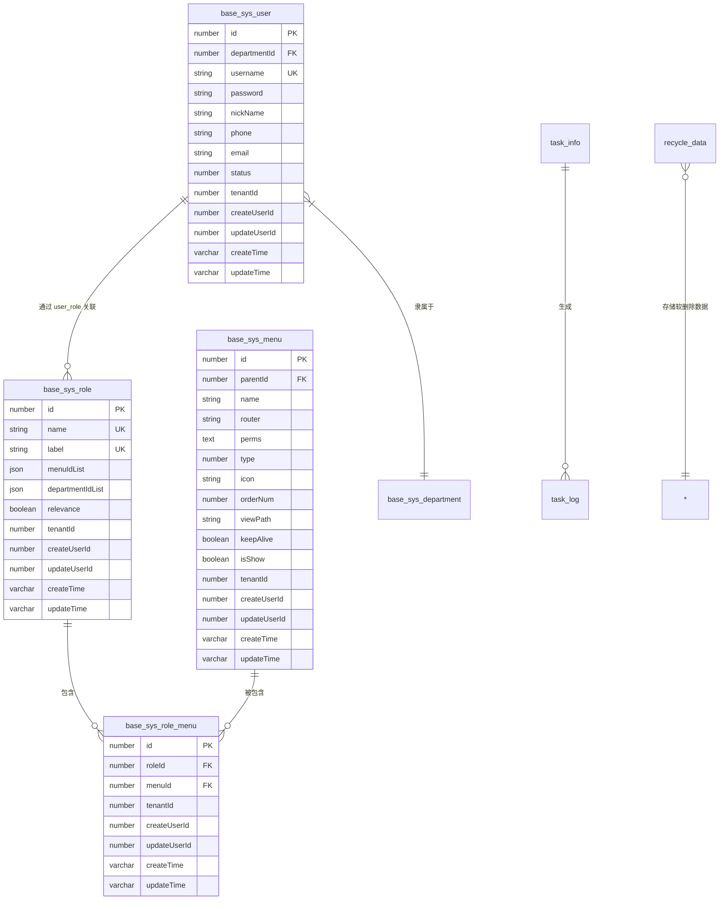
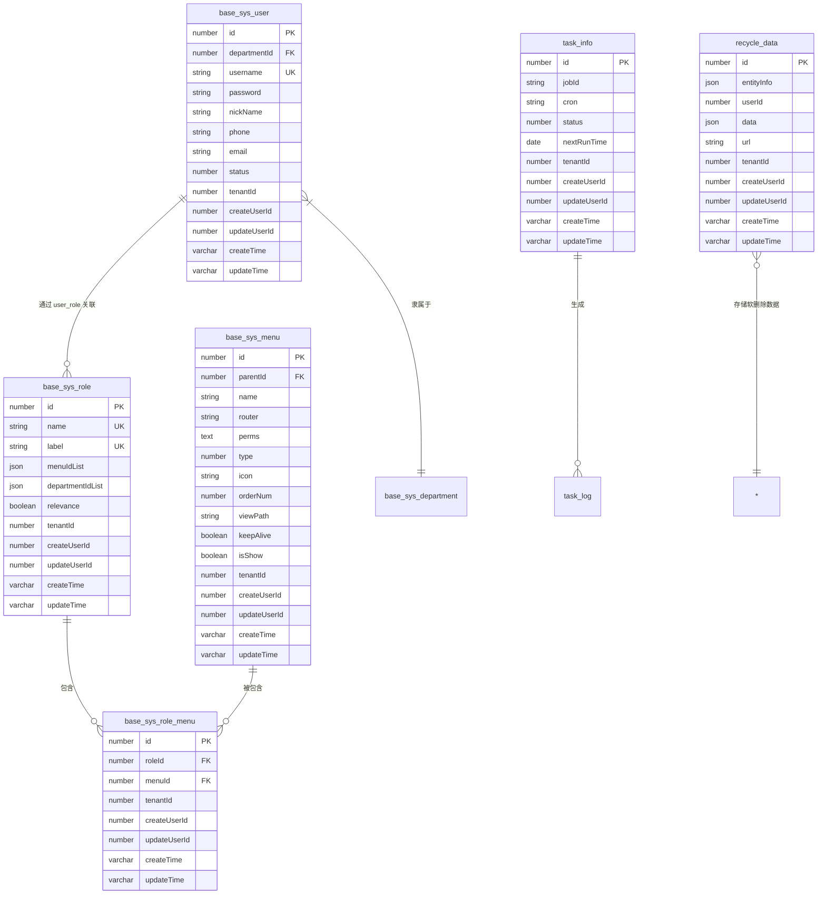

# 数据库设计

<cite>
**本文档引用的文件**
- [user.ts](file://src/modules/base/entity/sys/user.ts)
- [role.ts](file://src/modules/base/entity/sys/role.ts)
- [menu.ts](file://src/modules/base/entity/sys/menu.ts)
- [role_menu.ts](file://src/modules/base/entity/sys/role_menu.ts)
- [base.ts](file://src/modules/base/entity/base.ts)
- [data.ts](file://src/modules/recycle/entity/data.ts)
- [info.ts](file://src/modules/task/entity/info.ts)
</cite>

## 目录
1. [简介](#简介)
2. [核心实体与关系](#核心实体与关系)
3. [基础模块实体设计](#基础模块实体设计)
4. [多租户数据隔离机制](#多租户数据隔离机制)
5. [回收站模块设计](#回收站模块设计)
6. [任务模块设计](#任务模块设计)
7. [数据库范式与性能优化](#数据库范式与性能优化)
8. [ER图可视化](#er图可视化)

## 简介
本文档详细描述了 `cool-admin-midway` 项目的数据库模型设计，涵盖核心实体、字段定义、主外键约束、索引策略、业务含义及模块间关系。重点分析基础模块中的用户、角色、菜单及其关联表的实体关系，解释多租户支持、软删除回收机制与任务调度模块的设计逻辑。

## 核心实体与关系
系统以 `base_sys_user`（用户）、`base_sys_role`（角色）、`base_sys_menu`（菜单）为核心，通过 `base_sys_role_menu`（角色菜单关联）实现权限控制。所有实体继承自 `BaseEntity`，具备统一的创建/更新时间、用户ID及租户ID字段，支持多租户与审计追踪。

**Diagram sources**
- [user.ts](file://src/modules/base/entity/sys/user.ts#L1-L58)
- [role.ts](file://src/modules/base/entity/sys/role.ts#L1-L31)
- [menu.ts](file://src/modules/base/entity/sys/menu.ts#L1-L47)
- [role_menu.ts](file://src/modules/base/entity/sys/role_menu.ts#L1-L14)
- [base.ts](file://src/modules/base/entity/base.ts#L1-L72)

## 基础模块实体设计

### 用户表 (base_sys_user)
代表系统用户，核心字段包括：
- `username`: 唯一用户名，建立唯一索引
- `password`: 加密存储的密码
- `passwordV`: 密码版本号，用于强制Token失效
- `status`: 状态（0-禁用，1-启用）
- `departmentId`: 所属部门ID，外键关联部门表
- `tenantId`: 租户ID，用于数据隔离

**Section sources**
- [user.ts](file://src/modules/base/entity/sys/user.ts#L1-L58)

### 角色表 (base_sys_role)
定义系统角色，关键字段：
- `name`: 角色名称，唯一索引
- `label`: 角色标签，用于前端展示或权限匹配
- `menuIdList`: JSON格式存储的菜单权限ID列表
- `departmentIdList`: JSON格式存储的部门数据权限
- `relevance`: 数据权限是否关联上下级

**Section sources**
- [role.ts](file://src/modules/base/entity/sys/role.ts#L1-L31)

### 菜单表 (base_sys_menu)
表示系统菜单与权限节点：
- `type`: 类型（0-目录，1-菜单，2-按钮）
- `perms`: 权限标识符，用于后端接口鉴权
- `parentId`: 父菜单ID，实现树形结构
- `orderNum`: 排序字段
- `keepAlive`: 路由缓存开关

**Section sources**
- [menu.ts](file://src/modules/base/entity/sys/menu.ts#L1-L47)

### 角色菜单关联表 (base_sys_role_menu)
多对多关联表，记录角色与菜单的绑定关系：
- `roleId`: 角色ID，外键
- `menuId`: 菜单ID，外键
- 无复合主键，使用自增ID作为主键

**Section sources**
- [role_menu.ts](file://src/modules/base/entity/sys/role_menu.ts#L1-L14)

## 多租户数据隔离机制
系统通过 `tenantId` 字段实现多租户数据隔离：
- 所有继承自 `BaseEntity` 的实体均包含 `tenantId` 字段
- 在数据库查询层面，通过全局拦截器自动注入当前租户的 `tenantId` 条件
- 确保用户只能访问所属租户的数据，实现数据层面的硬隔离
- `tenantId` 建立了普通索引，优化按租户查询的性能

**Section sources**
- [base.ts](file://src/modules/base/entity/base.ts#L50-L54)

## 回收站模块设计
软删除数据统一存储于 `recycle_data` 表，实现集中管理与恢复：

### 回收站表 (recycle_data)
- `entityInfo`: JSON字段，记录被删除数据的来源（数据源名称、实体类名）
- `data`: JSON字段，存储被删除的原始数据对象数组
- `userId`: 操作人ID，记录执行删除的用户
- `url`: 请求的删除接口路径
- `params`: 请求参数快照
- `count`: 删除的数据条数

该设计避免了在每个业务表中添加软删除字段，实现了删除行为的集中审计与数据恢复功能。

**Section sources**
- [data.ts](file://src/modules/recycle/entity/data.ts#L1-L41)

## 任务模块设计

### 任务信息表 (task_info)
存储定时任务的配置信息：
- `jobId`: 任务在调度系统中的唯一ID
- `cron`: Cron表达式，定义执行时间
- `every`: 固定间隔毫秒数（与Cron互斥）
- `status`: 任务状态（0-停止，1-运行）
- `taskType`: 任务类型（0-Cron，1-时间间隔）
- `service`: 执行任务的Service实例ID
- `nextRunTime`: 下一次执行时间，用于调度器快速判断

**Section sources**
- [info.ts](file://src/modules/task/entity/info.ts#L1-L62)

## 数据库范式与性能优化

### 范式设计考量
- 用户、角色、菜单采用第三范式，消除冗余
- `menuIdList` 和 `departmentIdList` 使用JSON字段存储ID列表，牺牲部分范式换取查询性能（避免多表JOIN）
- `recycle_data` 表为反范式设计，集中存储所有软删除数据，便于统一管理

### 索引策略
- 所有唯一字段（如 `username`, `role.name`, `role.label`）建立唯一索引
- 常用查询字段（`createTime`, `updateTime`, `tenantId`, `parentId`, `phone`）建立普通索引
- `recycle_data.userId` 建立索引，优化按操作人查询

### 性能建议
- 对高频查询的关联字段（如 `user.departmentId`）考虑添加外键约束并建立索引
- 定期归档或清理 `recycle_data` 表，避免单表过大影响性能
- 对 `task_info` 表的 `nextRunTime` 和 `status` 字段建立复合索引，优化调度器查询效率

## ER图可视化

**Diagram sources**
- [user.ts](file://src/modules/base/entity/sys/user.ts#L1-L58)
- [role.ts](file://src/modules/base/entity/sys/role.ts#L1-L31)
- [menu.ts](file://src/modules/base/entity/sys/menu.ts#L1-L47)
- [role_menu.ts](file://src/modules/base/entity/sys/role_menu.ts#L1-L14)
- [info.ts](file://src/modules/task/entity/info.ts#L1-L62)
- [data.ts](file://src/modules/recycle/entity/data.ts#L1-L41)
- [base.ts](file://src/modules/base/entity/base.ts#L1-L72)