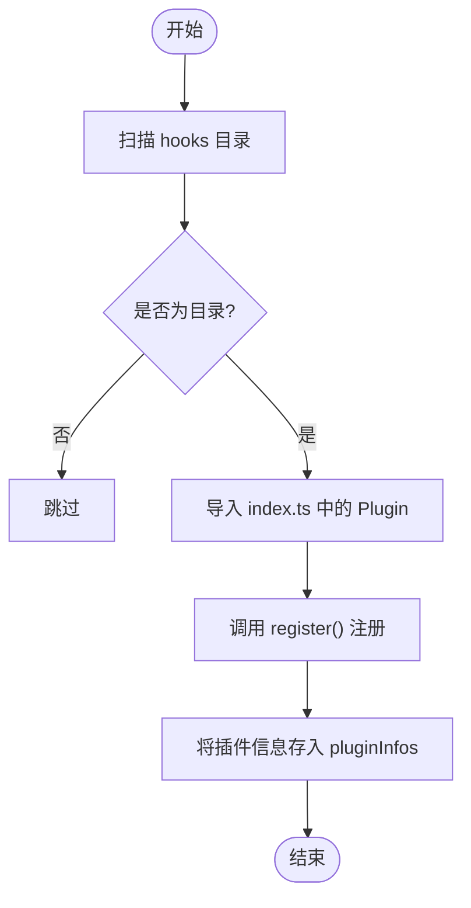
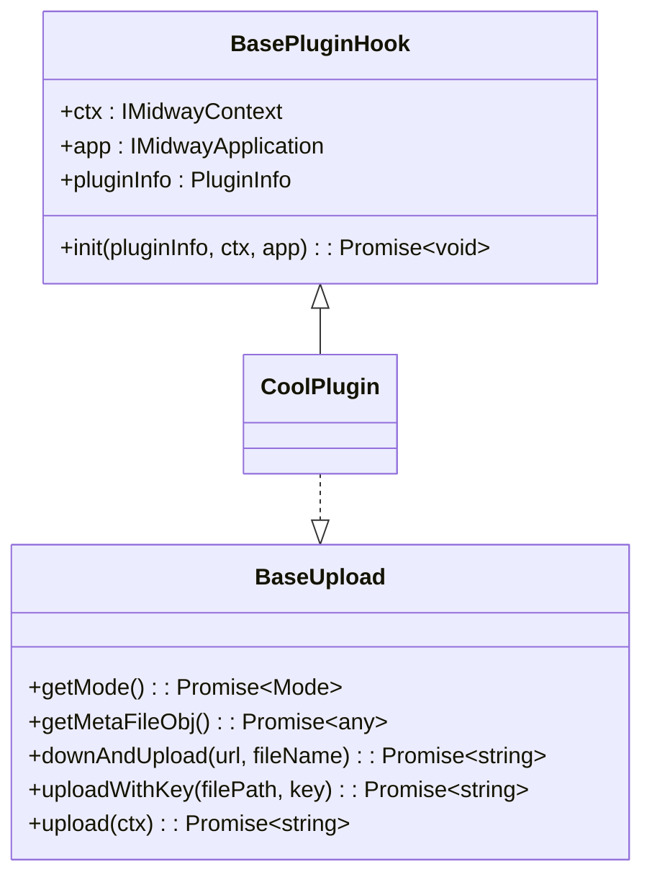
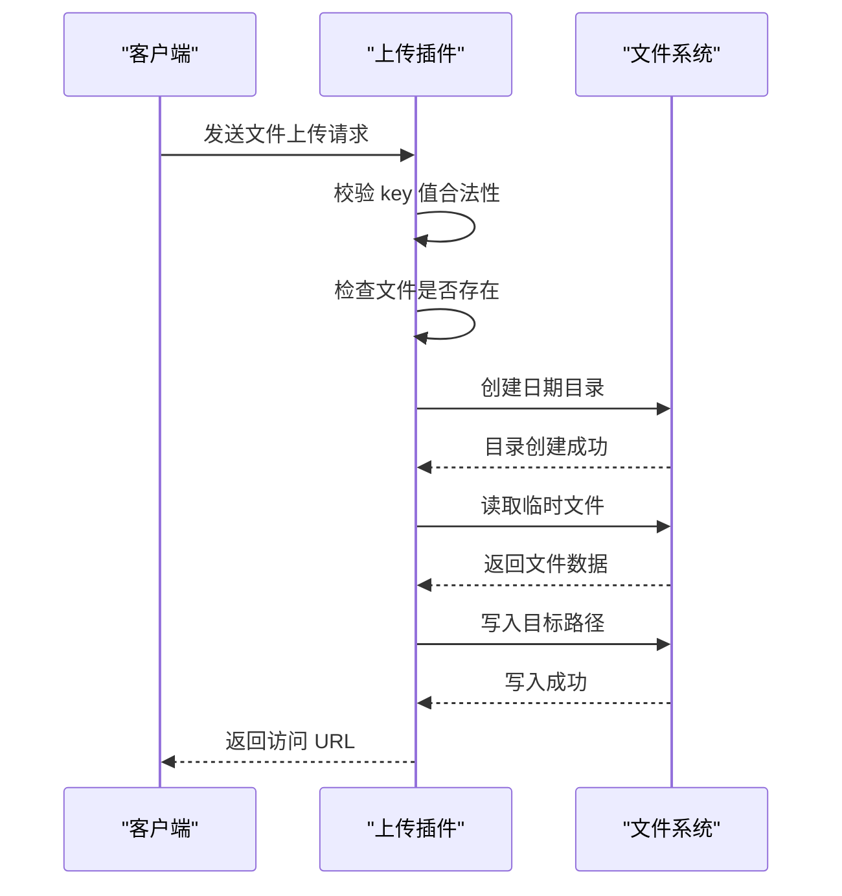
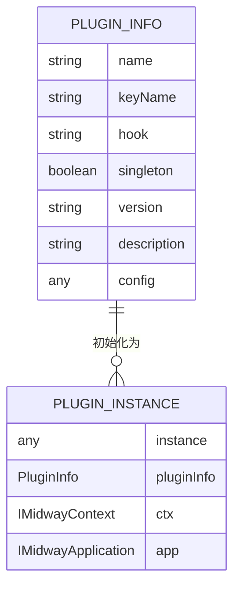
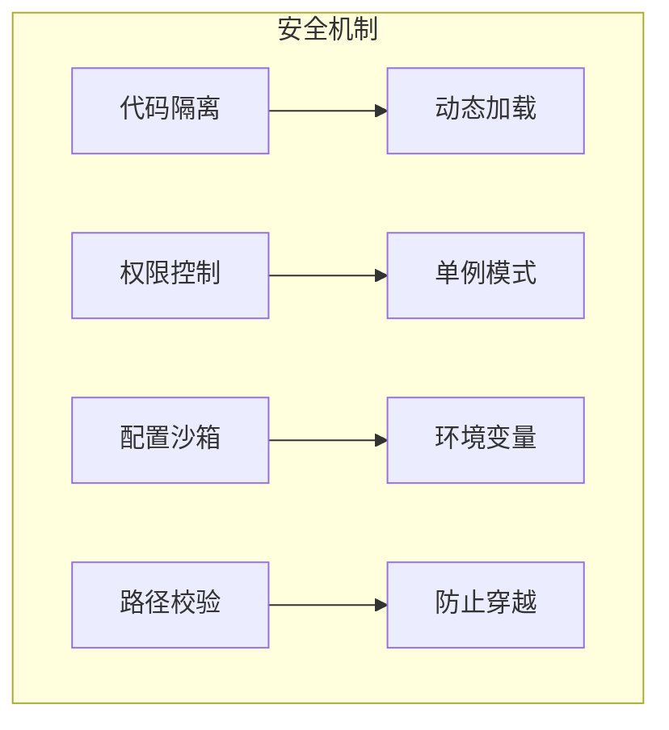

# 插件化机制

<cite>
**本文档引用的文件**  
- [center.ts](file://src/modules/plugin/service/center.ts)
- [index.ts](file://src/modules/plugin/hooks/upload/index.ts)
- [interface.ts](file://src/modules/plugin/hooks/upload/interface.ts)
- [base.ts](file://src/modules/plugin/hooks/base.ts)
- [plugin.d.ts](file://typings/plugin.d.ts)
- [upload.d.ts](file://typings/upload.d.ts)
- [interface.ts](file://src/modules/plugin/interface.ts)
</cite>

## 目录
1. [引言](#引言)
2. [插件管理中心](#插件管理中心)
3. [钩子系统设计](#钩子系统设计)
4. [上传钩子实现分析](#上传钩子实现分析)
5. [插件类型定义与接口规范](#插件类型定义与接口规范)
6. [文件上传插件开发示例](#文件上传插件开发示例)
7. [插件间通信与安全机制](#插件间通信与安全机制)
8. [总结](#总结)

## 引言
`cool-admin-midway` 是一个基于 Midway 框架的企业级 Node.js 后端管理系统，其核心优势之一在于高度可扩展的插件化架构。本文档深入剖析其插件化扩展机制，重点阐述 `plugin` 模块如何通过 `center.ts` 实现插件的注册、发现与调用，解析 `hooks` 钩子系统的实现原理，并结合类型定义说明插件开发的接口规范，最终提供一个完整的文件上传插件开发示例。

## 插件管理中心

`PluginCenterService` 是整个插件体系的核心管理器，负责插件的生命周期管理、注册、初始化与调用。

### 核心功能
- **插件注册与存储**：使用 `Map` 结构维护插件实例（`plugins`）和插件信息（`pluginInfos`），支持单例与非单例模式。
- **钩子自动发现**：扫描 `modules/plugin/hooks` 目录下的子目录，动态加载并注册钩子插件。
- **插件初始化**：从数据库读取已启用的插件配置，动态加载插件代码并实例化。
- **事件驱动机制**：通过 `CoolEventManager` 发布 `EVENT_PLUGIN_READY` 事件，通知系统插件已准备就绪。

### 插件注册流程


**Diagram sources**
- [center.ts](file://src/modules/plugin/service/center.ts#L80-L115)

**Section sources**
- [center.ts](file://src/modules/plugin/service/center.ts#L1-L225)

## 钩子系统设计

钩子（Hook）是 `cool-admin-midway` 实现功能扩展的核心机制，允许开发者在不修改核心代码的前提下，注入自定义逻辑。

### 基类设计
`BasePluginHook` 定义了所有钩子插件的基类，提供了统一的初始化接口：
- `ctx`：请求上下文，用于处理 HTTP 请求。
- `app`：应用实例，用于访问全局服务。
- `pluginInfo`：插件配置信息。
- `init()`：初始化方法，由插件中心调用。



**Diagram sources**
- [base.ts](file://src/modules/plugin/hooks/base.ts#L1-L27)
- [interface.ts](file://src/modules/plugin/hooks/upload/interface.ts#L1-L57)

### 钩子执行流程
1. 插件中心扫描 `hooks` 目录。
2. 动态导入每个钩子目录下的 `index.ts` 文件。
3. 获取导出的 `Plugin` 类。
4. 调用 `register()` 方法注册插件。
5. 插件实例化时调用 `init()` 方法传入配置和上下文。

**Section sources**
- [center.ts](file://src/modules/plugin/service/center.ts#L80-L115)
- [base.ts](file://src/modules/plugin/hooks/base.ts#L1-L27)

## 上传钩子实现分析

`upload` 钩子是 `cool-admin-midway` 中最典型的扩展点之一，用于实现文件上传功能。

### 核心方法
- `getMode()`：返回上传模式（本地、云存储等）。
- `upload(ctx)`：处理 HTTP 文件上传请求。
- `downAndUpload(url)`：从 URL 下载文件并上传。
- `uploadWithKey(filePath, key)`：将本地文件上传到指定路径。

### 安全性处理
- **路径校验**：防止 `..`、`./`、`\\` 等路径穿越攻击。
- **空文件检查**：确保上传文件非空。
- **异常捕获**：使用 `CoolCommException` 统一抛出业务异常。



**Diagram sources**
- [index.ts](file://src/modules/plugin/hooks/upload/index.ts#L1-L120)
- [interface.ts](file://src/modules/plugin/hooks/upload/interface.ts#L1-L57)

**Section sources**
- [index.ts](file://src/modules/plugin/hooks/upload/index.ts#L1-L120)

## 插件类型定义与接口规范

`typings/plugin.d.ts` 文件为插件系统提供了类型安全保障，确保插件开发符合预期接口。

### 类型定义结构
```typescript
interface PluginMap {
  upload: BaseUpload;
  'upload-cos': upload_cos.CoolPlugin;
}
```

### 接口规范
- 所有插件必须导出名为 `Plugin` 的类。
- 插件类必须继承 `BasePluginHook`。
- 插件必须实现对应钩子的接口（如 `BaseUpload`）。
- 插件信息（`PluginInfo`）包含名称、标识、版本、配置等元数据。



**Diagram sources**
- [plugin.d.ts](file://typings/plugin.d.ts#L1-L11)
- [interface.ts](file://src/modules/plugin/interface.ts#L1-L26)

**Section sources**
- [plugin.d.ts](file://typings/plugin.d.ts#L1-L11)
- [interface.ts](file://src/modules/plugin/interface.ts#L1-L26)

## 文件上传插件开发示例

以下是一个基于本地存储的文件上传插件完整实现。

### 1. 创建插件目录结构
```
src/modules/plugin/hooks/upload-local/
├── index.ts
└── interface.ts
```

### 2. 定义接口（可选复用）
```ts
// interface.ts
export interface LocalUploadConfig {
  domain: string;
  uploadDir: string;
}
```

### 3. 实现插件逻辑
```ts
// index.ts
import { BasePluginHook } from '../base';
import * as fs from 'fs';
import * as path from 'path';
import * as moment from 'moment';
import { v1 as uuid } from 'uuid';
import { CoolCommException } from '@cool-midway/core';
import { pUploadPath } from '../../../../comm/path';

export class CoolPlugin extends BasePluginHook {
  async getMode() {
    return { mode: 'local', type: 'local' };
  }

  async upload(ctx) {
    const { domain, uploadDir = 'upload' } = this.pluginInfo.config;
    const file = ctx.files?.[0];
    if (!file) throw new CoolCommException('文件为空');

    const ext = path.extname(file.filename);
    const fileName = `${moment().format('YYYYMMDD')}/${uuid()}${ext}`;
    const targetPath = path.join(pUploadPath(), uploadDir, fileName);

    // 确保目录存在
    const dir = path.dirname(targetPath);
    if (!fs.existsSync(dir)) fs.mkdirSync(dir, { recursive: true });

    fs.writeFileSync(targetPath, fs.readFileSync(file.data));
    return `${domain}/${uploadDir}/${fileName}`;
  }
}

export const Plugin = CoolPlugin;
```

### 4. 配置注入
在 `config.default.ts` 中添加：
```ts
module: {
  plugin: {
    hooks: {
      'upload-local': {
        domain: 'http://localhost:7001',
        uploadDir: 'uploads'
      }
    }
  }
}
```

**Section sources**
- [index.ts](file://src/modules/plugin/hooks/upload/index.ts#L1-L120)
- [config.ts](file://src/config/config.default.ts)

## 插件间通信与安全机制

### 通信模式
- **事件总线**：通过 `CoolEventManager` 实现松耦合通信。
- **共享服务**：通过 `@Inject()` 注入共享服务（如缓存、数据库）。
- **配置传递**：通过 `pluginInfo.config` 传递配置参数。

### 版本兼容性
- 插件信息中包含 `version` 字段。
- 插件中心可根据版本号进行兼容性判断。
- 建议使用语义化版本控制（SemVer）。

### 安全沙箱
- **代码隔离**：使用 `eval` 动态执行插件代码（需谨慎）。
- **权限控制**：通过 `singleton` 标志控制实例化方式。
- **配置沙箱**：环境变量隔离（`@env` 配置）。
- **路径校验**：防止路径穿越攻击。



**Diagram sources**
- [center.ts](file://src/modules/plugin/service/center.ts#L200-L220)
- [index.ts](file://src/modules/plugin/hooks/upload/index.ts#L50-L70)

**Section sources**
- [center.ts](file://src/modules/plugin/service/center.ts#L1-L225)
- [index.ts](file://src/modules/plugin/hooks/upload/index.ts#L1-L120)

## 总结
`cool-admin-midway` 的插件化机制通过 `PluginCenterService` 实现了插件的集中管理与动态加载，利用 `hooks` 目录和基类 `BasePluginHook` 构建了灵活的扩展点系统。结合 `typings/plugin.d.ts` 的类型定义，确保了插件开发的类型安全与接口一致性。开发者可基于此机制快速构建如文件上传、消息推送、支付集成等扩展功能，同时系统通过事件总线、配置沙箱和路径校验等机制保障了插件间的通信安全与系统稳定性。