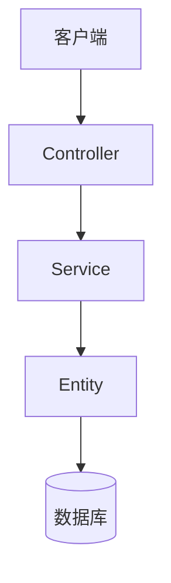
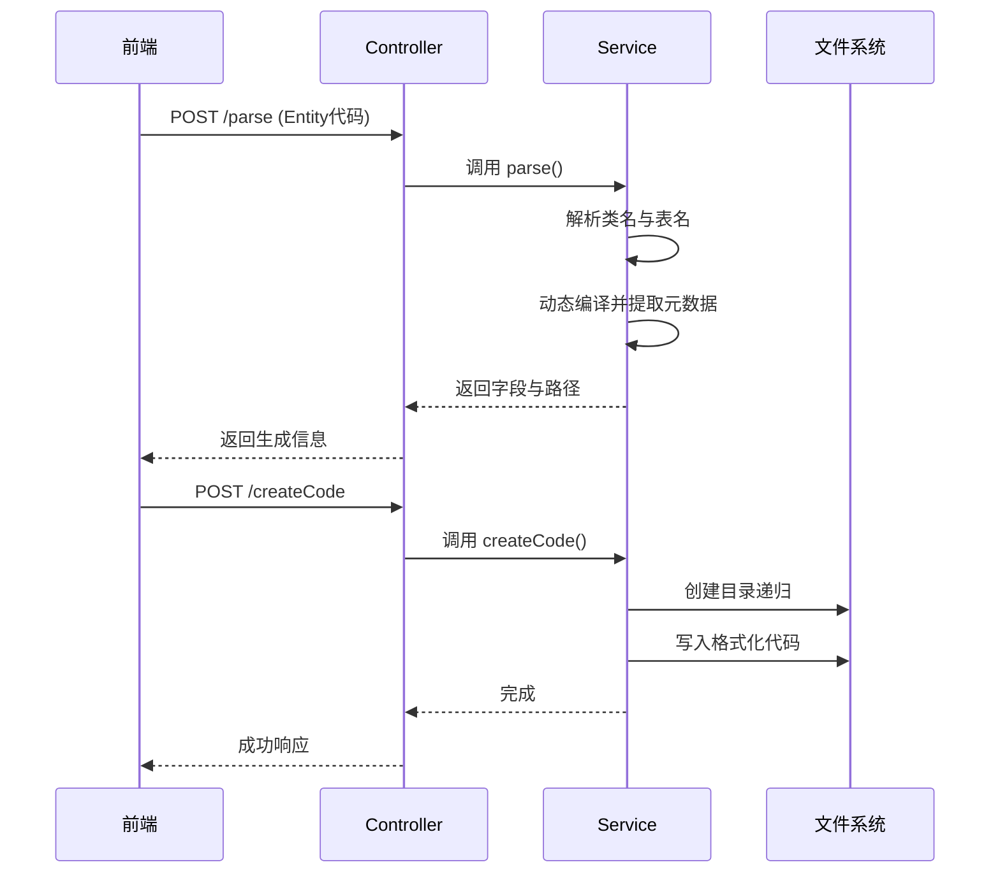
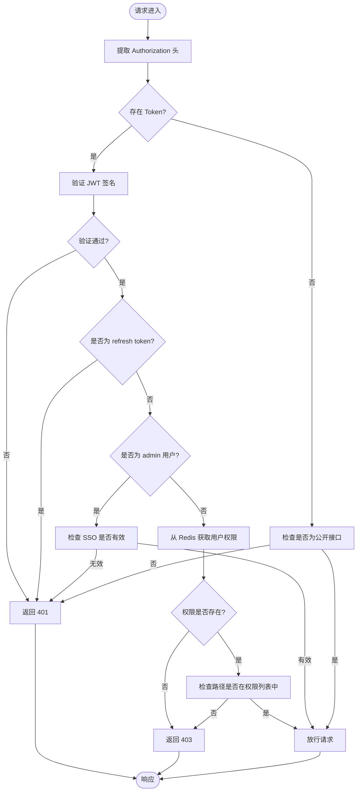
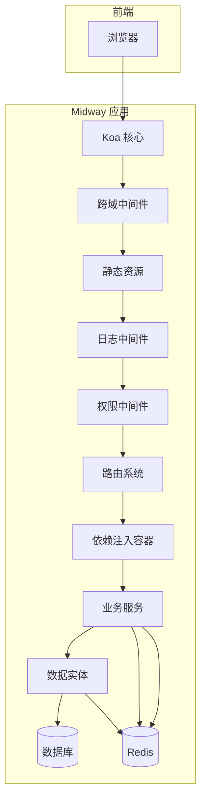

# 核心架构设计

<cite>
**本文档引用文件**  
- [configuration.ts](file://src/configuration.ts)
- [base/authority.ts](file://src/modules/base/middleware/authority.ts)
- [base/menu.ts](file://src/modules/base/entity/sys/menu.ts)
- [base/menu.ts](file://src/modules/base/service/sys/menu.ts)
- [base/menu.ts](file://src/modules/base/controller/admin/sys/menu.ts)
- [base/config.ts](file://src/modules/base/config.ts)
- [base/coding.ts](file://src/modules/base/service/coding.ts)
- [base/coding.ts](file://src/modules/base/controller/admin/coding.ts)
</cite>

## 目录
1. [系统架构概述](#系统架构概述)
2. [MVC 分层结构](#mvc-分层结构)
3. [应用入口与配置机制](#应用入口与配置机制)
4. [AI 代码生成机制](#ai-代码生成机制)
5. [权限控制系统](#权限控制系统)
6. [模块化加载策略](#模块化加载策略)
7. [系统上下文与组件交互](#系统上下文与组件交互)

## 系统架构概述

cool-admin-midway 是一个基于 Midway 框架构建的企业级后台管理系统，采用典型的 MVC 分层架构，结合模块化设计和 AI 辅助开发能力，实现了高内聚、低耦合的系统结构。系统通过 TypeScript 和装饰器实现元编程，支持自动化的 CRUD 接口生成、权限控制、菜单管理与代码生成，适用于快速开发中后台应用。

**Section sources**  
- [configuration.ts](file://src/configuration.ts#L1-L74)
- [base/config.ts](file://src/modules/base/config.ts#L1-L40)

## MVC 分层结构

系统严格遵循 MVC（Model-View-Controller）设计模式，各层职责清晰：

- **Controller**：负责接收 HTTP 请求，调用 Service 层处理业务逻辑，并返回响应。例如 `BaseSysMenuController` 处理菜单相关的增删改查请求。
- **Service**：封装核心业务逻辑，协调 Entity 与数据库操作，实现事务控制与数据校验。如 `BaseSysMenuService` 提供菜单权限计算、子菜单递归删除等功能。
- **Entity**：使用 TypeORM 映射数据库表结构，定义字段与关系。例如 `BaseSysMenuEntity` 对应 `base_sys_menu` 表，包含菜单名称、路由、权限标识等字段。

这种分层结构确保了业务逻辑与数据访问的解耦，提升了代码可维护性与可测试性。

**Diagram sources**  
- [base/menu.ts](file://src/modules/base/controller/admin/sys/menu.ts#L1-L47)
- [base/menu.ts](file://src/modules/base/service/sys/menu.ts#L1-L463)
- [base/menu.ts](file://src/modules/base/entity/sys/menu.ts#L1-L47)

**Section sources**  
- [base/menu.ts](file://src/modules/base/controller/admin/sys/menu.ts#L1-L47)
- [base/menu.ts](file://src/modules/base/service/sys/menu.ts#L1-L463)
- [base/menu.ts](file://src/modules/base/entity/sys/menu.ts#L1-L47)

## 应用入口与配置机制

`configuration.ts` 是整个应用的入口文件，使用 `@Configuration` 装饰器注册核心组件、中间件与插件。通过 `imports` 数组引入 Koa、TypeORM、Validate、StaticFile 等 Midway 官方组件，以及 `@cool-midway/core` 等自定义模块。

同时，通过 `importConfigs` 加载不同环境下的配置文件（`config.default.ts`、`config.local.ts`、`config.prod.ts`），实现多环境配置管理。该文件还注入了应用实例、日志服务和路由服务，为后续模块初始化提供基础支持。

**Section sources**  
- [configuration.ts](file://src/configuration.ts#L1-L74)

## AI 代码生成机制

系统内置 AI 代码生成功能，核心原理是通过反射解析 Entity 类定义，自动生成 CRUD 接口与前端请求路径。该机制由 `BaseSysMenuService.parse()` 方法实现：

1. 接收 Entity 类的源码字符串，使用正则提取类名与表名。
2. 利用 TypeScript 编译器 API（`ts.transpile`）动态编译并加载类定义。
3. 通过临时数据库连接（`TempDataSource`）解析实体元数据，获取字段信息。
4. 结合 Controller 模板与模块信息，生成完整的请求路径（如 `/admin/base/menu`）。

前端通过调用 `/admin/sys/menu/parse` 接口传入 Entity 代码，后端返回字段结构与路径信息，用于生成表单与接口调用代码。

此外，`BaseCodingService.createCode()` 支持批量写入文件，结合 Prettier 自动格式化代码，确保生成代码风格统一。

**Diagram sources**  
- [base/menu.ts](file://src/modules/base/service/sys/menu.ts#L272-L316)
- [base/coding.ts](file://src/modules/base/service/coding.ts#L56-L79)
- [base/coding.ts](file://src/modules/base/controller/admin/coding.ts#L1-L30)

**Section sources**  
- [base/menu.ts](file://src/modules/base/service/sys/menu.ts#L272-L316)
- [base/coding.ts](file://src/modules/base/service/coding.ts#L56-L79)
- [base/coding.ts](file://src/modules/base/controller/admin/coding.ts#L1-L30)

## 权限控制系统

系统采用基于 JWT 的认证机制与中间件拦截实现权限控制：

- **JWT 认证**：用户登录后生成 Token，包含 `userId`、`username`、`passwordVersion` 等信息，通过 `Authorization` 头传递。
- **Authority 中间件**：`BaseAuthorityMiddleware` 在请求进入时校验 Token 有效性，检查是否为刷新 Token，并从 Redis 缓存中获取用户权限列表（`perms`）。
- **权限比对**：将请求路径（如 `/admin/sys/user`）与用户权限列表进行匹配，若无对应权限则返回 403。
- **超管特权**：用户名为 `admin` 的用户拥有所有权限，无需逐项校验。
- **忽略路径**：通过 `TagTypes.IGNORE_TOKEN` 标记的路径（如登录接口）可免认证访问。

配置中支持单点登录（SSO）控制，确保同一用户只能在一个设备登录。

**Diagram sources**  
- [base/authority.ts](file://src/modules/base/middleware/authority.ts#L1-L134)
- [base/config.ts](file://src/modules/base/config.ts#L1-L40)

**Section sources**  
- [base/authority.ts](file://src/modules/base/middleware/authority.ts#L1-L134)
- [base/config.ts](file://src/modules/base/config.ts#L1-L40)

## 模块化加载策略

系统采用模块化设计，每个功能模块（如 `base`、`user`、`dict`）独立存放于 `src/modules` 目录下，包含各自的 `controller`、`service`、`entity` 与 `config.ts`。

- **模块配置**：每个模块通过 `config.ts` 导出配置，定义模块名称、描述、中间件、加载顺序等。
- **全局中间件注册**：`base` 模块在 `config.ts` 中注册 `BaseAuthorityMiddleware`、`BaseLogMiddleware` 等全局中间件。
- **加载顺序控制**：通过 `order` 字段控制模块加载优先级，确保依赖模块先加载。
- **动态注册**：框架在启动时扫描模块目录，按顺序加载并注册路由与服务。

这种设计实现了功能解耦，便于团队协作开发与模块复用。

**Section sources**  
- [base/config.ts](file://src/modules/base/config.ts#L1-L40)

## 系统上下文与组件交互

系统整体数据流与控制流如下：

1. **请求入口**：Koa 接收 HTTP 请求，经过跨域、静态资源、日志等中间件处理。
2. **权限拦截**：`BaseAuthorityMiddleware` 校验 JWT 与权限，决定是否放行。
3. **路由分发**：根据请求路径匹配 Controller 方法，注入依赖（如 Service）。
4. **业务处理**：Controller 调用 Service 执行业务逻辑，Service 使用 Entity 操作数据库。
5. **响应返回**：Controller 封装结果并返回 JSON 响应。

组件间通过依赖注入（@Inject）解耦，由 Midway 容器统一管理生命周期。TypeORM 提供 ORM 支持，Redis 用于缓存用户权限与会话信息，实现高性能访问控制。

**Diagram sources**  
- [configuration.ts](file://src/configuration.ts#L1-L74)
- [base/authority.ts](file://src/modules/base/middleware/authority.ts#L1-L134)
- [base/menu.ts](file://src/modules/base/service/sys/menu.ts#L1-L463)

**Section sources**  
- [configuration.ts](file://src/configuration.ts#L1-L74)
- [base/authority.ts](file://src/modules/base/middleware/authority.ts#L1-L134)
- [base/menu.ts](file://src/modules/base/service/sys/menu.ts#L1-L463)