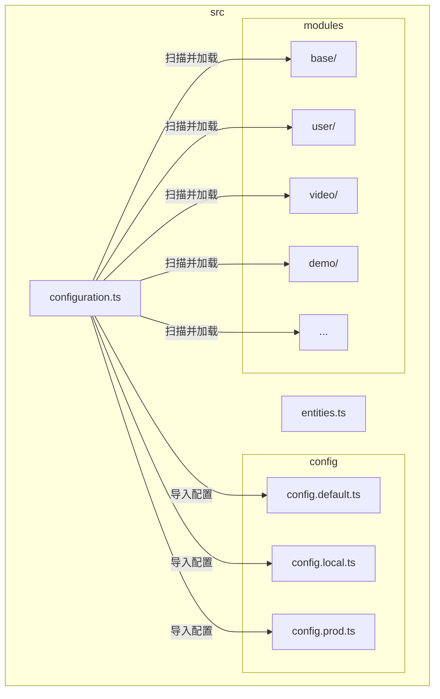
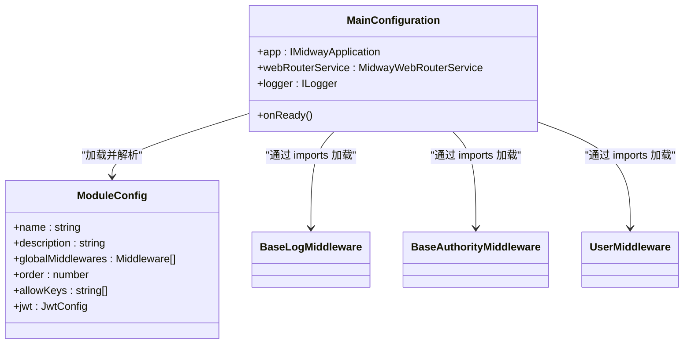
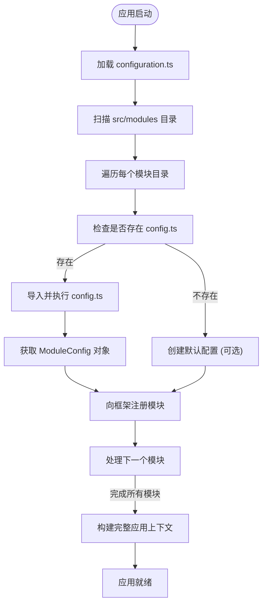

# 模块化架构设计

<cite>
**本文档引用文件**  
- [configuration.ts](file://src/configuration.ts)
- [base/config.ts](file://src/modules/base/config.ts)
- [user/config.ts](file://src/modules/user/config.ts)
- [video/config.ts](file://src/modules/video/config.ts)
- [demo/config.ts](file://src/modules/demo/config.ts)
- [recycle/config.ts](file://src/modules/recycle/config.ts)
- [echart/config.ts](file://src/modules/echart/config.ts)
- [base/service/sys/menu.ts](file://src/modules/base/service/sys/menu.ts)
</cite>

## 目录

1. [引言](#引言)
2. [项目结构概览](#项目结构概览)
3. [核心模块化机制](#核心模块化机制)
4. [模块配置与注册机制](#模块配置与注册机制)
5. [模块加载顺序与依赖管理](#模块加载顺序与依赖管理)
6. [模块间解耦与调用规范](#模块间解耦与调用规范)
7. [应用上下文动态构建流程](#应用上下文动态构建流程)
8. [模块生命周期与钩子函数](#模块生命周期与钩子函数)
9. [自定义模块创建指南](#自定义模块创建指南)
10. [常见配置错误与排查方法](#常见配置错误与排查方法)
11. [结论](#结论)

## 引言

`cool-admin-midway` 是一个基于 Midway 框架构建的企业级后台管理系统，其核心优势在于高度模块化的架构设计。本文档深入解析其模块化实现机制，重点阐述如何通过 `@Configuration` 装饰器实现模块的自动加载、依赖注入与上下文构建，帮助开发者理解其设计精髓并高效进行二次开发。

## 项目结构概览

项目采用清晰的模块化目录结构，所有业务功能均封装在 `src/modules` 目录下，每个子目录（如 `base`、`user`、`video`）代表一个独立的功能模块。每个模块内部遵循 MVC 分层模式，包含 `controller`、`service`、`entity` 等标准目录，并通过 `config.ts` 文件进行模块级配置。



**图示来源**  
- [configuration.ts](file://src/configuration.ts#L25-L73)
- 项目结构

**本节来源**  
- [configuration.ts](file://src/configuration.ts#L0-L74)
- 项目结构

## 核心模块化机制

`cool-admin-midway` 的模块化架构基于 Midway 框架的 `@Configuration` 装饰器实现。该装饰器是整个应用的启动入口，负责定义应用所需的核心组件和配置。

在 `src/configuration.ts` 中，`MainConfiguration` 类通过 `@Configuration` 的 `imports` 数组声明了所有需要加载的框架组件（如 Koa、TypeORM、Validate、Redis 等）和业务模块（通过 `cool` 组件间接加载）。`importConfigs` 则用于合并不同环境下的配置文件。



**图示来源**  
- [configuration.ts](file://src/configuration.ts#L25-L73)
- [base/config.ts](file://src/modules/base/config.ts#L0-L40)
- [user/config.ts](file://src/modules/user/config.ts#L0-L34)

**本节来源**  
- [configuration.ts](file://src/configuration.ts#L0-L74)

## 模块配置与注册机制

每个功能模块通过其根目录下的 `config.ts` 文件进行注册和配置。该文件导出一个函数，返回一个 `ModuleConfig` 对象，定义了模块的元数据和行为。

关键配置项包括：
- **name**: 模块名称，用于标识。
- **description**: 模块描述。
- **globalMiddlewares**: 全局中间件数组，对所有请求生效。
- **middlewares**: 本模块中间件，仅对本模块路由生效。
- **order**: 加载顺序，数值越大越优先。

例如，`base` 模块配置了 `BaseTranslateMiddleware`、`BaseAuthorityMiddleware` 和 `BaseLogMiddleware` 三个全局中间件，并设置了较高的加载优先级（`order: 10`），确保权限和日志功能在其他模块之前就绪。



**图示来源**  
- [configuration.ts](file://src/configuration.ts#L25-L73)
- [base/config.ts](file://src/modules/base/config.ts#L0-L40)
- [user/config.ts](file://src/modules/user/config.ts#L0-L34)
- [video/config.ts](file://src/modules/video/config.ts#L0-L20)

**本节来源**  
- [base/config.ts](file://src/modules/base/config.ts#L0-L40)
- [user/config.ts](file://src/modules/user/config.ts#L0-L34)
- [video/config.ts](file://src/modules/video/config.ts#L0-L20)
- [demo/config.ts](file://src/modules/demo/config.ts#L0-L18)

## 模块加载顺序与依赖管理

模块的加载顺序由 `ModuleConfig` 中的 `order` 字段精确控制。`cool-admin-midway` 通过此机制实现了模块间的隐式依赖管理。

例如，`base` 模块的 `order` 为 `10`，而 `user` 和 `video` 模块的 `order` 均为 `0`。这意味着 `base` 模块会优先加载，其提供的 `BaseAuthorityMiddleware` 和 `BaseLogMiddleware` 可以在 `user` 和 `video` 模块的控制器和路由被注册之前就已生效，从而确保了权限校验和日志记录功能的全局可用性。

这种设计实现了模块间的松耦合：`user` 模块无需显式声明对 `base` 模块的依赖，只需依赖 `base` 模块提供的中间件和基础服务即可。框架通过加载顺序保证了依赖的正确性。

**本节来源**  
- [base/config.ts](file://src/modules/base/config.ts#L0-L40)
- [user/config.ts](file://src/modules/user/config.ts#L0-L34)
- [video/config.ts](file://src/modules/video/config.ts#L0-L20)

## 模块间解耦与调用规范

`cool-admin-midway` 通过以下策略实现模块间解耦：
1.  **独立配置**：每个模块拥有独立的 `config.ts`，互不影响。
2.  **作用域中间件**：`middlewares` 数组允许模块定义仅作用于自身路由的中间件。
3.  **全局中间件共享**：`globalMiddlewares` 用于提供跨模块的通用功能（如鉴权、日志）。
4.  **服务注入**：模块间通过 Midway 的依赖注入（DI）容器进行服务调用，而非直接导入。

调用规范建议：
- **避免直接文件导入**：不应在 `user` 模块中直接 `import` `video` 模块的服务文件。
- **使用 DI 容器**：通过 `@Inject()` 装饰器注入其他模块的服务。例如，若 `user` 模块需要调用 `video` 模块的服务，`video` 模块的服务类应被正确装饰（如 `@Provide()`），然后在 `user` 模块的服务中通过 `@Inject('VideoService') videoService: VideoService` 的方式注入。

## 应用上下文动态构建流程

应用上下文的构建是一个动态过程，由 `MainConfiguration` 驱动：

1.  **启动**：Node.js 进程启动，加载 `bootstrap.js`，初始化 Midway 容器。
2.  **配置加载**：`MainConfiguration` 类被识别，`@Configuration` 装饰器开始工作。
3.  **组件导入**：`imports` 数组中的所有组件（框架和业务）被依次加载。
4.  **模块扫描**：`cool` 组件（或框架内置机制）扫描 `src/modules` 目录。
5.  **配置解析**：对于每个模块，执行其 `config.ts` 文件，获取 `ModuleConfig`。
6.  **注册与合并**：将模块的控制器、服务、中间件等注册到全局 DI 容器和路由系统中，并合并配置。
7.  **上下文构建**：所有模块加载完成后，完整的应用上下文（包含所有服务、路由、中间件）构建完毕。
8.  **就绪**：调用 `onReady()` 钩子，应用启动完成。

此流程确保了应用的可扩展性，新增模块只需在 `src/modules` 下创建目录并提供 `config.ts` 即可被自动集成。

**本节来源**  
- [configuration.ts](file://src/configuration.ts#L25-L73)
- [base/config.ts](file://src/modules/base/config.ts#L0-L40)

## 模块生命周期与钩子函数

`MainConfiguration` 类定义了模块生命周期的关键钩子——`onReady()`。该方法在所有模块都已加载、应用上下文完全构建后执行。

```typescript
async onReady() {}
```

开发者可以在此钩子中执行以下操作：
- 初始化数据（如创建管理员账户）。
- 启动定时任务。
- 建立外部连接（如 WebSocket）。
- 执行依赖于多个模块都已就绪的初始化逻辑。

此钩子是确保应用在完全准备好的状态下开始处理请求的关键。

**本节来源**  
- [configuration.ts](file://src/configuration.ts#L70-L72)

## 自定义模块创建指南

创建一个名为 `news` 的自定义模块的完整步骤如下：

### 1. 创建目录结构
在 `src/modules/` 下创建 `news` 目录，并建立标准子目录：
```
src/modules/news/
├── controller/
│   └── admin/
│       └── news.ts
├── entity/
│   └── news.ts
├── service/
│   └── news.ts
└── config.ts
```

### 2. 创建模块配置文件
在 `news/config.ts` 中编写配置：
```typescript
import { ModuleConfig } from '@cool-midway/core';

export default () => {
  return {
    name: '新闻模块',
    description: '新闻发布与管理',
    globalMiddlewares: [],
    middlewares: [],
    order: 1, // 确保在 base 之后，其他业务模块之前加载
  } as ModuleConfig;
};
```

### 3. 定义实体与服务
在 `entity/news.ts` 中定义数据库实体，在 `service/news.ts` 中编写业务逻辑。

### 4. 创建控制器
在 `controller/admin/news.ts` 中创建控制器，使用 `@Controller()` 装饰器定义路由。

### 5. 服务暴露
确保服务类使用 `@Provide()` 装饰器，以便能被 DI 容器管理。

完成以上步骤后，重启应用，`news` 模块将被自动加载并注册。

**本节来源**  
- [base/service/sys/menu.ts](file://src/modules/base/service/sys/menu.ts#L318-L384)
- [demo/config.ts](file://src/modules/demo/config.ts#L0-L18)

## 常见配置错误与排查方法

| 错误现象 | 可能原因 | 排查方法 |
| :--- | :--- | :--- |
| 模块功能无法访问 | `config.ts` 文件缺失或路径错误 | 检查 `src/modules/[模块名]/config.ts` 是否存在 |
| 中间件未生效 | 中间件类未正确导出或未在 `config.ts` 中注册 | 检查中间件类是否被 `@Provide()` 装饰，并确认其在 `globalMiddlewares` 或 `middlewares` 数组中 |
| 依赖服务注入失败 | 服务类缺少 `@Provide()` 装饰器 | 在服务类上添加 `@Provide()` 装饰器 |
| 模块加载顺序错误 | `order` 值设置不当 | 调整 `config.ts` 中的 `order` 值，确保依赖模块的 `order` 值更大 |
| 应用启动失败 | `configuration.ts` 的 `imports` 数组中组件路径错误 | 检查 `configuration.ts` 中所有 `import` 语句是否正确 |

**本节来源**  
- [base/config.ts](file://src/modules/base/config.ts#L0-L40)
- [configuration.ts](file://src/configuration.ts#L25-L73)

## 结论

`cool-admin-midway` 通过 `@Configuration` 装饰器和 `ModuleConfig` 配置对象，构建了一套强大而灵活的模块化架构。该设计实现了模块的自动发现、按序加载、依赖注入和上下文动态构建，极大地提升了代码的可维护性和可扩展性。开发者遵循其规范，可以高效地创建和集成新功能模块，同时通过合理的加载顺序和中间件机制，确保了系统的稳定与安全。