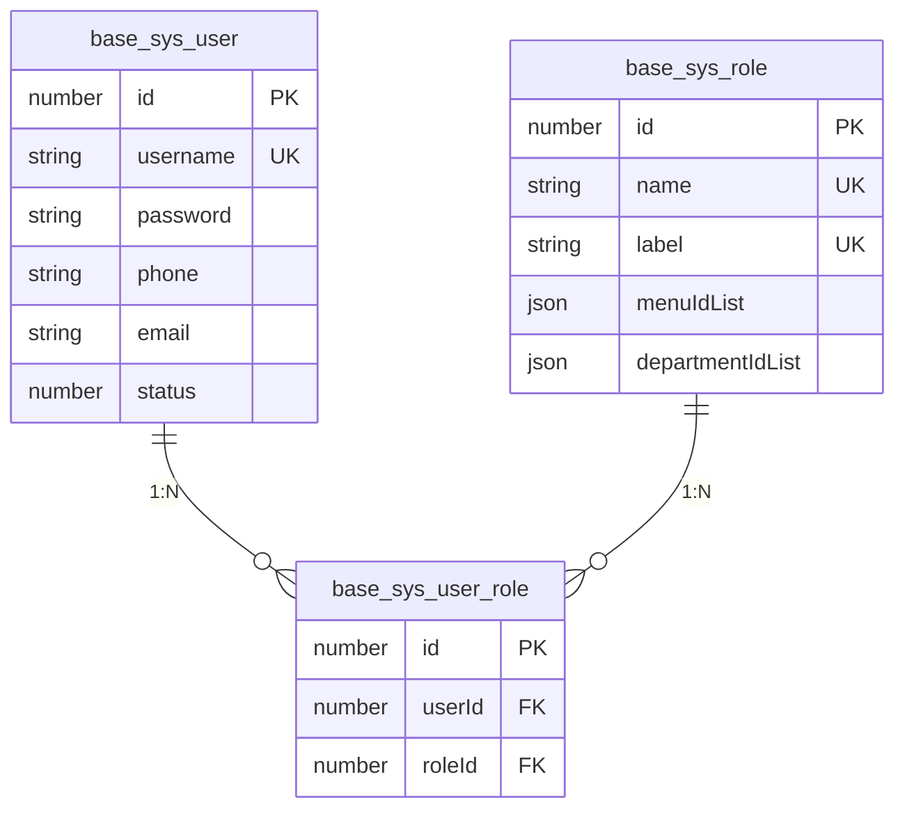
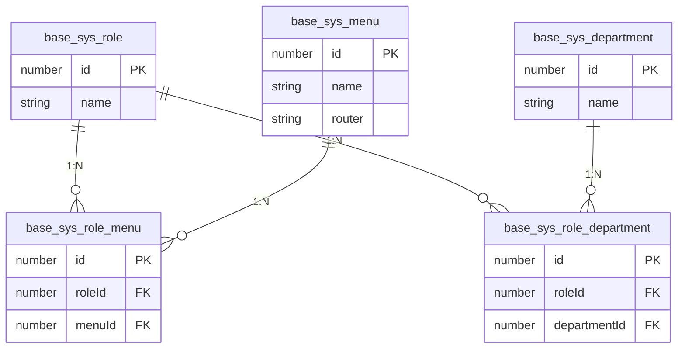

# 实体类（Entity）开发规范

<cite>
**本文档引用的文件**  
- [base.ts](file://src/modules/base/entity/base.ts)
- [user.ts](file://src/modules/base/entity/sys/user.ts)
- [role.ts](file://src/modules/base/entity/sys/role.ts)
- [user_role.ts](file://src/modules/base/entity/sys/user_role.ts)
- [role_menu.ts](file://src/modules/base/entity/sys/role_menu.ts)
- [menu.ts](file://src/modules/base/entity/sys/menu.ts)
- [role_department.ts](file://src/modules/base/entity/sys/role_department.ts)
</cite>

## 目录
1. [引言](#引言)
2. [实体基类设计](#实体基类设计)
3. [核心实体定义规范](#核心实体定义规范)
4. [关系映射实现方式](#关系映射实现方式)
5. [字段类型与索引设置](#字段类型与索引设置)
6. [命名规范与数据库一致性](#命名规范与数据库一致性)
7. [最佳实践总结](#最佳实践总结)

## 引言
本文档旨在为基于 TypeORM 的实体类开发提供详细规范，确保数据模型定义的一致性、可维护性和稳定性。通过 `@Entity`、`@Column`、`@PrimaryGeneratedColumn`、`@ManyToOne`、`@OneToMany` 等装饰器，结合 `BaseEntity` 基类，统一管理公共字段与行为。以 `base` 模块中的 `BaseSysUserEntity` 和 `BaseSysRoleEntity` 为例，展示主键定义、字段类型、索引设置、外键约束及多对多关系的实现方式。

## 实体基类设计

所有实体类必须继承自 `BaseEntity`，该基类位于 `src/modules/base/entity/base.ts`，封装了通用字段和时间处理逻辑，确保各实体具备统一的结构基础。

`BaseEntity` 提供以下核心字段：
- `id`: 自增主键，使用 `@PrimaryGeneratedColumn('increment')` 实现
- `createTime`: 创建时间，带索引，使用自定义时间转换器格式化为字符串
- `updateTime`: 更新时间，带索引，格式同上
- `tenantId`: 租户ID，支持多租户架构
- `createUserId` 与 `updateUserId`: 记录操作用户

此外，定义了 `transformerTime` 和 `transformerJson` 转换器，分别用于日期格式化和 JSON 字段的序列化/反序列化，确保数据在数据库与应用层之间正确转换。

**Section sources**
- [base.ts](file://src/modules/base/entity/base.ts#L1-L72)

## 核心实体定义规范

### 用户实体（BaseSysUserEntity）

用户实体 `BaseSysUserEntity` 映射到数据库表 `base_sys_user`，通过 `@Entity('base_sys_user')` 明确指定表名，避免命名歧义。

关键字段包括：
- `username`: 用户名，设置唯一索引 `@Index({ unique: true })`，长度限制为 100
- `password`: 密码字段，用于存储加密后的密码
- `passwordV`: 密码版本号，默认值为 1，用于控制 Token 失效机制
- `phone` 和 `email`: 手机号与邮箱，支持可空，`phone` 设置长度为 20
- `status`: 状态字段，0 表示禁用，1 表示启用，默认启用

非持久化字段如 `departmentName` 和 `roleIdList` 可用于查询结果扩展，不映射到数据库。

**Section sources**
- [user.ts](file://src/modules/base/entity/sys/user.ts#L1-L57)

### 角色实体（BaseSysRoleEntity）

角色实体 `BaseSysRoleEntity` 映射到 `base_sys_role` 表，包含角色基本信息与权限配置。

关键特性：
- `name` 和 `label` 均设置唯一索引，防止重复
- `menuIdList` 和 `departmentIdList` 使用 `type: 'json'` 并配合 `transformerJson`，实现数组类型字段的存储与解析
- `relevance`: 布尔类型，表示数据权限是否关联上下级，默认为 `false`

**Section sources**
- [role.ts](file://src/modules/base/entity/sys/role.ts#L1-L30)

## 关系映射实现方式

### 多对多关系：用户与角色

用户与角色之间为多对多关系，通过中间表 `base_sys_user_role` 实现，由 `BaseSysUserRoleEntity` 类定义。

该中间实体包含：
- `userId`: 外键，指向用户表
- `roleId`: 外键，指向角色表

此设计符合第三范式，避免数据冗余，并支持高效的角色分配与查询。

**Diagram sources**
- [user.ts](file://src/modules/base/entity/sys/user.ts#L1-L57)
- [role.ts](file://src/modules/base/entity/sys/role.ts#L1-L30)
- [user_role.ts](file://src/modules/base/entity/sys/user_role.ts#L1-L13)

### 角色与菜单、角色与部门的关系

类似地，角色与菜单、角色与部门的关系也通过中间表实现：
- `BaseSysRoleMenuEntity` → 表 `base_sys_role_menu`，关联角色与菜单
- `BaseSysRoleDepartmentEntity` → 表 `base_sys_role_department`，关联角色与部门

这些中间实体均继承自 `BaseEntity`，保留创建/更新时间等审计信息，增强数据可追溯性。

**Diagram sources**
- [role_menu.ts](file://src/modules/base/entity/sys/role_menu.ts#L1-L13)
- [role_department.ts](file://src/modules/base/entity/sys/role_department.ts#L1-L13)
- [menu.ts](file://src/modules/base/entity/sys/menu.ts#L1-L47)

## 字段类型与索引设置

### 字段类型选择
- 数值型：使用 `number`，对应数据库 `int` 或 `bigint`
- 字符串：明确设置 `length`，如 `username` 为 100，`phone` 为 20
- JSON 类型：使用 `type: 'json'` 并配合 `transformerJson`，确保对象/数组正确序列化
- 文本大字段：如 `perms` 使用 `type: 'text'`，避免长度限制

### 索引设置原则
- 高频查询字段必须加索引，如 `username`、`phone`、`createTime`
- 唯一性约束使用 `@Index({ unique: true })`
- 组合索引可根据业务需求后续添加

## 命名规范与数据库一致性

### 类名与表名
- 实体类名采用 `BaseSysUserEntity` 形式，前缀 `Base` 表示基础模块，`Sys` 表示系统级，`User` 为业务对象，`Entity` 标识类型
- 数据库表名统一为 `base_sys_user`，与类名一一对应，使用下划线分隔，全小写

### 字段名映射
- 实体属性名与数据库字段名保持一致，如 `createTime` → `create_time`
- TypeORM 默认支持驼峰转下划线，无需额外配置

此命名策略确保迁移脚本生成准确，避免因大小写或命名风格差异导致的查询失败。

## 最佳实践总结

1. **统一继承 `BaseEntity`**：所有实体必须继承，确保审计字段一致性
2. **显式指定表名**：使用 `@Entity('table_name')` 避免默认命名风险
3. **合理使用索引**：对查询频繁字段建立索引，唯一字段加唯一索引
4. **JSON 字段转换器**：复杂类型使用 `transformer` 保证数据完整性
5. **中间表设计**：多对多关系必须通过独立实体实现，支持扩展字段与审计
6. **命名一致性**：类名、表名、字段名保持映射清晰，提升可维护性

遵循以上规范，可构建稳定、可扩展的数据模型，为系统长期演进奠定坚实基础。

**Section sources**
- [base.ts](file://src/modules/base/entity/base.ts#L1-L72)
- [user.ts](file://src/modules/base/entity/sys/user.ts#L1-L57)
- [role.ts](file://src/modules/base/entity/sys/role.ts#L1-L30)
- [user_role.ts](file://src/modules/base/entity/sys/user_role.ts#L1-L13)
- [role_menu.ts](file://src/modules/base/entity/sys/role_menu.ts#L1-L13)
- [role_department.ts](file://src/modules/base/entity/sys/role_department.ts#L1-L13)