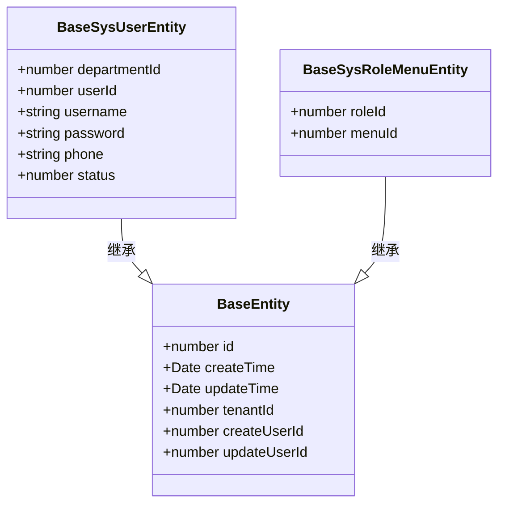
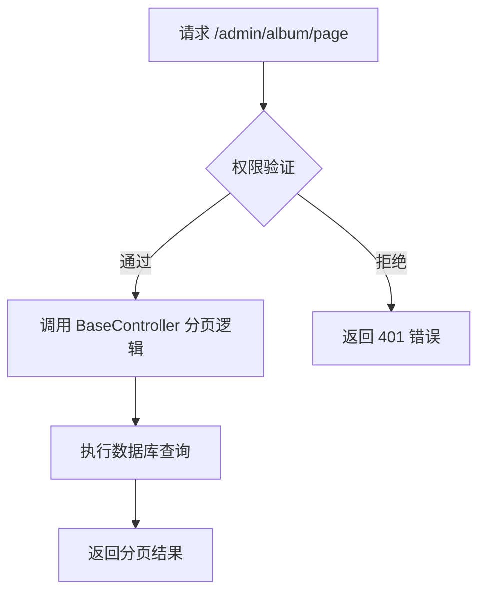
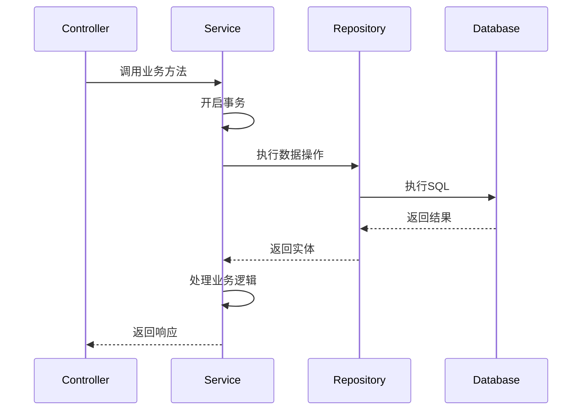
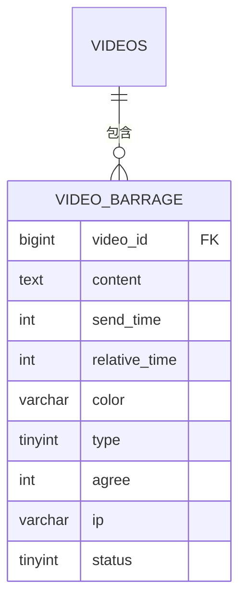

# 模块开发规范

<cite>
**本文档引用的文件**
- [base.ts](file://src/modules/base/entity/base.ts)
- [user.ts](file://src/modules/base/entity/sys/user.ts)
- [album.ts](file://src/modules/video/controller/admin/album.ts)
- [barrage.ts](file://src/modules/video/entity/barrage.ts)
- [coding.ts](file://src/modules/base/service/coding.ts)
- [config.ts](file://src/modules/base/config.ts)
</cite>

## 目录

1. [新模块创建流程](#新模块创建流程)
2. [Entity 编写规范](#entity-编写规范)
3. [Controller 分层设计](#controller-分层设计)
4. [Service 层职责](#service-层职责)
5. [模块间依赖管理](#模块间依赖管理)
6. [CRUD 操作实现示例](#crud-操作实现示例)
7. [模块注册与自动加载机制](#模块注册与自动加载机制)

## 新模块创建流程

在 `src/modules` 目录下创建新模块时，应遵循标准目录结构。每个模块应包含 `controller`、`entity`、`service` 和 `config.ts` 等核心子目录与文件。该结构确保了代码的可维护性和一致性，便于框架自动识别和加载模块。

**Section sources**
- [config.ts](file://src/modules/base/config.ts)

## Entity 编写规范

所有实体类应继承自 `BaseEntity` 基类，该基类定义了通用字段如 `id`、`createTime`、`updateTime`、`tenantId` 等。使用 TypeORM 装饰器进行字段映射，例如 `@Column` 定义列属性，`@PrimaryGeneratedColumn` 标识主键，`@Index` 创建索引以优化查询性能。

对于表间关系，使用 `@ManyToOne`、`@OneToMany` 等装饰器明确声明关联。例如，`BaseSysRoleMenuEntity` 中通过 `roleId` 和 `menuId` 实现角色与菜单的多对多关系映射。

**Diagram sources**
- [base.ts](file://src/modules/base/entity/base.ts#L39-L71)
- [user.ts](file://src/modules/base/entity/sys/user.ts#L6-L58)
- [role_menu.ts](file://src/modules/base/entity/sys/role_menu.ts#L6-L14)

**Section sources**
- [base.ts](file://src/modules/base/entity/base.ts#L39-L71)
- [user.ts](file://src/modules/base/entity/sys/user.ts#L6-L58)

## Controller 分层设计

Controller 层采用分层路径设计：`admin` 路径用于管理员接口，`app` 路径供应用端调用。通过 `@CoolController` 装饰器配置 API 行为，支持 `add`、`delete`、`update`、`info`、`list`、`page` 等标准操作。

使用 `@Get`、`@Post` 等路由装饰器定义具体请求方法。例如，`AdminAlbumController` 配置了分页查询条件 `pageQueryOp`，并自动注入创建用户 ID 到插入参数中。

**Diagram sources**
- [album.ts](file://src/modules/video/controller/admin/album.ts#L6-L20)
- [barrage.ts](file://src/modules/video/controller/admin/barrage.ts#L11-L28)

**Section sources**
- [album.ts](file://src/modules/video/controller/admin/album.ts#L6-L20)

## Service 层职责

Service 层负责封装业务逻辑，调用 Repository 操作数据，处理事务，并集成缓存机制。例如，`BaseCodingService` 提供了代码生成能力，在开发环境下动态创建模块文件结构。

服务类使用 `@Provide` 装饰器注册为依赖注入组件，通过 `@Inject` 在控制器中引用。复杂业务可通过 `QueryRunner` 手动管理事务，确保数据一致性。

**Diagram sources**
- [coding.ts](file://src/modules/base/service/coding.ts#L0-L55)

**Section sources**
- [coding.ts](file://src/modules/base/service/coding.ts#L0-L55)

## 模块间依赖管理

为避免循环引用，模块间依赖应通过接口或事件机制解耦。优先使用依赖注入而非直接导入类。对于共享类型定义，可在 `typings` 目录下声明全局类型文件，如 `plugin.d.ts`。

禁止在实体或服务中直接引用其他模块的具体实现类，应通过抽象层或配置中心进行通信。

**Section sources**
- [types.ts](file://src/modules/plugin/service/types.ts#L73-L119)

## CRUD 操作实现示例

以 `video` 模块为例，`BarrageEntity` 定义了弹幕数据结构，包含 `video_id`、`content`、`send_time` 等字段。`AdminBarrageController` 继承 `BaseController`，自动获得标准 CRUD 接口。

通过 `pageQueryOp` 配置查询条件，支持按 `video_id` 和 `type` 精确筛选，提升接口灵活性。

**Diagram sources**
- [barrage.ts](file://src/modules/video/entity/barrage.ts#L3-L64)
- [barrage.ts](file://src/modules/video/controller/admin/barrage.ts#L11-L28)

**Section sources**
- [barrage.ts](file://src/modules/video/entity/barrage.ts#L3-L64)

## 模块注册与自动加载机制

框架通过扫描 `src/modules` 目录下的 `config.ts` 文件自动注册模块。每个模块的 `config.ts` 应导出模块配置元数据，包括名称、描述、依赖项等。

运行时，框架遍历模块目录，动态加载控制器、服务和实体，完成依赖注入容器的初始化。开发者无需手动注册模块，只需保证目录结构合规即可。

**Section sources**
- [config.ts](file://src/modules/base/config.ts)