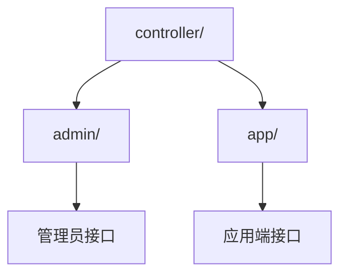
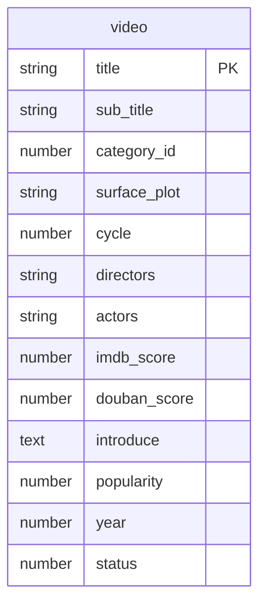
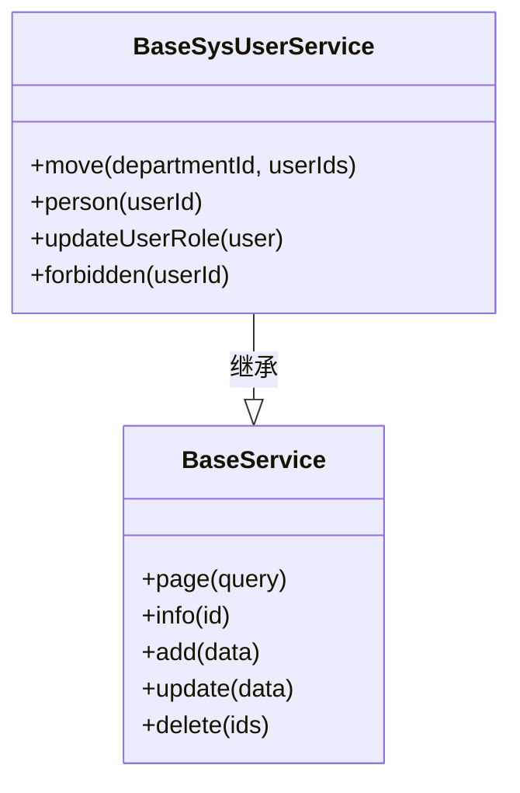
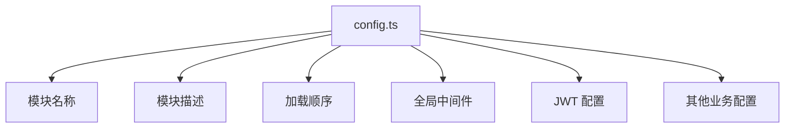

# 模块目录结构规范

<cite>
**本文档引用文件**  
- [base/config.ts](file://src/modules/base/config.ts)
- [user/config.ts](file://src/modules/user/config.ts)
- [video/config.ts](file://src/modules/video/config.ts)
- [base/controller/admin/sys/user.ts](file://src/modules/base/controller/admin/sys/user.ts)
- [user/controller/app/info.ts](file://src/modules/user/controller/app/info.ts)
- [base/entity/sys/user.ts](file://src/modules/base/entity/sys/user.ts)
- [video/entity/videos.ts](file://src/modules/video/entity/videos.ts)
- [base/service/sys/user.ts](file://src/modules/base/service/sys/user.ts)
- [video/service/videos.ts](file://src/modules/video/service/videos.ts)
</cite>

## 目录

1. [模块目录结构概述](#模块目录结构概述)
2. [核心组成部分详解](#核心组成部分详解)
3. [Controller 路径分离设计](#controller-路径分离设计)
4. [Entity 目录说明](#entity-目录说明)
5. [Service 目录说明](#service-目录说明)
6. [Config.ts 配置文件](#configts-配置文件)
7. [实际模块结构示例](#实际模块结构示例)
8. [模块命名规范与自动加载机制](#模块命名规范与自动加载机制)

## 模块目录结构概述

在 cool-admin-midway 框架中，所有业务模块必须位于 `src/modules` 目录下的独立子目录中。每个模块应具备清晰、一致的目录结构，包含 `controller`、`entity`、`service` 和 `config.ts` 等核心组成部分。这种标准化的组织方式不仅提升了代码可维护性，也确保了框架能够通过自动扫描机制正确识别并注册各个模块。

标准模块结构如下：
```
src/modules/[module-name]/
├── controller/
├── entity/
├── service/
├── config.ts
```

**Section sources**
- [base/config.ts](file://src/modules/base/config.ts)
- [user/config.ts](file://src/modules/user/config.ts)
- [video/config.ts](file://src/modules/video/config.ts)

## 核心组成部分详解

每个模块由多个核心部分构成，分别承担不同的职责：

- **controller**：处理 HTTP 请求，定义 API 接口
- **entity**：定义数据库实体类，映射数据表结构
- **service**：封装业务逻辑，提供可复用的服务方法
- **config.ts**：模块配置文件，定义模块元信息和初始化设置

这些组件共同构成了一个高内聚、低耦合的功能单元，便于独立开发、测试和部署。

**Section sources**
- [base/config.ts](file://src/modules/base/config.ts)
- [base/controller/admin/sys/user.ts](file://src/modules/base/controller/admin/sys/user.ts)
- [base/entity/sys/user.ts](file://src/modules/base/entity/sys/user.ts)
- [base/service/sys/user.ts](file://src/modules/base/service/sys/user.ts)

## Controller 路径分离设计

`controller` 目录下采用 `admin` 与 `app` 的路径分离设计，明确区分管理员接口与应用端（如小程序、APP）接口。

- **admin**：存放管理员后台使用的控制器，通常具有更高的权限校验要求
- **app**：存放面向终端用户的应用接口，适用于移动端、H5 等场景

例如，在 `user` 模块中：
- `controller/admin/info.ts` 提供管理员对用户信息的管理功能
- `controller/app/info.ts` 提供用户个人中心相关接口，如获取个人信息、修改密码等

这种设计实现了前后端职责分离，增强了安全性与可维护性。



**Diagram sources**
- [user/controller/app/info.ts](file://src/modules/user/controller/app/info.ts)
- [base/controller/admin/sys/user.ts](file://src/modules/base/controller/admin/sys/user.ts)

**Section sources**
- [user/controller/app/info.ts](file://src/modules/user/controller/app/info.ts)
- [base/controller/admin/sys/user.ts](file://src/modules/base/controller/admin/sys/user.ts)

## Entity 目录说明

`entity` 目录用于存放 TypeORM 实体类，每个文件对应一张数据库表。实体类通过装饰器定义字段、索引、约束等元数据。

例如，`video` 模块中的 `videos.ts` 定义了影片信息实体：
- 使用 `@Entity('video')` 指定表名
- 使用 `@Column` 定义字段类型与注释
- 使用 `@Index` 创建数据库索引以提升查询性能

实体类是 ORM 层的核心，直接映射数据库结构，为数据访问提供类型安全支持。



**Diagram sources**
- [video/entity/videos.ts](file://src/modules/video/entity/videos.ts)

**Section sources**
- [video/entity/videos.ts](file://src/modules/video/entity/videos.ts)
- [base/entity/sys/user.ts](file://src/modules/base/entity/sys/user.ts)

## Service 目录说明

`service` 目录封装模块的核心业务逻辑，避免将复杂逻辑直接写入控制器中，提升代码复用性和可测试性。

服务类通常包含以下功能：
- 数据库操作（增删改查）
- 事务处理
- 权限校验
- 业务规则验证
- 调用其他服务或外部接口

例如，`BaseSysUserService` 提供了用户管理的完整业务逻辑，包括分页查询、角色分配、密码加密、禁用账户等功能。



**Diagram sources**
- [base/service/sys/user.ts](file://src/modules/base/service/sys/user.ts)
- [video/service/videos.ts](file://src/modules/video/service/videos.ts)

**Section sources**
- [base/service/sys/user.ts](file://src/modules/base/service/sys/user.ts)
- [video/service/videos.ts](file://src/modules/video/service/videos.ts)

## Config.ts 配置文件

每个模块根目录下的 `config.ts` 文件用于定义模块的配置信息与菜单初始化参数。该文件导出一个函数，返回 `ModuleConfig` 类型的对象。

主要配置项包括：
- `name`：模块名称
- `description`：模块描述
- `order`：加载顺序，值越大越优先
- `globalMiddlewares`：全局中间件列表
- `jwt`：JWT 认证配置
- `allowKeys`：允许读取的配置键

例如，`base` 模块配置了权限管理相关的中间件和 JWT 秘钥，而 `user` 模块则定义了短信验证码超时时间。



**Diagram sources**
- [base/config.ts](file://src/modules/base/config.ts)
- [user/config.ts](file://src/modules/user/config.ts)
- [video/config.ts](file://src/modules/video/config.ts)

**Section sources**
- [base/config.ts](file://src/modules/base/config.ts)
- [user/config.ts](file://src/modules/user/config.ts)
- [video/config.ts](file://src/modules/video/config.ts)

## 实际模块结构示例

以下通过 `base`、`user`、`video` 三个模块展示标准模块的实际组织方式：

### base 模块
- `controller/admin/sys/user.ts`：系统用户管理接口
- `entity/sys/user.ts`：用户实体定义
- `service/sys/user.ts`：用户业务逻辑
- `config.ts`：基础权限模块配置

### user 模块
- `controller/app/info.ts`：用户个人信息接口
- `entity/info.ts`：用户信息实体
- `service/info.ts`：用户信息服务
- `config.ts`：用户模块配置

### video 模块
- `controller/admin/videos.ts`：视频管理接口
- `entity/videos.ts`：视频实体定义
- `service/videos.ts`：视频业务逻辑
- `config.ts`：视频模块配置

这些模块均遵循统一的结构规范，确保框架可以自动扫描并注册。

**Section sources**
- [base/config.ts](file://src/modules/base/config.ts)
- [user/config.ts](file://src/modules/user/config.ts)
- [video/config.ts](file://src/modules/video/config.ts)
- [base/controller/admin/sys/user.ts](file://src/modules/base/controller/admin/sys/user.ts)
- [user/controller/app/info.ts](file://src/modules/user/controller/app/info.ts)
- [video/entity/videos.ts](file://src/modules/video/entity/videos.ts)
- [base/service/sys/user.ts](file://src/modules/base/service/sys/user.ts)
- [video/service/videos.ts](file://src/modules/video/service/videos.ts)

## 模块命名规范与自动加载机制

所有模块应使用小写字母命名，避免使用特殊字符或空格。模块名称应简洁明了，反映其业务领域（如 `user`、`video`、`dict`）。

框架通过扫描 `src/modules` 目录下的子目录，自动加载每个模块的 `config.ts` 文件，并根据配置注册路由、中间件和服务。因此，保持目录结构的一致性至关重要，任何偏离标准结构的模块可能导致无法被正确识别或功能异常。

**Section sources**
- [base/config.ts](file://src/modules/base/config.ts)
- [user/config.ts](file://src/modules/user/config.ts)
- [video/config.ts](file://src/modules/video/config.ts)