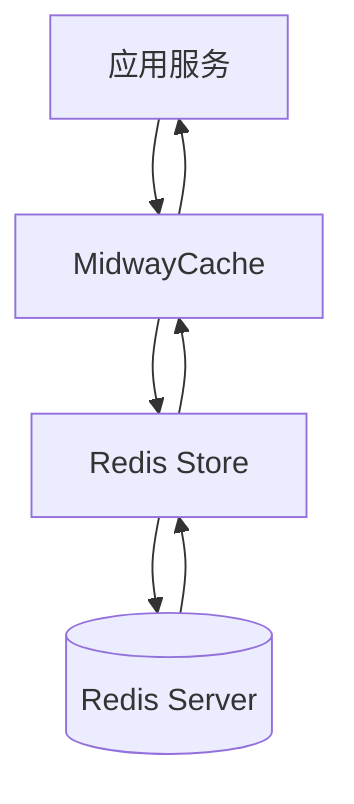
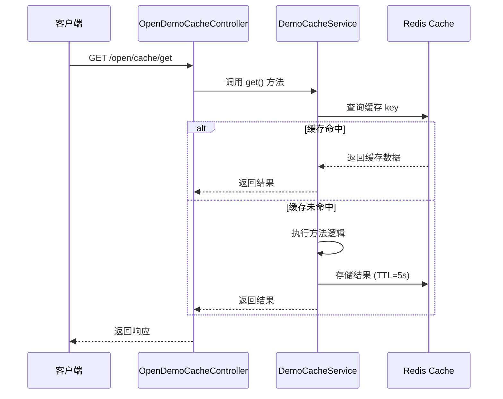
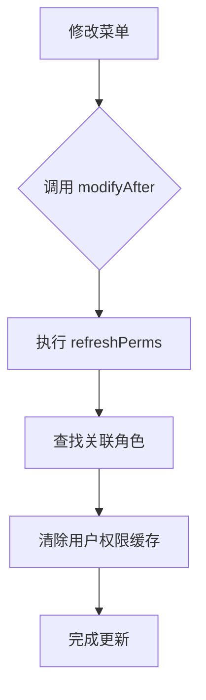
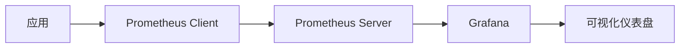

# 缓存与性能优化

<cite>
**本文档引用的文件**
- [cache.ts](file://src/modules/demo/service/cache.ts)
- [cache.ts](file://src/modules/demo/controller/open/cache.ts)
- [menu.ts](file://src/modules/base/service/sys/menu.ts)
- [menu.ts](file://src/modules/base/event/menu.ts)
- [config.prod.ts](file://src/config/config.prod.ts)
- [conf.ts](file://src/modules/base/entity/sys/conf.ts)
- [base.ts](file://src/modules/base/entity/base.ts)
</cite>

## 目录
1. [引言](#引言)
2. [Redis 分布式缓存集成](#redis-分布式缓存集成)
3. [缓存应用场景与实现](#缓存应用场景与实现)
4. [方法级缓存：@Cacheable 实现机制](#方法级缓存cacheable-实现机制)
5. [缓存失效策略与一致性保障](#缓存失效策略与一致性保障)
6. [数据库查询优化](#数据库查询优化)
7. [生产环境性能监控](#生产环境性能监控)
8. [代码层面的性能优化实践](#代码层面的性能优化实践)
9. [总结](#总结)

## 引言

在现代高并发系统中，性能优化是保障用户体验和系统稳定性的关键环节。本指南围绕 Cool Admin Midway 框架，深入探讨如何通过 Redis 实现分布式缓存、优化数据库查询、提升系统吞吐量，并结合 Prometheus 实现生产级性能监控。重点分析菜单、系统参数等高频低变数据的缓存策略，以及如何利用 `@CoolCache` 装饰器实现自动缓存读取与更新。

**Section sources**
- [cache.ts](file://src/modules/demo/service/cache.ts#L1-L18)
- [config.prod.ts](file://src/config/config.prod.ts#L1-L60)

## Redis 分布式缓存集成

系统通过 `@midwayjs/cache-manager` 和 `cache-manager-ioredis-yet` 集成 Redis 作为默认缓存存储。在生产配置文件 `config.prod.ts` 中，已明确配置 Redis 客户端连接参数，包括主机地址、端口、数据库索引和存储驱动。

缓存客户端通过 `@InjectClient(CachingFactory, 'default')` 注入，支持 `set`、`get`、`del` 等基本操作，并可指定缓存过期时间（TTL），实现灵活的数据缓存控制。

**Diagram sources**
- [config.prod.ts](file://src/config/config.prod.ts#L40-L55)
- [cache.ts](file://src/modules/demo/controller/open/cache.ts#L10-L15)

**Section sources**
- [config.prod.ts](file://src/config/config.prod.ts#L40-L55)
- [cache.ts](file://src/modules/demo/controller/open/cache.ts#L10-L25)

## 缓存应用场景与实现

### 适用场景

以下类型的数据非常适合使用缓存：
- **系统参数**：存储于 `base_sys_conf` 表，通过 `BaseSysConfEntity` 管理，数据静态且访问频繁。
- **菜单树结构**：存储于 `base_sys_menu` 表，通过 `BaseSysMenuEntity` 管理，结构复杂但变更频率低。
- **用户信息**：用户基础信息和权限数据，读取频繁，适合缓存以减少数据库压力。

### 缓存实现示例

`DemoCacheService` 提供了缓存的基本使用模式。通过 `@CoolCache(5000)` 装饰器，`get()` 方法的返回值将被缓存 5 秒。当方法被调用时，框架会自动检查缓存，若存在则直接返回缓存值，否则执行方法并将结果存入缓存。

**Diagram sources**
- [cache.ts](file://src/modules/demo/service/cache.ts#L7-L15)
- [cache.ts](file://src/modules/demo/controller/open/cache.ts#L25-L35)

**Section sources**
- [cache.ts](file://src/modules/demo/service/cache.ts#L7-L15)
- [conf.ts](file://src/modules/base/entity/sys/conf.ts#L1-L14)
- [menu.ts](file://src/modules/base/entity/sys/menu.ts#L1-L46)

## 方法级缓存：@Cacheable 实现机制

`@CoolCache` 装饰器是实现方法级缓存的核心。它基于 MidwayJS 的 AOP（面向切面编程）机制，在方法执行前拦截调用，查询缓存；若未命中，则执行原方法，并将返回值按指定 TTL 存入 Redis。

该机制实现了缓存逻辑与业务逻辑的解耦，开发者只需在需要缓存的方法上添加装饰器，即可自动获得缓存能力，极大地提升了开发效率和代码可维护性。

**Section sources**
- [cache.ts](file://src/modules/demo/service/cache.ts#L7-L15)

## 缓存失效策略与一致性保障

### 失效策略

当前系统主要采用**时间过期（TTL）**策略。例如，`@CoolCache(5000)` 表示缓存 5 秒后自动失效。对于更复杂的场景，可通过 `midwayCache.del(key)` 手动清除特定缓存。

### 一致性保障

为保障缓存与数据库的一致性，系统在关键数据变更时主动刷新相关缓存。例如，在 `BaseSysMenuService` 中，当菜单数据被修改或删除时，会调用 `refreshPerms()` 方法，该方法会清除与该菜单相关的权限缓存，确保后续请求能获取到最新的数据。

**Diagram sources**
- [menu.ts](file://src/modules/base/service/sys/menu.ts#L25-L35)
- [menu.ts](file://src/modules/base/service/sys/menu.ts#L150-L180)

**Section sources**
- [menu.ts](file://src/modules/base/service/sys/menu.ts#L25-L35)
- [menu.ts](file://src/modules/base/service/sys/menu.ts#L150-L180)

## 数据库查询优化

### 索引优化

在 `BaseSysConfEntity` 中，`cKey` 字段使用了 `@Index({ unique: true })`，这不仅保证了配置键的唯一性，也极大提升了基于 `cKey` 的查询效率。对于高频查询的字段，应合理设计数据库索引。

### 避免 N+1 查询

在 `BaseSysMenuService.getMenus()` 方法中，通过 `createQueryBuilder` 结合 `innerJoinAndSelect` 一次性获取菜单及其关联的角色菜单数据，有效避免了经典的 N+1 查询问题，减少了数据库交互次数。

**Section sources**
- [conf.ts](file://src/modules/base/entity/sys/conf.ts#L7-L10)
- [menu.ts](file://src/modules/base/service/sys/menu.ts#L75-L90)

## 生产环境性能监控

项目已集成 Prometheus 指标采集功能，可用于监控以下关键指标：
- HTTP 请求的 QPS、延迟分布
- 系统资源使用情况（CPU、内存）
- 自定义业务指标（如缓存命中率、任务执行时间）

通过 `process.memoryUsage()` 可获取 Node.js 进程的内存使用情况，结合日志输出，为性能诊断提供数据支持。

**Diagram sources**
- [README.md](file://README.md#L485-L490)
- [collect.ts](file://src/modules/task/service/collect.ts#L174-L186)

**Section sources**
- [README.md](file://README.md#L485-L490)
- [collect.ts](file://src/modules/task/service/collect.ts#L174-L186)

## 代码层面的性能优化实践

### 异步处理

对于耗时操作（如文件生成、数据采集），应使用 `async/await` 进行异步处理，避免阻塞主线程，提高系统吞吐量。

### 连接池配置

TypeORM 默认使用连接池管理数据库连接。在 `config.prod.ts` 中配置合理的连接池大小，可以有效复用连接，减少创建和销毁连接的开销。

### 批量操作

在 `BaseSysMenuService.import()` 方法中，虽然目前是逐条保存，但最佳实践是使用 `save()` 的批量插入功能或原生 SQL 批量操作，以显著提升大量数据导入的性能。

**Section sources**
- [menu.ts](file://src/modules/base/service/sys/menu.ts#L423-L462)
- [config.prod.ts](file://src/config/config.prod.ts#L10-L35)

## 总结

通过集成 Redis 实现分布式缓存，结合 `@CoolCache` 装饰器，系统能够高效地缓存菜单、系统参数等静态数据，显著提升接口响应速度。配合合理的数据库索引、避免 N+1 查询、异步处理和连接池配置，可构建高性能的应用。最后，利用 Prometheus 进行生产环境监控，确保系统稳定运行。这些优化策略共同构成了 Cool Admin Midway 的性能基石。