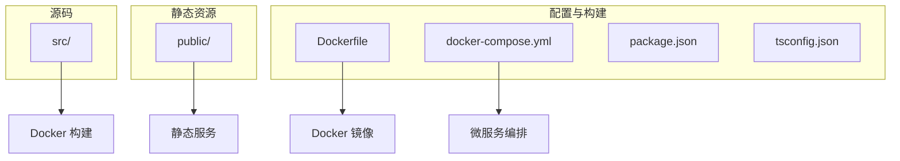
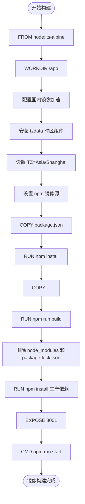
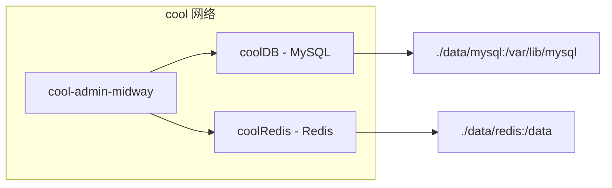
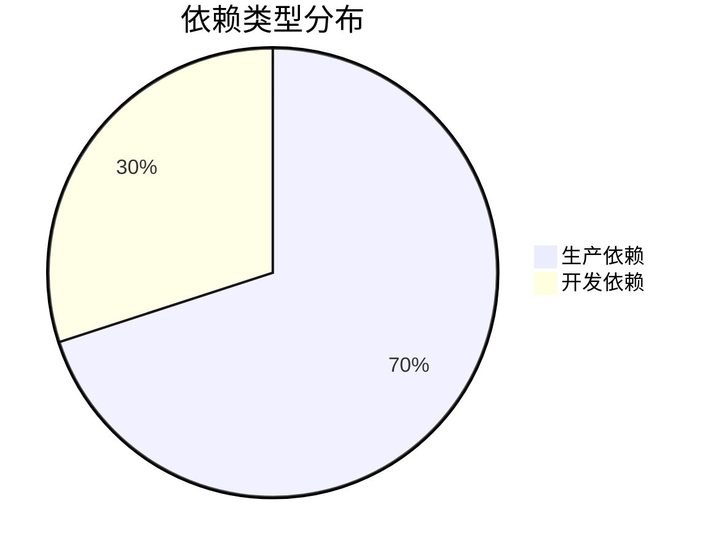

# Docker 部署指南

<cite>
**本文档引用的文件**  
- [Dockerfile](file://Dockerfile)
- [docker-compose.yml](file://docker-compose.yml)
- [package.json](file://package.json)
- [src/config/config.prod.ts](file://src/config/config.prod.ts)
- [src/configuration.ts](file://src/configuration.ts)
</cite>

## 目录
1. [简介](#简介)
2. [项目结构](#项目结构)
3. [核心组件](#核心组件)
4. [架构概览](#架构概览)
5. [详细组件分析](#详细组件分析)
6. [依赖分析](#依赖分析)
7. [性能考虑](#性能考虑)
8. [故障排除指南](#故障排除指南)
9. [结论](#结论)

## 简介
本文档详细说明如何使用 Docker 部署 `cool-admin-midway` 应用。涵盖多阶段构建流程、微服务环境定义、容器间通信最佳实践、构建与启动命令示例、环境变量作用以及安全配置建议。

## 项目结构
本项目采用模块化设计，主要包含 `src` 源码目录、`public` 静态资源、配置文件和 Docker 相关文件。核心服务通过 Midway 框架实现，支持 TypeScript 编译和模块化加载。



**Diagram sources**
- [Dockerfile](file://Dockerfile#L1-L32)
- [docker-compose.yml](file://docker-compose.yml#L1-L40)

**Section sources**
- [Dockerfile](file://Dockerfile#L1-L32)
- [docker-compose.yml](file://docker-compose.yml#L1-L40)

## 核心组件
应用基于 Midway.js 框架构建，使用 TypeORM 进行数据库操作，集成 Redis 缓存、任务队列（Bull）等功能。通过 `@cool-midway/core` 提供基础能力，如权限控制、日志、菜单管理等。

**Section sources**
- [src/configuration.ts](file://src/configuration.ts#L1-L75)
- [package.json](file://package.json#L1-L95)

## 架构概览
系统采用微服务架构，通过 Docker 容器化部署，包含应用服务、MySQL 数据库、Redis 缓存服务。各组件通过 Docker 网络通信，数据持久化通过卷映射实现。

```mermaid
graph TD
Client[客户端] --> API[应用服务]
API --> DB[(MySQL)]
API --> Cache[(Redis)]
API --> Static[静态文件]
DB --> |数据持久化| VolumeDB[./data/mysql]
Cache --> |缓存持久化| VolumeCache[./data/redis]
class API,DockerService
class DB,Cache,DockerService
class VolumeDB,VolumeCache,DockerVolume
style DockerService fill:#e6f3ff,stroke:#3399ff
style DockerVolume fill:#fff2e6,stroke:#ff9900
```

**Diagram sources**
- [docker-compose.yml](file://docker-compose.yml#L1-L40)
- [src/config/config.prod.ts](file://src/config/config.prod.ts#L1-L60)

## 详细组件分析

### 应用服务构建流程
Dockerfile 实现了多阶段构建，优化镜像大小并确保生产环境纯净。

#### 多阶段构建流程图


**Diagram sources**
- [Dockerfile](file://Dockerfile#L1-L32)

**Section sources**
- [Dockerfile](file://Dockerfile#L1-L32)
- [package.json](file://package.json#L1-L95)

### 微服务环境编排
`docker-compose.yml` 定义了完整的运行环境，包括数据库、缓存服务和网络配置。

#### 服务依赖关系图


**Diagram sources**
- [docker-compose.yml](file://docker-compose.yml#L1-L40)

**Section sources**
- [docker-compose.yml](file://docker-compose.yml#L1-L40)
- [src/config/config.prod.ts](file://src/config/config.prod.ts#L1-L60)

## 依赖分析
项目依赖分为生产依赖和开发依赖，通过 `package.json` 管理。Docker 构建过程中先安装所有依赖进行编译，再清除开发依赖仅保留生产环境所需模块。



**Diagram sources**
- [package.json](file://package.json#L1-L95)

**Section sources**
- [package.json](file://package.json#L1-L95)

## 性能考虑
- 使用 Alpine Linux 基础镜像减小体积
- 多阶段构建避免携带开发工具
- Redis 缓存提升数据访问性能
- TypeORM 查询优化与连接池管理
- 静态资源由 Nginx 或静态文件中间件直接服务

## 故障排除指南
常见问题及解决方案：

| 问题现象 | 可能原因 | 解决方案 |
|--------|--------|--------|
| 数据库连接失败 | 网络未正确配置 | 检查 `docker-compose.yml` 中 networks 配置 |
| 时区不正确 | TZ 环境变量未设置 | 确保 Dockerfile 和 docker-compose 中均设置 TZ |
| 启动报错 `synchronize: true` | 生产环境自动建表风险 | 在 `config.prod.ts` 中关闭 synchronize |
| Redis 连接超时 | 密码或端口错误 | 检查 redis 配置及是否启用 requirepass |

**Section sources**
- [src/config/config.prod.ts](file://src/config/config.prod.ts#L1-L60)
- [docker-compose.yml](file://docker-compose.yml#L1-L40)

## 结论
通过 Docker 部署 `cool-admin-midway` 可实现环境一致性、快速部署和可扩展性。建议在生产环境中：
- 使用独立的配置文件管理敏感信息
- 启用 HTTPS 和访问控制
- 定期备份数据库卷
- 监控容器资源使用情况