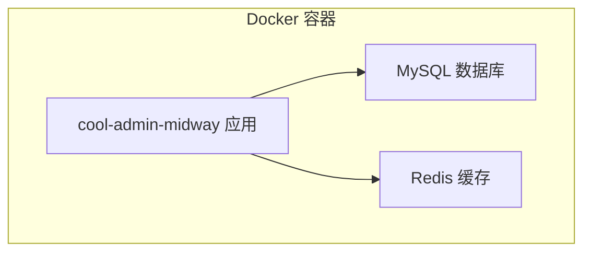
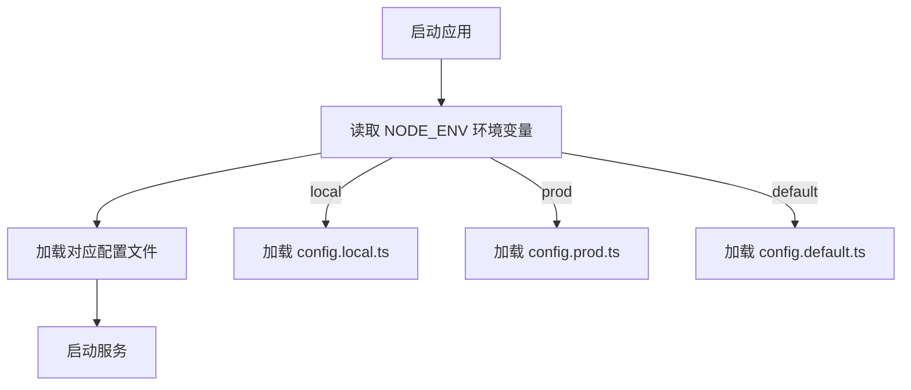
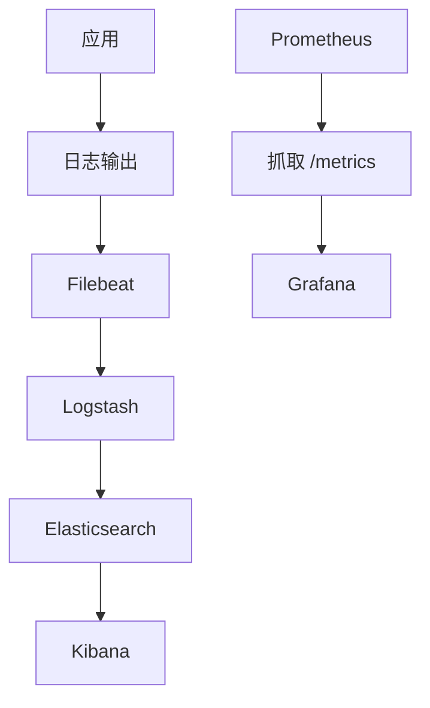
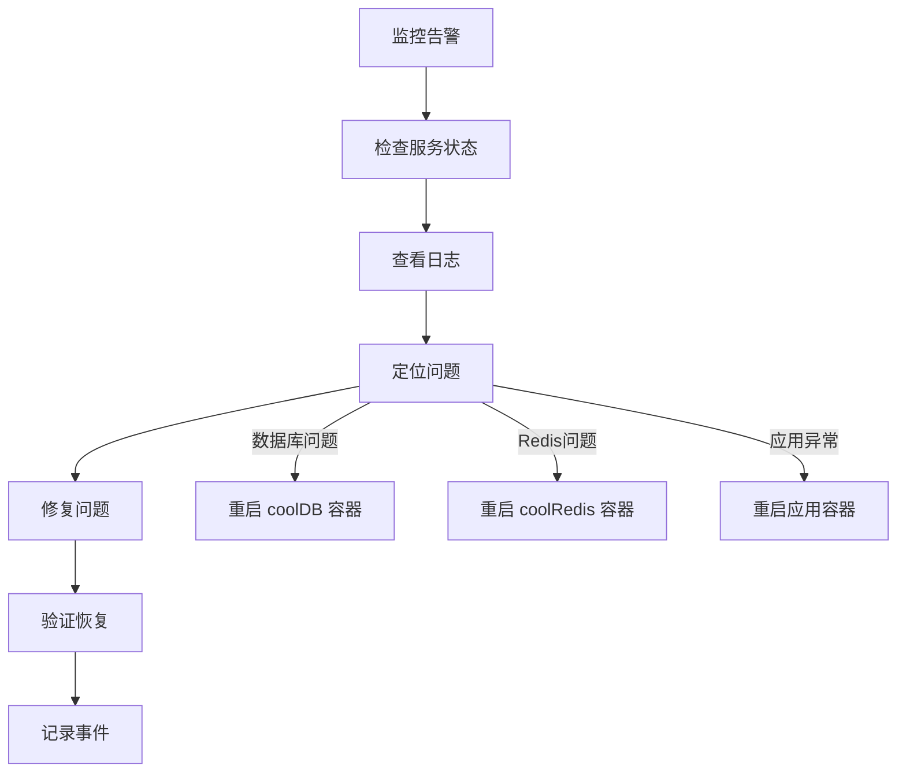

# 部署与运维

<cite>
**本文档中引用的文件**  
- [Dockerfile](file://Dockerfile)
- [docker-compose.yml](file://docker-compose.yml)
- [package.json](file://package.json)
- [config.prod.ts](file://src/config/config.prod.ts)
- [config.default.ts](file://src/config/config.default.ts)
- [configuration.ts](file://src/configuration.ts)
</cite>

## 目录
1. [简介](#简介)
2. [Docker 部署方案](#docker-部署方案)
3. [多环境配置管理](#多环境配置管理)
4. [CI/CD 集成方案](#cicd-集成方案)
5. [日志收集与监控](#日志收集与监控)
6. [运维操作最佳实践](#运维操作最佳实践)

## 简介
`cool-admin-midway` 是一个基于 Midway 框架的快速开发平台，支持模块化、插件化架构。本指南旨在为生产环境提供完整的部署与运维操作说明，涵盖 Docker 部署、环境配置、CI/CD 集成、日志监控及常见运维场景的最佳实践。

**Section sources**
- [README.md](file://README.md)

## Docker 部署方案

### 构建应用镜像
项目根目录下的 `Dockerfile` 定义了镜像构建流程，基于 `node:lts-alpine` 基础镜像，优化了国内依赖下载速度，并设置了中国时区。

构建步骤如下：
1. 设置工作目录 `/app`
2. 配置 Alpine 国内镜像源（华为云）
3. 安装时区组件并设置 `TZ=Asia/Shanghai`
4. 使用 `npmmirror.com` 镜像源加速 npm 包安装
5. 复制 `package.json` 并安装依赖
6. 复制源码并执行 `npm run build` 进行构建
7. 清理开发依赖后重新安装生产依赖
8. 暴露端口 8001
9. 启动命令为 `npm run start`

使用以下命令构建镜像：
```bash
docker build -t cool-admin-midway:latest .
```

### 服务编排与依赖管理
`docker-compose.yml` 文件定义了本地数据库与缓存服务的容器配置，包括 MySQL 和 Redis。

**服务说明：**
- **coolDB**: 使用官方 MySQL 镜像，持久化数据至 `./data/mysql/`，配置了 CMS 业务库和用户权限。
- **coolRedis**: 使用官方 Redis 镜像，持久化数据至 `./data/redis/`，默认无密码。

可通过修改 `ports` 字段避免端口冲突，如将 `3306:3306` 改为 `3307:3306`。

启动服务：
```bash
docker-compose up -d
```



**Diagram sources**
- [Dockerfile](file://Dockerfile)
- [docker-compose.yml](file://docker-compose.yml)

**Section sources**
- [Dockerfile](file://Dockerfile#L1-L32)
- [docker-compose.yml](file://docker-compose.yml#L1-L40)

## 多环境配置管理

### 环境配置文件结构
项目采用 Midway 的多环境配置机制，通过 `src/config/` 目录下的配置文件实现环境隔离：
- `config.default.ts`: 默认配置，所有环境共享
- `config.local.ts`: 本地开发环境配置
- `config.prod.ts`: 生产环境配置

运行时通过 `NODE_ENV` 环境变量加载对应配置。

### 敏感信息保护
生产环境配置 `config.prod.ts` 中包含数据库连接信息，但建议通过环境变量注入敏感信息，而非硬编码。

当前配置示例：
```ts
typeorm: {
  dataSource: {
    default: {
      host: '127.0.0.1',
      port: 3306,
      username: 'cms',
      password: 'n4mM4KHkEyaNZEm2', // 建议通过环境变量传入
      database: 'cms'
    }
  }
}
```

**最佳实践：**
1. 在 `docker-compose.yml` 中添加环境变量：
```yaml
environment:
  DB_HOST: coolDB
  DB_USER: cms
  DB_PASS: ${DB_PASSWORD}
```
2. 修改 `config.prod.ts` 使用 `process.env.DB_PASS` 获取密码
3. 使用 `.env` 文件管理敏感信息，并确保其不在 Git 中提交

### 配置加载机制
`src/configuration.ts` 中通过 `importConfigs` 注册多环境配置，框架自动根据运行环境加载对应配置。



**Diagram sources**
- [configuration.ts](file://src/configuration.ts#L25-L73)
- [config.prod.ts](file://src/config/config.prod.ts#L1-L58)
- [config.default.ts](file://src/config/config.default.ts#L1-L141)

**Section sources**
- [config.prod.ts](file://src/config/config.prod.ts#L1-L58)
- [config.default.ts](file://src/config/config.default.ts#L1-L141)
- [configuration.ts](file://src/configuration.ts#L1-L74)

## CI/CD 集成方案

### 构建脚本分析
`package.json` 中定义了完整的构建与部署生命周期脚本：

| 脚本 | 说明 |
|------|------|
| `build` | 执行 `cool entity && bundle && mwtsc --cleanOutDir`，生成生产代码 |
| `dev` | 本地开发模式，启用热重载 |
| `start` | 生产环境启动命令 |
| `lint`, `lint:fix` | 代码规范检查与自动修复 |
| `test`, `cov` | 单元测试与覆盖率 |
| `pkg` | 使用 pkg 打包为可执行文件 |

### 自动化构建流程
CI/CD 流程建议如下：
1. 拉取代码
2. 执行 `npm install`
3. 运行 `npm run lint` 和 `npm run test`
4. 执行 `npm run build` 构建生产包
5. 构建 Docker 镜像并推送至镜像仓库
6. 在目标服务器拉取镜像并重启服务

### 推荐 CI/CD 工具
- GitHub Actions / GitLab CI
- Jenkins
- 阿里云效 / 腾讯云 CODING


**Section sources**
- [package.json](file://package.json#L1-L94)

## 日志收集与监控

### 内建监控支持
`package.json` 显示项目已集成 `@midwayjs/prometheus` 模块，支持 Prometheus 监控指标暴露。

`configuration.ts` 中已注册该组件，应用启动后可在 `/metrics` 路径获取监控数据。

### 日志管理
系统日志由 `BaseSysLogService` 管理，支持：
- 自动记录请求日志（URL、参数、IP、用户ID）
- 可配置日志保留天数
- 定时清理任务（每日执行）

日志清理任务定义于 `src/modules/base/job/log.ts`，使用 `@midwayjs/cron` 实现。

### 推荐监控方案
**方案一：Prometheus + Grafana**
- Prometheus 抓取 `/metrics` 接口数据
- Grafana 展示可视化面板
- 配置告警规则

**方案二：ELK Stack**
- Filebeat 收集应用日志
- Logstash 进行日志解析
- Elasticsearch 存储与检索
- Kibana 可视化分析

**日志级别建议：**
- 生产环境：`info` 及以上
- 调试环境：`debug`



**Section sources**
- [package.json](file://package.json#L1-L94)
- [configuration.ts](file://src/configuration.ts#L25-L73)
- [src/modules/base/service/sys/log.ts](file://src/modules/base/service/sys/log.ts#L1-L61)
- [src/modules/base/job/log.ts](file://src/modules/base/job/log.ts#L1-L24)

## 运维操作最佳实践

### 性能压测
使用 `ab` 或 `wrk` 对关键接口进行压力测试：
```bash
ab -n 1000 -c 10 http://localhost:8001/api/user/info
```

建议监控：
- 请求吞吐量（QPS）
- 平均响应时间
- 错误率
- 内存与 CPU 使用率

### 故障恢复
**常见故障及应对：**
1. **数据库连接失败**：检查 `coolDB` 容器状态，确认网络与凭证
2. **Redis 不可用**：检查 `coolRedis` 容器，确认持久化配置
3. **应用崩溃**：查看日志 `logs/` 目录，定位异常堆栈
4. **内存泄漏**：使用 `node --inspect` 调试或监控 `process.memoryUsage()`

**恢复流程：**


### 版本升级
**升级步骤：**
1. 备份数据库与配置文件
2. 拉取最新代码
3. 执行 `npm run build` 重新构建
4. 停止旧容器
5. 启动新镜像
6. 验证功能与接口

**数据库迁移：**
- 使用 TypeORM Migration 管理 schema 变更
- 生产环境禁用 `synchronize: true`
- 手动编写迁移脚本并测试

### 安全建议
- 生产环境关闭 `eps` 配置（防止敏感信息暴露）
- 定期轮换 JWT 密钥与数据库密码
- 限制 API 接口访问频率
- 启用 HTTPS

**Section sources**
- [src/config/config.prod.ts](file://src/config/config.prod.ts#L1-L58)
- [src/modules/base/service/sys/log.ts](file://src/modules/base/service/sys/log.ts#L1-L61)
- [src/modules/base/job/log.ts](file://src/modules/base/job/log.ts#L1-L24)