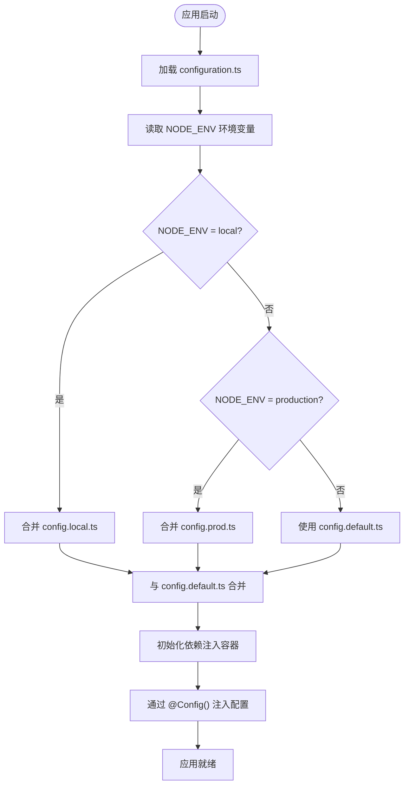
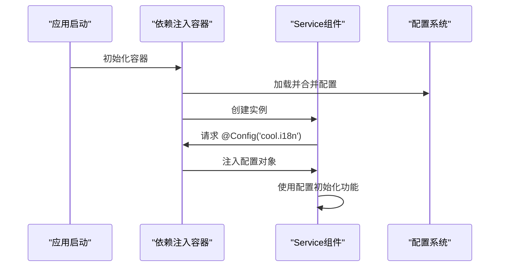
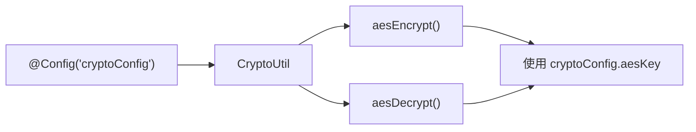

# 配置加载机制

<cite>
**本文档中引用的文件**  
- [configuration.ts](file://src/configuration.ts)
- [config.default.ts](file://src/config/config.default.ts)
- [config.local.ts](file://src/config/config.local.ts)
- [config.prod.ts](file://src/config/config.prod.ts)
- [base/config.ts](file://src/modules/base/config.ts)
- [user/config.ts](file://src/modules/user/config.ts)
- [crypto.ts](file://src/comm/crypto.ts)
- [user/middleware/app.ts](file://src/modules/user/middleware/app.ts)
- [base/service/translate.ts](file://src/modules/base/service/translate.ts)
- [base/middleware/translate.ts](file://src/modules/base/middleware/translate.ts)
</cite>

## 目录

1. [配置加载流程概述](#配置加载流程概述)
2. [核心配置文件解析](#核心配置文件解析)
3. [环境配置优先级策略](#环境配置优先级策略)
4. [运行时配置注入机制](#运行时配置注入机制)
5. [多模块配置合并逻辑](#多模块配置合并逻辑)
6. [实际应用场景分析](#实际应用场景分析)
7. [配置热更新与调试方法](#配置热更新与调试方法)

## 配置加载流程概述

`cool-admin-midway` 框架的配置加载流程以 `src/configuration.ts` 为启动入口，通过 `@Configuration` 装饰器引导 Midway 框架在应用初始化阶段自动扫描并合并 `src/config/` 目录下的环境特定配置文件。该机制基于 MidwayJS 的模块化配置系统，实现了环境感知、优先级覆盖和组件注入三大核心功能。

框架启动时，`MainConfiguration` 类通过 `importConfigs` 字段声明了默认、本地和生产环境的配置模块，由 Midway 运行时根据当前 `NODE_ENV` 环境变量自动选择并合并配置。此过程发生在依赖注入容器初始化之前，确保所有服务组件在创建时即可访问完整配置。



**Diagram sources**  
- [configuration.ts](file://src/configuration.ts#L25-L73)
- [config.default.ts](file://src/config/config.default.ts#L0-L141)
- [config.local.ts](file://src/config/config.local.ts#L0-L42)
- [config.prod.ts](file://src/config/config.prod.ts#L0-L59)

**Section sources**  
- [configuration.ts](file://src/configuration.ts#L0-L74)

## 核心配置文件解析

`configuration.ts` 是整个应用的配置中枢，其核心是 `@Configuration` 装饰器的两个关键属性：`imports` 和 `importConfigs`。

`imports` 定义了应用所依赖的 Midway 组件模块，如 Koa、TypeORM、Redis 等，这些模块在启动时被自动加载和初始化。`importConfigs` 则是一个配置映射对象，明确指定了不同环境下的配置来源。

```mermaid
classDiagram
class MainConfiguration {
+app : IMidwayApplication
+webRouterService : MidwayWebRouterService
+logger : ILogger
+onReady()
}
class Configuration {
+imports : Component[]
+importConfigs : ConfigMap[]
}
MainConfiguration --> Configuration : "使用"
Configuration --> "config.default" : "引用"
Configuration --> "config.local" : "引用"
Configuration --> "config.prod" : "引用"
```

**Diagram sources**  
- [configuration.ts](file://src/configuration.ts#L0-L74)

**Section sources**  
- [configuration.ts](file://src/configuration.ts#L0-L74)

## 环境配置优先级策略

框架采用标准的环境优先级策略，确保配置的灵活性和安全性：

1. **`NODE_ENV=local`**: 优先加载 `config.local.ts`，其配置项将覆盖 `config.default.ts` 中的同名项。适用于开发环境，通常包含调试开关、本地数据库连接等。
2. **`NODE_ENV=production`**: 优先加载 `config.prod.ts`，覆盖默认配置。用于生产环境，通常关闭自动建表、禁用敏感功能。
3. **其他环境**: 回退至 `config.default.ts`，提供所有环境共享的基础配置。

例如，在数据库配置中，`config.local.ts` 启用了 `synchronize: true` 以实现自动建表，而 `config.prod.ts` 则将其设为 `false` 以防止线上数据丢失，体现了环境差异化的最佳实践。

**Section sources**  
- [config.default.ts](file://src/config/config.default.ts#L0-L141)
- [config.local.ts](file://src/config/config.local.ts#L0-L42)
- [config.prod.ts](file://src/config/config.prod.ts#L0-L59)

## 运行时配置注入机制

框架通过 `@App()` 和 `@Config()` 装饰器实现运行时配置的依赖注入，使 Service、Controller 等组件能够跨模块访问配置实例。

- `@App()`：注入 `IMidwayApplication` 实例，可用于获取应用环境、基础路径等全局信息。
- `@Config()`：注入指定路径的配置对象。支持精确路径（如 `'cool.i18n'`）或通配符（`ALL`）注入整个配置。



**Diagram sources**  
- [base/service/translate.ts](file://src/modules/base/service/translate.ts#L43-L51)
- [base/middleware/translate.ts](file://src/modules/base/middleware/translate.ts#L19-L27)
- [user/middleware/app.ts](file://src/modules/user/middleware/app.ts#L15-L25)

**Section sources**  
- [base/service/translate.ts](file://src/modules/base/service/translate.ts#L43-L51)
- [base/middleware/translate.ts](file://src/modules/base/middleware/translate.ts#L19-L27)
- [user/middleware/app.ts](file://src/modules/user/middleware/app.ts#L0-L71)

## 多模块配置合并逻辑

各功能模块（如 `base`、`user`、`demo`）下的 `config.ts` 文件通过 `ModuleConfig` 接口定义模块级配置。主配置系统在启动时会自动扫描并识别这些模块配置，将其整合到全局配置体系中。

模块配置通常包含模块名称、描述、中间件、加载顺序等元信息，以及模块特有的功能配置（如 JWT 秘钥、短信超时时间）。这些配置通过 `@Config('module.user.jwt')` 等路径被精确注入到相关组件中，实现了配置的模块化和隔离。

**Section sources**  
- [base/config.ts](file://src/modules/base/config.ts#L0-L39)
- [user/config.ts](file://src/modules/user/config.ts#L0-L33)
- [demo/config.ts](file://src/modules/demo/config.ts#L0-L18)

## 实际应用场景分析

### 数据库连接初始化
在 `config.local.ts` 和 `config.prod.ts` 中，`typeorm.dataSource.default` 配置了数据库连接参数。`base` 模块的 `TenantSubscriber` 订阅者通过注入 `typeorm` 配置实现多租户数据隔离。

### JWT 中间件读取密钥
`user` 模块的 `UserMiddleware` 中，通过 `@Config('module.user.jwt')` 注入 JWT 配置，获取 `secret` 秘钥用于 token 的验证和解码，确保了认证逻辑的安全性。

### 加密工具配置注入
`comm/crypto.ts` 中的 `CryptoUtil` 类通过 `@Config('cryptoConfig')` 注入 AES 密钥和 RSA 密钥对，为应用提供统一的加密解密服务。



**Diagram sources**  
- [comm/crypto.ts](file://src/comm/crypto.ts#L0-L41)

**Section sources**  
- [comm/crypto.ts](file://src/comm/crypto.ts#L0-L41)
- [user/middleware/app.ts](file://src/modules/user/middleware/app.ts#L27-L35)

## 配置热更新与调试方法

### 配置热更新
Midway 框架本身不支持运行时配置热更新。配置在应用启动时一次性加载并冻结。若需动态配置，建议使用外部配置中心（如 Nacos、Apollo）或数据库存储，并在服务中实现轮询或监听机制。

### 调试方法
1. **启动时打印配置快照**：在 `MainConfiguration` 的 `onReady()` 方法中添加 `console.log(this.app.getConfig())` 可输出当前运行时的完整配置。
2. **环境变量检查**：确保 `NODE_ENV` 设置正确，可通过 `this.app.getEnv()` 在代码中获取。
3. **配置路径验证**：使用 `@Config()` 时，确保路径字符串与配置对象的属性路径完全匹配。

**Section sources**  
- [configuration.ts](file://src/configuration.ts#L65-L73)