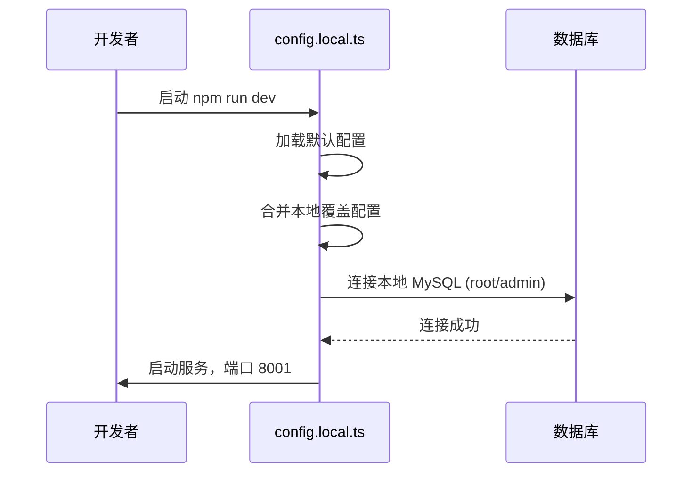
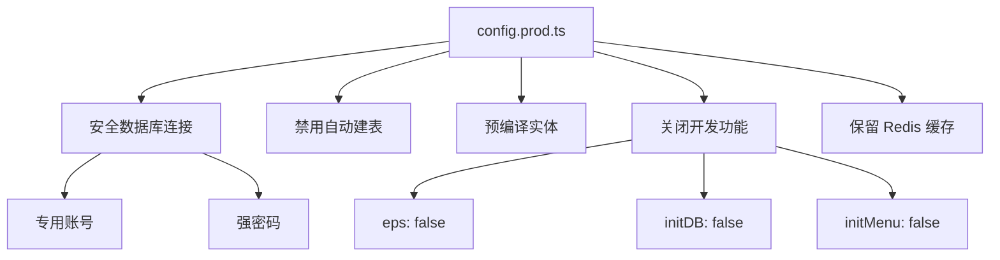
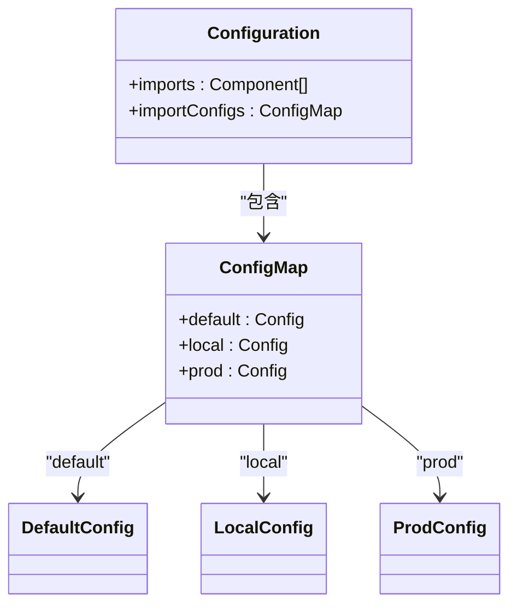
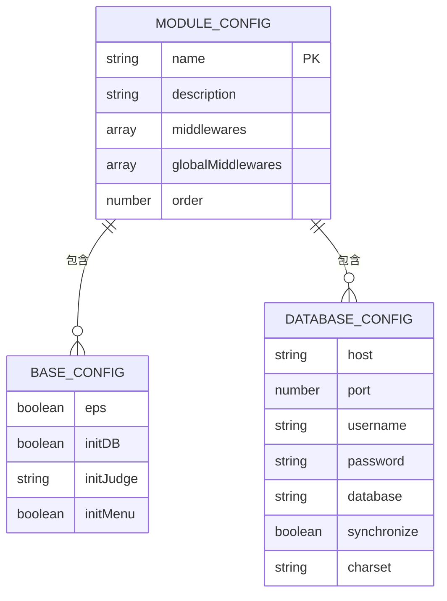

# 配置文件详解

<cite>
**本文档中引用的文件**  
- [config.default.ts](file://src/config/config.default.ts)
- [config.local.ts](file://src/config/config.local.ts)
- [config.prod.ts](file://src/config/config.prod.ts)
- [configuration.ts](file://src/configuration.ts)
</cite>

## 目录
1. [项目结构](#项目结构)  
2. [核心配置文件分析](#核心配置文件分析)  
3. [配置加载机制](#配置加载机制)  
4. [模块化配置组织](#模块化配置组织)  
5. [配置错误排查建议](#配置错误排查建议)

## 项目结构

cool-admin-midway 项目采用清晰的模块化结构，配置文件集中存放在 `src/config` 目录下，包含三类环境配置文件：`config.default.ts`、`config.local.ts` 和 `config.prod.ts`。这些文件分别对应默认配置、本地开发配置和生产环境配置。项目通过 Midway 框架的配置合并机制，根据运行环境自动加载并优先级覆盖配置项。

**Section sources**  
- [config.default.ts](file://src/config/config.default.ts#L1-L141)
- [config.local.ts](file://src/config/config.local.ts#L1-L43)
- [config.prod.ts](file://src/config/config.prod.ts#L1-L59)

## 核心配置文件分析

### config.default.ts：默认配置基线

`config.default.ts` 是所有环境共享的默认配置文件，定义了数据库连接、Redis 设置、JWT 密钥、上传路径等核心参数的初始值。该文件作为配置基线，确保在任何环境下都有合理的默认行为。

主要配置项包括：
- **加密配置**：AES 密钥、RSA 公私钥对、默认盐值
- **Koa 服务端口**：通过 `availablePort(8001)` 动态分配
- **静态文件服务**：映射 `/` 到 `public` 目录，`/upload` 到上传路径
- **文件上传限制**：最大 200MB
- **Redis 缓存**：连接本地 Redis 实例，使用 `cache-manager-ioredis-yet`
- **Cool 框架配置**：多租户、国际化、CRUD 模式等

**Diagram sources**  
- [config.default.ts](file://src/config/config.default.ts#L1-L141)

**Section sources**  
- [config.default.ts](file://src/config/config.default.ts#L1-L141)

### config.local.ts：本地开发配置

`config.local.ts` 用于本地开发环境（`NODE_ENV=local`），覆盖默认配置以支持开发者个性化调试。例如，使用 `root` 用户连接本地数据库，启用自动建表（`synchronize: true`）以便快速迭代。

关键特性：
- **数据库配置**：连接本地 MySQL，用户名 `root`，密码 `admin`，数据库 `cms`
- **实体自动扫描**：使用通配符 `**/modules/*/entity` 动态加载实体
- **开发便利功能**：启用 `eps`（实体路径服务）、自动导入数据库和菜单
- **日志关闭**：`logging: false` 避免日志刷屏

**Diagram sources**  
- [config.local.ts](file://src/config/config.local.ts#L1-L43)

**Section sources**  
- [config.local.ts](file://src/config/config.local.ts#L1-L43)

### config.prod.ts：生产环境配置

`config.prod.ts` 用于生产环境（`NODE_ENV=prod`），强调安全性、性能和稳定性。配置项经过加固，避免敏感信息暴露和自动变更。

核心配置：
- **数据库安全**：使用专用账号 `cms`，强密码 `n4mM4KHkEyaNZEm2`
- **禁用自动建表**：`synchronize: false` 防止数据丢失
- **实体预编译**：使用 `entities` 数组而非通配符，提升启动性能
- **关闭开发功能**：`eps: false`、`initDB: false`、`initMenu: false` 防止信息泄露
- **Redis 缓存保留**：维持高性能数据访问

**Diagram sources**  
- [config.prod.ts](file://src/config/config.prod.ts#L1-L59)

**Section sources**  
- [config.prod.ts](file://src/config/config.prod.ts#L1-L59)

## 配置加载机制

Midway 框架通过 `configuration.ts` 中的 `importConfigs` 配置项实现多环境配置自动加载。框架根据 `NODE_ENV` 环境变量决定加载顺序，优先级为：`local > prod > default`。

**Diagram sources**  
- [configuration.ts](file://src/configuration.ts#L25-L73)

**Section sources**  
- [configuration.ts](file://src/configuration.ts#L25-L73)

## 模块化配置组织

项目采用模块化配置方式，各功能模块（如 `base`、`user`、`video`）在 `src/modules/*/config.ts` 中定义独立配置段。这种设计提高了可维护性和可扩展性，支持按需加载和动态配置。

命名规范：
- 配置项使用小驼峰命名（如 `initDB`、`eps`）
- 模块配置文件统一命名为 `config.ts`
- 环境变量通过 `this.app.getEnv()` 获取

**Diagram sources**  
- [src/modules/base/config.ts](file://src/modules/base/config.ts)
- [src/modules/user/config.ts](file://src/modules/user/config.ts)

**Section sources**  
- [src/modules/base/service/sys/menu.ts](file://src/modules/base/service/sys/menu.ts#L318-L384)

## 配置错误排查建议

### 常见问题与解决方案

| 问题现象 | 可能原因 | 解决方案 |
|--------|--------|--------|
| 服务无法启动 | 环境变量拼写错误 | 检查 `NODE_ENV` 是否为 `local` 或 `prod` |
| 数据库连接失败 | 连接字符串格式错误 | 验证 `host`、`port`、`username`、`password` |
| Redis 无法访问 | 端口或密码错误 | 确认 `redis.client.port` 和 `password` |
| 静态资源 404 | 路径配置错误 | 检查 `staticFile.dirs` 的 `dir` 和 `prefix` |
| 上传失败 | 文件大小超限 | 调整 `upload.fileSize` 值 |

### 调试技巧

- 使用 `console.log` 输出 `app.getConfig()` 查看最终合并配置
- 检查 `src/configuration.ts` 中 `importConfigs` 是否正确引用配置文件
- 确保 `config.local.ts` 和 `config.prod.ts` 导出类型为 `MidwayConfig`
- 验证 `entities` 数组在生产环境中是否正确导入

**Section sources**  
- [config.default.ts](file://src/config/config.default.ts#L1-L141)
- [config.local.ts](file://src/config/config.local.ts#L1-L43)
- [config.prod.ts](file://src/config/config.prod.ts#L1-L59)
- [configuration.ts](file://src/configuration.ts#L25-L73)