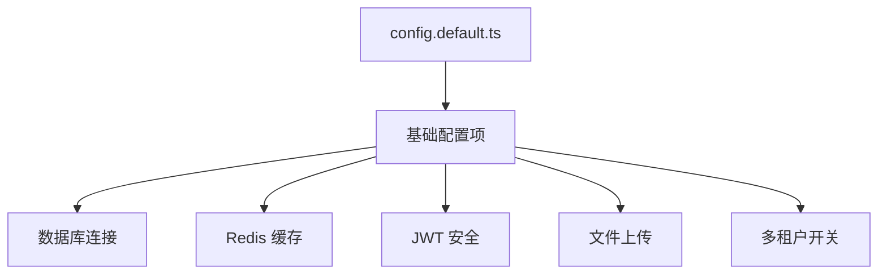
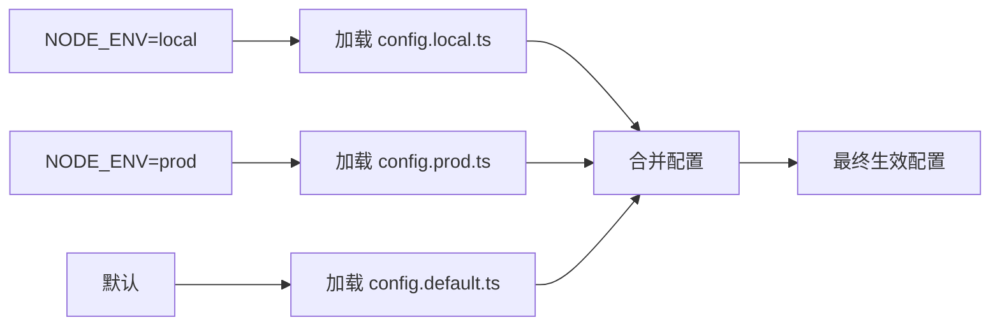

# 配置系统详解

<cite>
**本文档引用文件**  
- [configuration.ts](file://src/configuration.ts)
- [config.default.ts](file://src/config/config.default.ts)
- [config.local.ts](file://src/config/config.local.ts)
- [config.prod.ts](file://src/config/config.prod.ts)
- [base/sys/conf.ts](file://src/modules/base/service/sys/conf.ts)
- [plugin/center.ts](file://src/modules/plugin/service/center.ts)
- [plugin/config.ts](file://src/modules/plugin/config.ts)
- [user/config.ts](file://src/modules/user/config.ts)
- [base/sys/menu.ts](file://src/modules/base/service/sys/menu.ts)
</cite>

## 目录
1. [配置体系概述](#配置体系概述)
2. [核心配置文件解析](#核心配置文件解析)
3. [配置结构分类](#配置结构分类)
4. [配置加载与合并机制](#配置加载与合并机制)
5. [模块级配置管理](#模块级配置管理)
6. [配置安全性实践](#配置安全性实践)
7. [配置调试技巧](#配置调试技巧)
8. [自定义配置扩展](#自定义配置扩展)

## 配置体系概述

cool-admin-midway 采用分层配置管理体系，基于 MidwayJS 框架的配置加载机制，实现多环境差异化配置。系统通过 `NODE_ENV` 环境变量自动识别运行环境，并按优先级合并不同层级的配置文件，确保开发、测试、生产等不同场景下的配置隔离与安全。

**Section sources**
- [configuration.ts](file://src/configuration.ts#L25-L73)
- [config.default.ts](file://src/config/config.default.ts#L0-L141)

## 核心配置文件解析

### config.default.ts：默认配置基础

`config.default.ts` 是系统的默认配置文件，定义了所有环境共享的基础配置项。该文件包含数据库连接、Redis 缓存、JWT 密钥、上传路径等核心参数的默认值，为其他环境配置提供继承基础。



**Diagram sources**
- [config.default.ts](file://src/config/config.default.ts#L0-L141)

### config.local.ts：本地开发覆盖

`config.local.ts` 用于本地开发环境，覆盖 `config.default.ts` 中的部分配置。例如启用数据库自动建表（`synchronize: true`）、开启 Swagger 文档生成（`eps: true`）等功能，便于开发调试。

**Section sources**
- [config.local.ts](file://src/config/config.local.ts#L0-L43)

### config.prod.ts：生产环境定制

`config.prod.ts` 专用于生产环境，强调安全与稳定性。关闭自动建表（`synchronize: false`），禁用敏感功能（如 `eps: false`），并使用更严格的数据库账号权限，防止线上数据风险。

**Section sources**
- [config.prod.ts](file://src/config/config.prod.ts#L0-L59)

## 配置结构分类

### 数据库连接配置

通过 TypeORM 配置数据源，支持 MySQL 等关系型数据库。配置项包括主机、端口、用户名、密码、数据库名、字符集及实体路径。

```typescript
typeorm: {
  dataSource: {
    default: {
      type: 'mysql',
      host: '127.0.0.1',
      port: 3306,
      username: 'root',
      password: 'admin',
      database: 'cms',
      synchronize: true,
      entities: ['**/modules/*/entity']
    }
  }
}
```

**Section sources**
- [config.local.ts](file://src/config/config.local.ts#L10-L35)
- [config.prod.ts](file://src/config/config.prod.ts#L10-L35)

### Redis 缓存配置

集成 `cache-manager-ioredis-yet` 实现缓存管理，支持多客户端配置。默认使用 Redis 作为缓存存储，配置端口、主机、密码及数据库索引。

```typescript
cacheManager: {
  clients: {
    default: {
      store: redisStore,
      options: {
        port: 6379,
        host: '127.0.0.1',
        password: '',
        ttl: 0,
        db: 0
      }
    }
  }
}
```

**Section sources**
- [config.prod.ts](file://src/config/config.prod.ts#L40-L55)
- [config.default.ts](file://src/config/config.default.ts#L80-L94)

### JWT 密钥配置

JWT 用于用户身份认证，配置包含密钥、过期时间等。敏感信息建议通过环境变量注入，避免硬编码。

```typescript
jwt: {
  expire: 60 * 60 * 24,
  refreshExpire: 60 * 60 * 24 * 30,
  secret: '8685679a-0994-4f3e-aa8e-08a83204728ax'
}
```

**Section sources**
- [user/config.ts](file://src/modules/user/config.ts#L25-L31)

### 上传路径配置

静态文件托管与上传路径通过 `staticFile` 和 `upload` 配置项定义，支持自定义前缀与目录映射。

```typescript
staticFile: {
  dirs: {
    default: { prefix: '/', dir: path.join(__dirname, '..', '..', 'public') },
    static: { prefix: '/upload', dir: pUploadPath() }
  }
}
```

**Section sources**
- [config.default.ts](file://src/config/config.default.ts#L50-L58)

### 多租户开关配置

通过 `cool.tenant.enable` 控制是否开启多租户模式，并可通过 `urls` 字段指定需要过滤的接口路径。

```typescript
tenant: {
  enable: false,
  urls: []
}
```

**Section sources**
- [config.default.ts](file://src/config/config.default.ts#L117-L122)

## 配置加载与合并机制

Midway 框架通过 `@Configuration` 装饰器的 `importConfigs` 属性实现配置自动合并。系统根据 `NODE_ENV` 环境变量选择对应的配置文件进行加载，优先级为：`config.local.ts` > `config.prod.ts` > `config.default.ts`。



**Diagram sources**
- [configuration.ts](file://src/configuration.ts#L25-L73)

**Section sources**
- [configuration.ts](file://src/configuration.ts#L25-L73)

## 模块级配置管理

每个功能模块（如 user、plugin、demo）可在 `src/modules/*/config.ts` 中定义独立配置。这些配置由 `MainConfiguration` 在启动时自动注入，支持模块特定的中间件、加载顺序、插件钩子等设置。

```typescript
export default () => {
  return {
    name: '用户模块',
    description: 'APP、小程序、公众号等用户',
    globalMiddlewares: [UserMiddleware],
    order: 0,
    sms: { timeout: 60 * 3 },
    jwt: { expire: 60 * 60 * 24 }
  } as ModuleConfig;
}
```

**Section sources**
- [user/config.ts](file://src/modules/user/config.ts#L0-L33)
- [plugin/config.ts](file://src/modules/plugin/config.ts#L0-L26)

## 配置安全性实践

### 敏感信息保护

数据库密码、JWT 密钥等敏感信息不应硬编码在配置文件中。推荐通过环境变量注入：

```bash
export DB_PASSWORD='your_secure_password'
export JWT_SECRET='your_jwt_secret'
```

并在配置中读取：

```typescript
password: process.env.DB_PASSWORD,
secret: process.env.JWT_SECRET
```

### 配置文件权限控制

生产环境中应限制配置文件的读写权限，确保只有授权用户可访问。同时避免将 `config.local.ts` 提交至版本控制系统。

**Section sources**
- [config.local.ts](file://src/config/config.local.ts#L20-L25)
- [config.prod.ts](file://src/config/config.prod.ts#L20-L25)

## 配置调试技巧

### 打印当前生效配置

在 `onReady` 钩子中打印配置，便于排查问题：

```typescript
async onReady() {
  this.logger.info('当前配置:', this.app.getConfig());
}
```

### 使用配置服务动态获取

通过 `BaseSysConfService` 可在运行时动态获取数据库中的配置项：

```typescript
const value = await this.baseSysConfService.getValue('site_title');
```

**Section sources**
- [base/sys/conf.ts](file://src/modules/base/service/sys/conf.ts#L0-L39)
- [configuration.ts](file://src/configuration.ts#L70-L73)

## 自定义配置扩展

### 添加新模块配置

新建模块时，可在 `src/modules/{moduleName}/config.ts` 中创建配置文件，系统会自动识别并加载。

```typescript
import { ModuleConfig } from '@cool-midway/core';

export default () => {
  return {
    name: '新模块',
    description: '模块描述',
    order: 1
  } as ModuleConfig;
}
```

### 动态创建配置文件

系统支持通过菜单服务自动创建缺失的模块配置文件：

```typescript
await this.createConfigFile('newModule');
```

**Section sources**
- [base/sys/menu.ts](file://src/modules/base/service/sys/menu.ts#L318-L343)
- [demo/config.ts](file://src/modules/demo/config.ts#L0-L19)